## Use Case Diagram

### Sistem Informasi Manajemen Toko Kue

Diagram diperbarui mengikuti state terbaru aplikasi (Laravel 12 + Livewire). Enam aktor utama: Pemilik, Kasir, Produksi, Inventori, Pekerja (generic sebelum ditetapkan peran), dan Pelanggan publik. Modul mencakup Autentikasi, Kasir (POS & shift), Produksi (pesanan & siap-beli), Inventori (produk, bahan baku, belanja, hitung stok, alur), Manajemen (pekerja, peran, pelanggan, profil usaha, channel pembayaran), Notifikasi otomatis, dan Landing page publik.

```plantuml
@startuml Use Case Diagram - Sistem Manajemen Toko Kue (Revised)

left to right direction
skinparam packageStyle rectangle
skinparam actorStyle awesome

' === AKTOR ===
actor "Pemilik" as owner
actor "Kasir" as cashier
actor "Produksi" as production
actor "Inventori" as inventory
actor "Pekerja" as worker
actor "Pelanggan" as customer

rectangle "Sistem Informasi Manajemen Toko Kue" {

    package "Autentikasi" {
        usecase "Login" as UC_LOGIN
        usecase "Aktivasi Akun" as UC_ACTIVATE
        usecase "Logout" as UC_LOGOUT
    }

    package "Kasir / POS" {
        usecase "Kelola Pesanan (Ready/Pesanan)" as UC_ORDER
        usecase "Kelola Pembayaran & Pelunasan" as UC_PAYMENT
        usecase "Kelola Refund" as UC_REFUND
        usecase "Cetak Struk" as UC_RECEIPT
        usecase "Kelola Sesi Kasir" as UC_SHIFT
        usecase "Laporan Kasir" as UC_REPORT_CASHIER
    }

    package "Produksi" {
        usecase "Rencana Produksi (Pesanan/Siap Beli)" as UC_PLAN_PROD
        usecase "Mulai Produksi" as UC_START_PROD
        usecase "Update Hasil & Gagal" as UC_PROGRESS_PROD
        usecase "Selesai / Batal Produksi" as UC_FINISH_PROD
        usecase "Antrian Produksi" as UC_QUEUE_PROD
        usecase "Laporan Produksi" as UC_REPORT_PROD
    }

    package "Inventori" {
        usecase "Kelola Produk & Komposisi" as UC_PRODUCT
        usecase "Kelola Bahan Baku & Batch" as UC_MATERIAL
        usecase "Kelola Kategori & Satuan" as UC_MASTER
        usecase "Rencana/Mulai/Selesai Belanja" as UC_EXPENSE
        usecase "Hitung Stok / Rusak / Hilang" as UC_STOCK_COUNT
        usecase "Alur Persediaan & Log" as UC_INVENTORY_FLOW
        usecase "Laporan Inventori" as UC_REPORT_INV
        usecase "Kelola Supplier" as UC_SUPPLIER
    }

    package "Manajemen" {
        usecase "Kelola Pekerja" as UC_WORKER
        usecase "Kelola Peran & Hak Akses" as UC_ROLE
        usecase "Kelola Pelanggan & Poin" as UC_CUSTOMER
        usecase "Kelola Profil Usaha" as UC_STORE_PROFILE
        usecase "Kelola Channel Pembayaran" as UC_PAYMENT_CHANNEL
        usecase "Kelola Dokumen Usaha" as UC_STORE_DOC
        usecase "Notifikasi Sistem" as UC_NOTIF
    }

    package "Landing Page" {
        usecase "Lihat Katalog" as UC_CATALOG
        usecase "Cara Pesan" as UC_HOW_ORDER
        usecase "FAQ" as UC_FAQ
    }
}

' === RELASI AKTOR ===
worker --> UC_ACTIVATE
worker --> UC_LOGIN
worker --> UC_LOGOUT

owner --> UC_REPORT_CASHIER
owner --> UC_REPORT_PROD
owner --> UC_REPORT_INV
owner --> UC_WORKER
owner --> UC_ROLE
owner --> UC_CUSTOMER
owner --> UC_STORE_PROFILE
owner --> UC_PAYMENT_CHANNEL
owner --> UC_STORE_DOC
owner --> UC_NOTIF

cashier --> UC_ORDER
cashier --> UC_PAYMENT
cashier --> UC_REFUND
cashier --> UC_RECEIPT
cashier --> UC_SHIFT
cashier --> UC_REPORT_CASHIER

production --> UC_PLAN_PROD
production --> UC_START_PROD
production --> UC_PROGRESS_PROD
production --> UC_FINISH_PROD
production --> UC_QUEUE_PROD
production --> UC_REPORT_PROD

inventory --> UC_PRODUCT
inventory --> UC_MATERIAL
inventory --> UC_MASTER
inventory --> UC_EXPENSE
inventory --> UC_STOCK_COUNT
inventory --> UC_INVENTORY_FLOW
inventory --> UC_REPORT_INV
inventory --> UC_SUPPLIER
inventory --> UC_NOTIF

customer --> UC_CATALOG
customer --> UC_HOW_ORDER
customer --> UC_FAQ

' === INCLUDE / EXTEND ===
UC_ORDER ..> UC_PAYMENT : <<include>>
UC_ORDER ..> UC_RECEIPT : <<include>>
UC_ORDER ..> UC_QUEUE_PROD : <<include>>
UC_EXPENSE <|-- UC_INVENTORY_FLOW : <<extend>>
UC_EXPENSE <|-- UC_STOCK_COUNT : <<extend>>
UC_WORKER <|-- UC_ROLE : <<extend>>
UC_WORKER <|-- UC_ACTIVATE : <<include>>

@enduml
```

---

## Ringkasan Use Case (terbaru)

| No  | Use Case                                 | Aktor              | Catatan singkat                                                              |
| --- | ---------------------------------------- | ------------------ | ---------------------------------------------------------------------------- |
| 1   | Login / Logout                           | Pekerja            | Akses sistem sesuai permission; redirect ke ringkasan atau menunggu peran    |
| 2   | Aktivasi Akun                            | Pekerja            | Aktivasi via token undangan; set password & aktif                            |
| 3   | Kelola Pesanan (ready / pesanan)         | Kasir              | Tambah/ubah/hapus item, jadwal ambil (pesanan), hubungkan pelanggan          |
| 4   | Kelola Pembayaran & Pelunasan            | Kasir              | DP atau lunas, pilih channel pembayaran, hitung kembalian, catat receipt     |
| 5   | Kelola Refund                            | Kasir              | Batalkan pesanan, pilih metode refund, gunakan channel pembayaran            |
| 6   | Kelola Sesi Kasir                        | Kasir              | Buka/tutup shift, rekam kas awal/akhir, rekap penjualan                      |
| 7   | Cetak Struk & Report Kasir               | Kasir, Pemilik     | Cetak struk, ekspor PDF, lihat laporan kasir                                 |
| 8   | Rencana & Antrian Produksi               | Produksi           | Tarik data dari pesanan atau siap-beli, jadwalkan, antri                     |
| 9   | Mulai/Progres/Selesai Produksi           | Produksi           | Kurangi bahan sesuai komposisi, catat hasil & gagal, update stok produk      |
| 10  | Kelola Produk & Komposisi                | Inventori          | Produk, kategori, biaya lain, komposisi bahan, suhu simpan, status siap-beli |
| 11  | Kelola Bahan Baku & Batch                | Inventori          | Material, kategori bahan, satuan, batch FIFO, minimum stok                   |
| 12  | Belanja (Rencana → Mulai → Selesai)      | Inventori          | Rencana belanja, input hasil aktual, buat batch, update stok                 |
| 13  | Hitung Stok / Rusak / Hilang             | Inventori          | Stock opname, catat selisih, log inventori                                   |
| 14  | Alur Persediaan & Laporan Inventori      | Inventori, Pemilik | Visualisasi pergerakan stok, laporan inventori                               |
| 15  | Kelola Supplier                          | Inventori          | Supplier contact + alamat/maps; relasi ke belanja                            |
| 16  | Kelola Pekerja & Peran                   | Pemilik            | CRUD pekerja, undang, aktif/nonaktif, mapping role/permission                |
| 17  | Kelola Pelanggan & Poin                  | Pemilik            | CRUD pelanggan, poin loyalty, riwayat poin                                   |
| 18  | Kelola Profil Usaha & Channel Pembayaran | Pemilik            | Profil toko, dokumen usaha, metode/channel pembayaran (bank/QRIS)            |
| 19  | Notifikasi Sistem                        | Semua role         | Alert stok minimum/expired, produksi siap, shift, pembayaran                 |
| 20  | Landing Page Publik                      | Pelanggan          | Katalog, detail produk, cara pesan, FAQ                                      |

---

## Narasi Detail Use Case

### UC-01: Login

**Aktor:** Pekerja (semua role)  
**Deskripsi:** Pekerja melakukan login untuk mengakses sistem sesuai dengan peran dan hak aksesnya.  
**Prasyarat:** Akun sudah diaktivasi (is_active = true)  
**Alur Utama:**

1. Pekerja membuka halaman login
2. Sistem menampilkan form login (email & password)
3. Pekerja memasukkan kredensial
4. Sistem memvalidasi format input
5. Sistem mencari user berdasarkan email
6. Sistem memverifikasi password menggunakan Hash
7. Sistem memeriksa status is_active
8. Sistem regenerate session untuk keamanan
9. Sistem mengambil roles & permissions user dari database
10. Jika user memiliki permission, redirect ke dashboard sesuai role
11. Jika tidak ada permission, redirect ke halaman "menunggu peran"

**Alur Alternatif:**

-   4a. Format input tidak valid → tampilkan error validasi
-   5a. Email tidak ditemukan → tampilkan error "kredensial salah"
-   6a. Password salah → tampilkan error "kredensial salah"
-   7a. Akun tidak aktif → tampilkan error "akun belum diaktivasi"

**Exception:**

-   Database connection error → tampilkan halaman error 500
-   Session storage penuh → hapus session lama dan retry
-   Rate limiting exceeded (terlalu banyak percobaan login) → blokir IP sementara
-   CSRF token mismatch → redirect ke halaman login dengan pesan error

**Postcondition:** Pekerja berhasil login dan diarahkan ke dashboard atau halaman menunggu peran

---

### UC-02: Aktivasi Akun

**Aktor:** Pekerja (baru)  
**Deskripsi:** Pekerja baru mengaktivasi akun melalui link undangan untuk pertama kali login.  
**Prasyarat:** Pemilik sudah mengirim undangan dengan token yang valid  
**Alur Utama:**

1. Pekerja mengklik link aktivasi dari email
2. Sistem memvalidasi token (exist, not expired, not used)
3. Sistem menampilkan form set password
4. Pekerja memasukkan password dan konfirmasi password
5. Sistem memvalidasi aturan password (min 8 karakter, dll)
6. Sistem update is_active = true, password = hashed, activated_at = now
7. Sistem menghapus invitation_token
8. Sistem otomatis login user
9. Redirect ke dashboard sesuai role (jika sudah ada permission)

**Alur Alternatif:**

-   2a. Token tidak valid/expired → tampilkan error "token tidak valid"
-   2b. Token sudah digunakan → tampilkan error "token sudah digunakan"
-   5a. Password tidak memenuhi syarat → tampilkan error validasi
-   5b. Password dan konfirmasi tidak sama → tampilkan error

**Exception:**

-   Email service down saat kirim undangan → queue ulang pengiriman email
-   Token URL rusak/corrupt → tampilkan halaman "link tidak valid"
-   Database error saat update user → rollback dan tampilkan error
-   Concurrent activation attempt → lock record dan proses satu per satu

**Postcondition:** Akun pekerja aktif dan dapat login

---

### UC-03: Kelola Pesanan (Ready/Pesanan)

**Aktor:** Kasir  
**Deskripsi:** Kasir membuat transaksi untuk produk siap beli atau pesanan (reguler/kotak).  
**Prasyarat:** Shift kasir sudah dibuka, produk tersedia  
**Alur Utama:**

1. Kasir membuka halaman POS/transaksi
2. Kasir memilih metode transaksi (siap-beli / pesanan-reguler / pesanan-kotak)
3. Kasir menambahkan produk ke keranjang dengan qty
4. Sistem mengecek stok produk (untuk siap beli) atau komposisi bahan (untuk pesanan)
5. Kasir input data pelanggan (phone, firstOrCreate)
6. Untuk pesanan: Kasir set jadwal ambil
7. Kasir memilih metode pembayaran (DP/Lunas/Belum Bayar)
8. Sistem menghitung total_amount
9. Sistem menyimpan transaksi dengan status sesuai metode
10. Sistem menyimpan transaction_details
11. Untuk pesanan: Sistem otomatis membuat record production
12. Untuk siap beli: Sistem kurangi stok produk langsung
13. Sistem kirim notifikasi ke produksi (untuk pesanan)

**Alur Alternatif:**

-   4a. Stok tidak cukup → tampilkan error "stok tidak cukup"
-   4b. Bahan tidak cukup → tampilkan peringatan ke inventori
-   7a. Pembayaran tunai → lanjut cetak struk
-   7b. Non-tunai → pilih payment channel

**Exception:**

-   Shift belum dibuka → paksa kasir buka shift terlebih dahulu
-   Produk dihapus saat di keranjang → refresh keranjang dan tampilkan notifikasi
-   Race condition stock update → gunakan database lock untuk mencegah oversell
-   Transaction rollback error → log error dan tampilkan pesan ke kasir
-   Printer error saat cetak struk → simpan PDF backup untuk print ulang

**Postcondition:** Transaksi tersimpan, notifikasi terkirim, produksi otomatis terbuat (untuk pesanan)

---

### UC-04: Kelola Pembayaran & Pelunasan

**Aktor:** Kasir  
**Deskripsi:** Kasir mencatat pembayaran DP atau pelunasan untuk transaksi.  
**Prasyarat:** Transaksi sudah dibuat  
**Alur Utama:**

1. Kasir membuka detail transaksi
2. Sistem menampilkan status pembayaran (Belum Bayar/DP/Lunas)
3. Kasir klik "Bayar" atau "Pelunasan"
4. Kasir input nominal bayar
5. Kasir pilih metode pembayaran (Tunai/Non-Tunai)
6. Jika non-tunai: Kasir pilih payment channel (Bank/E-Wallet)
7. Sistem hitung kembalian (untuk tunai)
8. Sistem generate receipt_number
9. Sistem simpan record payment
10. Sistem update payment_status transaksi
11. Jika lunas & siap beli: Tambah poin pelanggan (floor(total/10000))
12. Sistem kirim notifikasi pembayaran

**Alur Alternatif:**

-   4a. Nominal kurang dari yang harus dibayar → tampilkan error
-   6a. Upload bukti transfer untuk non-tunai
-   11a. Pelanggan tidak terdaftar → skip poin

**Exception:**

-   Payment channel tidak aktif saat transaksi → tampilkan error pilih channel lain
-   File upload bukti transfer gagal → retry upload atau lanjut tanpa bukti
-   Double payment submission → cek existing payment dan tolak duplikasi
-   Points calculation overflow → cap maksimal poin yang bisa didapat
-   Receipt number generation conflict → regenerate dengan timestamp

**Postcondition:** Pembayaran tercatat, receipt tersimpan, poin bertambah (jika applicable)

---

### UC-05: Kelola Refund

**Aktor:** Kasir  
**Deskripsi:** Kasir membatalkan transaksi dan melakukan refund.  
**Prasyarat:** Transaksi sudah dibuat dan belum direfund  
**Alur Utama:**

1. Kasir membuka detail transaksi
2. Kasir klik "Batalkan Pesanan"
3. Sistem menampilkan form refund
4. Kasir input alasan refund
5. Kasir pilih metode refund (Tunai/Transfer)
6. Jika transfer: Kasir pilih payment channel dan input nomor rekening
7. Kasir upload bukti refund (opsional)
8. Sistem buat record refund
9. Sistem update status transaksi = "Dibatalkan"
10. Sistem update total_refund pada transaksi
11. Jika ada shift aktif: Kaitkan dengan refund_by_shift
12. Sistem kirim notifikasi refund

**Alur Alternatif:**

-   6a. Refund tunai langsung dari shift kasir
-   11a. Tidak ada shift aktif → refund_by_shift = null

**Exception:**

-   Transaksi sudah direfund sebelumnya → tampilkan error "sudah direfund"
-   Produksi sudah dimulai untuk pesanan → konfirmasi pembatalan produksi dulu
-   File upload bukti refund error → simpan refund tanpa file, upload belakangan
-   Kas shift tidak cukup untuk refund tunai → catat sebagai utang refund
-   Concurrent refund attempt → lock transaksi dan proses satu per satu

**Postcondition:** Transaksi dibatalkan, refund tercatat, notifikasi terkirim

---

### UC-06: Kelola Sesi Kasir (Shift)

**Aktor:** Kasir  
**Deskripsi:** Kasir membuka dan menutup sesi kasir untuk tracking penjualan dan kas.  
**Prasyarat:** Kasir memiliki permission untuk kelola shift  
**Alur Utama (Buka Shift):**

1. Kasir membuka halaman transaksi
2. Sistem cek apakah ada shift aktif untuk user
3. Jika tidak ada: Sistem tampilkan modal "Buka Sesi"
4. Kasir input kas awal (initial_cash)
5. Sistem generate shift_number
6. Sistem simpan shift dengan status = "Buka"
7. Kasir dapat mulai transaksi

**Alur Utama (Tutup Shift):**

1. Kasir klik "Tutup Sesi"
2. Kasir input kas akhir (final_cash)
3. Sistem hitung total_sales dari transaksi di shift ini
4. Sistem hitung total_refunds dari refund di shift ini
5. Sistem update shift: status = "Tutup", end_time = now
6. Sistem kirim notifikasi shift closed
7. Sistem tampilkan ringkasan shift (sales, refunds, selisih kas)

**Alur Alternatif:**

-   2a. Ada shift aktif → langsung tampilkan POS
-   4a. Kas awal tidak sesuai dengan kas penutupan shift sebelumnya → tampilkan warning

**Exception:**

-   Shift sebelumnya lupa ditutup → paksa tutup shift lama sebelum buka baru
-   Selisih kas terlalu besar (>10% dari sales) → flagging dan notifikasi ke pemilik
-   Force close shift karena system maintenance → auto-close dengan catatan
-   Multiple kasir coba buka shift bersamaan → hanya izinkan satu shift per user
-   Network error saat tutup shift → simpan data lokal dan sync saat online

**Postcondition:** Shift tercatat lengkap dengan ringkasan penjualan

---

### UC-07: Cetak Struk & Laporan Kasir

**Aktor:** Kasir, Pemilik  
**Deskripsi:** Kasir mencetak struk transaksi dan melihat laporan kasir.  
**Prasyarat:** Transaksi sudah selesai atau shift sudah ditutup  
**Alur Utama (Cetak Struk):**

1. Setelah transaksi selesai, sistem tampilkan tombol "Cetak Struk"
2. Kasir klik tombol cetak
3. Sistem generate struk dengan data: invoice, items, total, bayar, kembalian
4. Sistem cetak melalui thermal printer atau PDF

**Alur Utama (Laporan Kasir):**

1. Pemilik/Kasir membuka halaman laporan kasir
2. Sistem tampilkan filter: tanggal, shift, user
3. User pilih filter dan submit
4. Sistem tampilkan data: total penjualan, refund, selisih kas per shift
5. User dapat export ke PDF/Excel

**Exception:**

-   Printer offline → generate PDF untuk print manual atau nanti
-   Printer paper jam → retry setelah paper ready
-   PDF generation timeout (data terlalu besar) → compress data atau limit records
-   Export Excel memory limit → export per batch/chunks
-   Laporan kosong karena tidak ada data → tampilkan pesan "tidak ada data"

**Postcondition:** Struk tercetak atau laporan tersaji

---

### UC-08: Rencana & Antrian Produksi

**Aktor:** Produksi  
**Deskripsi:** Produksi melihat antrian produksi yang otomatis terbuat dari pesanan atau manual untuk siap beli.  
**Prasyarat:** Ada transaksi pesanan atau produksi siap beli dibuat manual  
**Alur Utama:**

1. Produksi membuka halaman antrian produksi
2. Sistem tampilkan list produksi dengan status "Antrian"
3. Sistem tampilkan detail: production_number, method, jadwal, produk & qty
4. Produksi dapat filter berdasarkan tanggal, method, status
5. Produksi pilih produksi untuk diproses

**Exception:**

-   Antrian produksi kosong → tampilkan pesan "tidak ada antrian"
-   Data produksi corrupt/incomplete → tandai error dan notifikasi admin
-   Filter tanggal invalid → reset ke default (hari ini)
-   Transaksi terkait sudah dibatalkan → auto-update status produksi jadi "Batal"

**Postcondition:** Produksi siap memulai proses produksi

---

### UC-09: Mulai/Progress/Selesai Produksi

**Aktor:** Produksi  
**Deskripsi:** Produksi memulai, mencatat progress, dan menyelesaikan produksi.  
**Prasyarat:** Produksi dalam status "Antrian", stok bahan cukup  
**Alur Utama:**

1. Produksi buka detail produksi
2. Sistem tampilkan komposisi bahan yang dibutuhkan per produk
3. Sistem cek stok bahan dengan metode FIFO batch
4. Jika cukup: Produksi pilih pekerja yang ditugaskan
5. Produksi klik "Mulai Produksi"
6. Sistem update status = "Proses", is_start = true, start_date = now
7. Sistem kurangi stok bahan sesuai komposisi dari batch (FIFO)
8. Sistem catat inventory_log (action = "out", reference_type = "Production")
9. Produksi input quantity_get (jadi) dan quantity_fail (gagal)
10. Sistem update production_details
11. Sistem tambah stok produk jadi sesuai quantity_get
12. Produksi klik "Selesaikan"
13. Sistem update status = "Selesai", is_finish = true, end_date = now
14. Jika terkait transaksi: Update status transaksi = "Dapat Diambil"
15. Sistem kirim notifikasi produksi selesai

**Alur Alternatif:**

-   3a. Stok bahan tidak cukup → tampilkan error, produksi tidak bisa dimulai
-   9a. Semua gagal → qty_get = 0, stok produk tidak bertambah

**Exception:**

-   Batch FIFO calculation error → fallback ke manual selection batch
-   Komposisi produk belum diset → error dan paksa set komposisi dulu
-   Produksi sudah dimulai oleh user lain (concurrent) → lock dan tolak
-   Inventory log creation failed → rollback stock changes dan retry
-   Negative stock after deduction → tampilkan critical error dan rollback
-   Worker yang ditugaskan dihapus/nonaktif → izinkan ubah worker

**Postcondition:** Produksi selesai, stok bahan berkurang, stok produk bertambah, notifikasi terkirim

---

### UC-10: Kelola Produk & Komposisi

**Aktor:** Inventori  
**Deskripsi:** Inventori mengelola data produk, kategori, dan komposisi bahan baku.  
**Prasyarat:** Inventori memiliki permission kelola produk  
**Alur Utama:**

1. Inventori membuka halaman kelola produk
2. Sistem tampilkan list produk dengan filter kategori, status
3. Inventori dapat tambah/edit/hapus produk
4. Untuk setiap produk, inventori set: code, name, category, price, is_ready, is_active
5. Inventori klik "Komposisi" untuk set bahan yang dibutuhkan
6. Inventori tambahkan material dengan quantity per unit produk
7. Sistem simpan product_compositions
8. Sistem validasi: jika is_ready = true, maka harus ada komposisi

**Alur Alternatif:**

-   8a. Produk siap beli tanpa komposisi → error validasi

**Exception:**

-   Product code duplicate → tampilkan error "kode sudah digunakan"
-   Image upload gagal → simpan produk tanpa gambar, upload belakangan
-   Kategori dihapus saat produk dibuat → refresh kategori dan minta pilih ulang
-   Circular reference di komposisi (produk A butuh produk B, B butuh A) → validasi dan tolak
-   Total komposisi quantity = 0 → tolak dan minta minimal 1 bahan
-   Hapus produk yang masih ada di transaksi aktif → soft delete atau tolak

**Postcondition:** Produk dan komposisi tersimpan

---

### UC-11: Kelola Bahan Baku & Batch

**Aktor:** Inventori  
**Deskripsi:** Inventori mengelola master data bahan baku, kategori, satuan, dan batch.  
**Prasyarat:** Inventori memiliki permission kelola material  
**Alur Utama:**

1. Inventori membuka halaman kelola bahan baku
2. Sistem tampilkan list material dengan kategori dan satuan
3. Inventori dapat tambah/edit/hapus material
4. Untuk setiap material: set code, name, ingredient_category, unit, is_active
5. Inventori dapat lihat batch per material (sorted by date FIFO)
6. Sistem tampilkan total stok dari semua batch
7. Batch otomatis terbuat saat belanja selesai

**Exception:**

-   Material code duplicate → tampilkan error "kode sudah digunakan"
-   Unit/kategori dihapus saat material dibuat → refresh dan pilih ulang
-   Batch calculation error (sum mismatch) → recalculate dari database
-   Hapus material yang masih ada di komposisi produk → tolak atau cascade update
-   Image upload timeout → simpan material tanpa gambar

**Postcondition:** Material tersimpan, batch terupdate

---

### UC-12: Belanja (Rencana → Mulai → Selesai)

**Aktor:** Inventori  
**Deskripsi:** Inventori membuat rencana belanja, melakukan belanja, dan finalisasi dengan batch.  
**Prasyarat:** Supplier sudah terdaftar  
**Alur Utama:**

1. Inventori buka halaman belanja, klik "Tambah Belanja"
2. Inventori pilih supplier
3. Inventori tambahkan material dengan qty_expect dan price_expect
4. Sistem simpan expense dengan status = "Rencana"
5. Sistem simpan expense_details
6. Inventori klik "Mulai Belanja"
7. Sistem update status = "Proses", is_start = true
8. Inventori input qty_get (aktual), price_get (aktual), expiry_date
9. Sistem update expense_details, set is_quantity_get = true
10. Inventori klik "Selesaikan Belanja"
11. Sistem buat material_batch untuk setiap detail (FIFO)
12. Sistem catat inventory_log (action = "in", reference_type = "Expense")
13. Sistem update status = "Selesai", is_finish = true
14. Sistem hitung grand_total_actual
15. Sistem kirim notifikasi belanja selesai

**Alur Alternatif:**

-   8a. Qty aktual berbeda dari expect → sistem catat selisih
-   10a. Belanja dibatalkan → status = "Batal"

**Exception:**

-   Supplier dihapus saat belanja proses → izinkan lanjut dengan supplier_id = null
-   Expense number duplicate → regenerate dengan timestamp
-   Material dihapus saat input qty_get → skip material dan lanjut yang lain
-   Batch creation failed → rollback expense status dan tampilkan error
-   Expiry date di masa lalu → warning tapi izinkan simpan
-   Total actual > 50% berbeda dari expect → flagging dan notifikasi ke pemilik
-   Concurrent expense finish → lock dan proses satu per satu

**Postcondition:** Belanja selesai, batch terbuat, stok bertambah, log tercatat

---

### UC-13: Hitung Stok / Rusak / Hilang

**Aktor:** Inventori  
**Deskripsi:** Inventori melakukan stock opname, mencatat bahan rusak atau hilang.  
**Prasyarat:** Material sudah ada  
**Alur Utama:**

1. Inventori buka halaman hitung, pilih action (hitung/rusak/hilang)
2. Inventori tambahkan material dengan qty_expect
3. Sistem simpan hitung dengan status = "Rencana"
4. Sistem simpan hitung_details
5. Inventori klik "Mulai Aksi"
6. Sistem update status = "Proses", is_start = true, hitung_date = now
7. Inventori input quantity_actual per detail
8. Sistem update hitung_details
9. Inventori klik "Selesaikan"
10. Sistem sesuaikan batch berdasarkan action:
    - Hitung: adjustment (selisih antara actual vs expect)
    - Rusak: kurangi batch (out)
    - Hilang: kurangi batch (out)
11. Sistem catat inventory_log dengan action sesuai
12. Sistem update status = "Selesai", is_finish = true
13. Sistem hitung grand_total dan loss_grand_total
14. Sistem kirim notifikasi

**Alur Alternatif:**

-   10a. Stock opname sesuai → selisih = 0

**Exception:**

-   Hitung number duplicate → regenerate dengan timestamp
-   Material dihapus saat hitung proses → skip material tersebut
-   Selisih terlalu besar (>30%) → flagging dan minta konfirmasi ulang
-   Batch adjustment menyebabkan negative stock → tolak dan tampilkan error
-   Concurrent hitung finish untuk material sama → lock material dan proses serial
-   Action type invalid → default ke "hitung"

**Postcondition:** Stok disesuaikan, log tercatat, notifikasi terkirim

---

### UC-14: Alur Persediaan & Laporan Inventori

**Aktor:** Inventori, Pemilik  
**Deskripsi:** Melihat visualisasi pergerakan stok dan laporan inventori.  
**Prasyarat:** Ada aktivitas inventori (belanja, produksi, hitung)  
**Alur Utama:**

1. User membuka halaman alur persediaan
2. Sistem tampilkan inventory_logs dengan filter: material, action, date range
3. Sistem tampilkan chart pergerakan stok (in vs out)
4. User membuka laporan inventori
5. Sistem tampilkan: stok tersedia, nilai persediaan, batch mendekati expired
6. User dapat export laporan ke PDF/Excel

**Exception:**

-   Data inventory log terlalu banyak → pagination dan lazy loading
-   Chart rendering timeout → tampilkan table sebagai fallback
-   Date range terlalu lebar (>1 tahun) → batasi maksimal 1 tahun
-   Export file terlalu besar → export per chunk atau compress
-   Calculation error untuk nilai persediaan → recalculate dari batch prices

**Postcondition:** User mendapat insight persediaan

---

### UC-15: Kelola Supplier

**Aktor:** Inventori  
**Deskripsi:** Inventori mengelola data supplier untuk belanja bahan baku.  
**Prasyarat:** Inventori memiliki permission kelola supplier  
**Alur Utama:**

1. Inventori membuka halaman supplier
2. Sistem tampilkan list supplier
3. Inventori dapat tambah/edit/hapus supplier
4. Untuk setiap supplier: input name, phone, address, is_active
5. Sistem validasi phone unique

**Exception:**

-   Phone number duplicate → tampilkan error "nomor sudah terdaftar"
-   Hapus supplier yang masih punya expense aktif → soft delete atau tolak
-   Invalid phone format → validasi dan minta format yang benar

**Postcondition:** Supplier tersimpan dan dapat digunakan untuk belanja

---

### UC-16: Kelola Pekerja & Peran

**Aktor:** Pemilik  
**Deskripsi:** Pemilik mengelola pekerja, mengundang pekerja baru, dan assign role/permission.  
**Prasyarat:** Pemilik memiliki permission kelola user  
**Alur Utama:**

1. Pemilik membuka halaman kelola pekerja
2. Sistem tampilkan list pekerja dengan role
3. Pemilik klik "Undang Pekerja"
4. Pemilik input: name, email, phone
5. Sistem generate invitation_token
6. Sistem simpan user dengan is_active = false
7. Sistem kirim email undangan aktivasi
8. Pemilik assign role ke user (Pemilik/Kasir/Produksi/Inventori)
9. Sistem sync permissions via Spatie Permission
10. Pemilik dapat ubah status aktif/nonaktif user

**Alur Alternatif:**

-   4a. Email sudah terdaftar → error
-   8a. User belum aktivasi → role tersimpan tapi tidak bisa login

**Exception:**

-   Email service down → queue invitation dan retry nanti
-   Token generation conflict → regenerate dengan random string
-   Permission sync failed → rollback role assignment dan retry
-   Hapus user yang masih punya transaksi/shift aktif → soft delete saja
-   Nonaktifkan user yang sedang login → force logout user tersebut
-   Assign multiple roles conflict → izinkan multi-role atau batasi satu role

**Postcondition:** Pekerja terdaftar, undangan terkirim, role assigned

---

### UC-17: Kelola Pelanggan & Poin

**Aktor:** Pemilik  
**Deskripsi:** Pemilik mengelola data pelanggan dan sistem poin loyalty.  
**Prasyarat:** Pemilik memiliki permission kelola customer  
**Alur Utama:**

1. Pemilik membuka halaman kelola pelanggan
2. Sistem tampilkan list pelanggan dengan poin
3. Pemilik dapat edit/hapus pelanggan
4. Pemilik klik detail pelanggan
5. Sistem tampilkan riwayat poin (earn/redeem) dan transaksi
6. Poin otomatis bertambah saat transaksi siap beli lunas (floor(total/10000))
7. Poin tersimpan di points_histories dengan action = "earn"

**Alur Alternatif:**

-   3a. Pelanggan otomatis terbuat saat kasir input phone di POS (firstOrCreate)

**Exception:**

-   Phone number duplicate → update existing customer
-   Points calculation overflow → cap maksimal poin
-   Hapus customer yang masih punya transaksi → soft delete atau tolak
-   Points history corruption → recalculate dari transaction history
-   Negative points → reset ke 0 dan flag untuk investigasi

**Postcondition:** Data pelanggan terupdate, riwayat poin tercatat

---

### UC-18: Kelola Profil Usaha & Channel Pembayaran

**Aktor:** Pemilik  
**Deskripsi:** Pemilik mengelola profil toko, dokumen usaha, dan channel pembayaran.  
**Prasyarat:** Pemilik memiliki permission kelola setting  
**Alur Utama (Profil Usaha):**

1. Pemilik membuka halaman profil usaha
2. Sistem tampilkan form: nama usaha, alamat, phone, email, logo
3. Pemilik update data
4. Sistem simpan di store_settings

**Alur Utama (Dokumen Usaha):**

1. Pemilik membuka halaman dokumen usaha
2. Sistem tampilkan list dokumen (SIUP, TDP, dll) dengan type_cost
3. Pemilik tambah dokumen: upload file, set expired date, nominal
4. Sistem simpan di store_documents
5. Sistem kirim notifikasi jika dokumen mendekati expired

**Alur Utama (Channel Pembayaran):**

1. Pemilik membuka halaman channel pembayaran
2. Sistem tampilkan list channel (Bank, E-Wallet)
3. Pemilik tambah channel: name, type, account_number, account_name
4. Sistem simpan di payment_channels dengan is_active = true
5. Channel tersedia untuk kasir saat pembayaran non-tunai

**Exception:**

-   Logo upload gagal → simpan profil tanpa logo
-   Store settings key conflict → update existing setting
-   Dokumen file upload error → simpan record tanpa file
-   Dokumen expired → auto-update status = "Berakhir" dan kirim notifikasi
-   Payment channel account number duplicate → tampilkan warning
-   Nonaktifkan channel yang masih dipakai transaksi hari ini → tampilkan konfirmasi

**Postcondition:** Profil, dokumen, dan channel tersimpan

---

### UC-19: Notifikasi Sistem

**Aktor:** Semua role (Pemilik, Kasir, Produksi, Inventori)  
**Deskripsi:** Sistem mengirim notifikasi otomatis untuk berbagai event.  
**Prasyarat:** Event terjadi (produksi selesai, shift tutup, dll)  
**Alur Utama:**

1. Event terjadi (misal: produksi selesai)
2. Sistem create notification record di table notifications
3. Sistem set notifiable_type = "App\Models\User", notifiable_id = user_id
4. Sistem store data JSON berisi detail event
5. User membuka halaman notifikasi atau bell icon
6. Sistem tampilkan list notifikasi unread
7. User klik notifikasi
8. Sistem mark as read (read_at = now)
9. Sistem redirect ke halaman terkait

**Jenis Notifikasi:**

-   Order Created/Completed/Refunded
-   Production Queued/Started/Completed
-   Shift Opened/Closed
-   Expense Completed
-   Stock Count Completed
-   Material Minimum Stock Alert
-   Material Expiry Alert
-   Document Expiry Alert

**Exception:**

-   User dihapus saat notifikasi dibuat → skip notifikasi tersebut
-   Notification data JSON corrupt → log error dan skip
-   Too many unread notifications (>1000) → archive old notifications
-   Notification delivery failed → queue untuk retry
-   Mark as read failed → retry atau ignore error

**Postcondition:** Notifikasi terkirim dan dapat dibaca user

---

### UC-20: Landing Page Publik

**Aktor:** Pelanggan (publik)  
**Deskripsi:** Pelanggan melihat katalog produk, cara pemesanan, dan FAQ.  
**Prasyarat:** Tidak perlu login  
**Alur Utama:**

1. Pelanggan membuka website toko
2. Sistem tampilkan landing page dengan katalog produk aktif & ready
3. Pelanggan klik detail produk
4. Sistem tampilkan foto, deskripsi, harga, ketersediaan
5. Pelanggan membuka halaman "Cara Pesan"
6. Sistem tampilkan tutorial pemesanan (via WhatsApp/langsung ke toko)
7. Pelanggan membuka halaman FAQ
8. Sistem tampilkan pertanyaan umum dan jawaban

**Exception:**

-   No products available → tampilkan pesan "belum ada produk"
-   Product image missing → tampilkan placeholder image
-   FAQ list kosong → tampilkan pesan "belum ada FAQ"
-   Page load timeout → tampilkan skeleton loading
-   Database query slow → implement caching untuk katalog

**Postcondition:** Pelanggan mendapat informasi produk dan cara pesan
