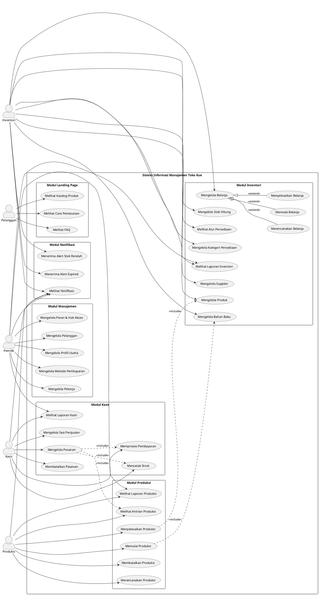

# USE CASE DIAGRAM

## Sistem Informasi Manajemen Toko Kue

### Penjelasan Diagram

Use case diagram berikut menggambarkan keseluruhan interaksi antara aktor dengan Sistem Informasi Manajemen Toko Kue. Diagram ini melibatkan lima aktor utama, yaitu Pemilik, Kasir, Produksi, Inventori, dan Pelanggan. Setiap aktor memiliki hak akses yang berbeda-beda sesuai dengan tanggung jawab dan kebutuhan operasional masing-masing, yang telah diidentifikasi melalui analisis kebutuhan sebelumnya.

Berikut adalah penjelasan peran masing-masing aktor dalam sistem:

1. Pemilik: Memiliki akses penuh ke seluruh modul sistem, terutama untuk melihat laporan, mengelola pekerja, peran, pelanggan, dan pengaturan usaha.
2. Kasir: Bertanggung jawab atas operasional penjualan, termasuk mengelola pesanan, memproses pembayaran, mencetak struk, dan mengelola sesi penjualan.
3. Produksi: Menangani perencanaan dan pelaksanaan produksi, mulai dari merencanakan, memulai, hingga menyelesaikan proses produksi.
4. Inventori: Mengelola persediaan bahan baku, produk, belanja, stok hitung, serta menerima alert terkait stok rendah dan bahan expired.
5. Pelanggan: Aktor eksternal yang dapat mengakses landing page untuk melihat katalog produk, cara pemesanan, dan FAQ.

Sistem ini dibagi ke dalam enam modul utama, yaitu Modul Kasir, Modul Produksi, Modul Inventori, Modul Manajemen, Modul Notifikasi, dan Modul Landing Page. Relasi antar use case menggunakan stereotype extend untuk menunjukkan variasi perilaku dan include untuk menunjukkan ketergantungan fungsional.

---

### Diagram Use Case (PlantUML)

---

## Daftar Use Case

| No  | Kode  | Nama Use Case                 | Aktor              | Deskripsi Singkat                                  |
| --- | ----- | ----------------------------- | ------------------ | -------------------------------------------------- |
| 1   | UC-01 | Mengelola Pesanan             | Kasir              | Membuat, mengubah, dan menghapus pesanan pelanggan |
| 2   | UC-02 | Memproses Pembayaran          | Kasir              | Menerima pembayaran DP atau lunas                  |
| 3   | UC-03 | Mencetak Struk                | Kasir              | Mencetak struk transaksi                           |
| 4   | UC-04 | Membatalkan Pesanan           | Kasir              | Membatalkan pesanan dan proses refund              |
| 5   | UC-05 | Mengelola Sesi Penjualan      | Kasir              | Membuka dan menutup sesi/shift kasir               |
| 6   | UC-06 | Melihat Laporan Kasir         | Kasir, Pemilik     | Melihat ringkasan dan laporan transaksi            |
| 7   | UC-07 | Merencanakan Produksi         | Produksi           | Membuat rencana produksi siap beli                 |
| 8   | UC-08 | Memulai Produksi              | Produksi           | Memulai proses produksi                            |
| 9   | UC-09 | Menyelesaikan Produksi        | Produksi           | Menandai produksi selesai, update stok             |
| 10  | UC-10 | Membatalkan Produksi          | Produksi           | Membatalkan rencana produksi                       |
| 11  | UC-11 | Melihat Antrian Produksi      | Produksi           | Melihat daftar pesanan yang perlu diproduksi       |
| 12  | UC-12 | Melihat Laporan Produksi      | Produksi, Pemilik  | Melihat ringkasan dan laporan produksi             |
| 13  | UC-13 | Mengelola Produk              | Inventori          | Menambah, mengubah, menghapus produk               |
| 14  | UC-14 | Mengelola Bahan Baku          | Inventori          | Mengelola data bahan baku/material                 |
| 15  | UC-15 | Mengelola Belanja             | Inventori          | Mengelola pembelian bahan baku                     |
| 16  | UC-16 | Merencanakan Belanja          | Inventori          | Membuat rencana belanja bahan baku                 |
| 17  | UC-17 | Memulai Belanja               | Inventori          | Melakukan proses belanja                           |
| 18  | UC-18 | Menyelesaikan Belanja         | Inventori          | Menyelesaikan belanja, update stok                 |
| 19  | UC-19 | Mengelola Stok Hitung         | Inventori          | Hitung stok, catat rusak/hilang                    |
| 20  | UC-20 | Melihat Alur Persediaan       | Inventori          | Tracking pergerakan bahan baku                     |
| 21  | UC-21 | Melihat Laporan Inventori     | Inventori, Pemilik | Melihat ringkasan dan laporan inventori            |
| 22  | UC-22 | Mengelola Kategori Persediaan | Inventori          | Mengelola kategori bahan baku                      |
| 23  | UC-23 | Mengelola Supplier            | Inventori          | Mengelola data supplier                            |
| 24  | UC-24 | Mengelola Pekerja             | Pemilik            | CRUD data pekerja/karyawan                         |
| 25  | UC-25 | Mengelola Peran & Hak Akses   | Pemilik            | Mengelola role dan permission                      |
| 26  | UC-26 | Mengelola Pelanggan           | Pemilik            | Mengelola data pelanggan dan poin                  |
| 27  | UC-27 | Mengelola Profil Usaha        | Pemilik            | Mengatur profil toko                               |
| 28  | UC-28 | Mengelola Metode Pembayaran   | Pemilik            | Mengatur channel pembayaran                        |
| 29  | UC-29 | Melihat Notifikasi            | Semua User         | Melihat notifikasi sistem                          |
| 30  | UC-30 | Menerima Alert Stok Rendah    | Inventori          | Notifikasi otomatis stok hampir habis              |
| 31  | UC-31 | Menerima Alert Expired        | Inventori          | Notifikasi bahan akan/sudah expired                |
| 32  | UC-32 | Melihat Katalog Produk        | Pelanggan          | Melihat daftar produk di landing page              |
| 33  | UC-33 | Melihat Cara Pemesanan        | Pelanggan          | Melihat panduan cara memesan                       |
| 34  | UC-34 | Melihat FAQ                   | Pelanggan          | Melihat pertanyaan yang sering ditanyakan          |

---

## Narasi Use Case

### UC-01: Mengelola Pesanan

| Komponen                | Deskripsi                                                                                                                                                                                                                                                                                    |
| ----------------------- | -------------------------------------------------------------------------------------------------------------------------------------------------------------------------------------------------------------------------------------------------------------------------------------------- |
| **Nama Use Case**       | Mengelola Pesanan                                                                                                                                                                                                                                                                            |
| **Kode**                | UC-01                                                                                                                                                                                                                                                                                        |
| **Aktor**               | Kasir                                                                                                                                                                                                                                                                                        |
| **Deskripsi**           | Use case ini memungkinkan kasir untuk membuat, melihat, mengubah, dan menghapus pesanan pelanggan. Pesanan dapat berupa pesanan reguler (custom dengan jadwal), pesanan kotak (box), atau siap beli (dari stok).                                                                             |
| **Pre-condition**       | - Kasir sudah login ke sistem - Kasir memiliki permission `kasir.pesanan.kelola` - Sesi penjualan aktif                                                                                                                                                                                |
| **Post-condition**      | - Pesanan tersimpan dalam database - Stok produk terupdate (untuk siap beli) - Notifikasi terkirim ke bagian terkait                                                                                                                                                                   |
| **Skenario Utama**      | 1. Kasir memilih jenis pesanan 2. Kasir memilih produk dari katalog 3. Kasir memasukkan jumlah pesanan 4. Kasir memasukkan data pelanggan (opsional) 5. Sistem menghitung total 6. Kasir memproses pembayaran 7. Sistem menyimpan pesanan 8. Sistem mengirim notifikasi |
| **Skenario Alternatif** | **A1: Pesanan Reguler/Kotak** - Kasir memasukkan jadwal pengambilan - Pesanan masuk antrian produksi  **A2: Stok Tidak Cukup** - Sistem menampilkan peringatan - Kasir menyesuaikan jumlah                                                                                 |
| **Exception**           | - E1: Produk tidak tersedia - sistem menampilkan error                                                                                                                                                                                                                                       |

---

### UC-02: Memproses Pembayaran

| Komponen                | Deskripsi                                                                                                                                                                                                                                                                                                                                  |
| ----------------------- | ------------------------------------------------------------------------------------------------------------------------------------------------------------------------------------------------------------------------------------------------------------------------------------------------------------------------------------------ |
| **Nama Use Case**       | Memproses Pembayaran                                                                                                                                                                                                                                                                                                                       |
| **Kode**                | UC-02                                                                                                                                                                                                                                                                                                                                      |
| **Aktor**               | Kasir                                                                                                                                                                                                                                                                                                                                      |
| **Deskripsi**           | Use case ini memungkinkan kasir untuk menerima pembayaran dari pelanggan. Pembayaran bisa berupa uang muka (DP) atau lunas.                                                                                                                                                                                                                |
| **Pre-condition**       | - Pesanan sudah dibuat - Kasir sudah login - Metode pembayaran aktif tersedia                                                                                                                                                                                                                                                        |
| **Post-condition**      | - Status pembayaran terupdate - Riwayat pembayaran tersimpan - Notifikasi terkirim - Poin pelanggan bertambah (jika lunas)                                                                                                                                                                                                        |
| **Skenario Utama**      | 1. Kasir memilih pesanan yang akan dibayar 2. Kasir memilih metode pembayaran 3. Kasir memasukkan jumlah yang dibayar 4. Sistem memvalidasi pembayaran 5. Sistem mengupdate status pembayaran 6. Sistem menghitung kembalian (jika cash) 7. Sistem menambah poin pelanggan (jika lunas) 8. Sistem mengirim notifikasi |
| **Skenario Alternatif** | **A1: Pembayaran DP** - Status menjadi "Uang Muka" - Pesanan menunggu pelunasan  **A2: Pelunasan** - Status menjadi "Lunas" - Poin pelanggan bertambah (Rp 10.000 = 1 poin)                                                                                                                                              |
| **Exception**           | - E1: Jumlah pembayaran kurang - sistem menampilkan error                                                                                                                                                                                                                                                                                  |

---

### UC-08: Memulai Produksi

| Komponen                | Deskripsi                                                                                                                                                                                                                                                                                                                                           |
| ----------------------- | --------------------------------------------------------------------------------------------------------------------------------------------------------------------------------------------------------------------------------------------------------------------------------------------------------------------------------------------------- |
| **Nama Use Case**       | Memulai Produksi                                                                                                                                                                                                                                                                                                                                    |
| **Kode**                | UC-08                                                                                                                                                                                                                                                                                                                                               |
| **Aktor**               | Produksi                                                                                                                                                                                                                                                                                                                                            |
| **Deskripsi**           | Use case ini memungkinkan bagian produksi untuk memulai proses produksi. Sistem akan mengurangi stok bahan baku sesuai komposisi produk.                                                                                                                                                                                                            |
| **Pre-condition**       | - Produksi sudah login - Ada rencana produksi yang akan dimulai - Bahan baku tersedia                                                                                                                                                                                                                                                         |
| **Post-condition**      | - Status produksi menjadi "Proses" - Stok bahan baku berkurang - Notifikasi terkirim                                                                                                                                                                                                                                                          |
| **Skenario Utama**      | 1. Produksi melihat antrian produksi 2. Produksi memilih produksi yang akan dimulai 3. Sistem memeriksa ketersediaan bahan baku 4. Produksi menentukan pekerja yang terlibat 5. Produksi mengkonfirmasi mulai produksi 6. Sistem mengurangi stok bahan baku 7. Sistem mengupdate status produksi 8. Sistem mengirim notifikasi |
| **Skenario Alternatif** | **A1: Bahan Baku Kurang** - Sistem menampilkan peringatan - Produksi dapat menyesuaikan jumlah                                                                                                                                                                                                                                                |
| **Exception**           | - E1: Bahan baku habis - produksi tidak dapat dimulai                                                                                                                                                                                                                                                                                               |

---

### UC-18: Menyelesaikan Belanja

| Komponen                | Deskripsi                                                                                                                                                                                                                                                                                                                                                                                                                    |
| ----------------------- | ---------------------------------------------------------------------------------------------------------------------------------------------------------------------------------------------------------------------------------------------------------------------------------------------------------------------------------------------------------------------------------------------------------------------------- |
| **Nama Use Case**       | Menyelesaikan Belanja                                                                                                                                                                                                                                                                                                                                                                                                        |
| **Kode**                | UC-18                                                                                                                                                                                                                                                                                                                                                                                                                        |
| **Aktor**               | Inventori                                                                                                                                                                                                                                                                                                                                                                                                                    |
| **Deskripsi**           | Use case ini memungkinkan bagian inventori untuk menyelesaikan proses belanja bahan baku. Sistem akan menambah stok bahan baku sesuai dengan yang dibeli.                                                                                                                                                                                                                                                                    |
| **Pre-condition**       | - Inventori sudah login - Ada belanja dengan status "Proses" - Permission `inventori.belanja.mulai`                                                                                                                                                                                                                                                                                                                    |
| **Post-condition**      | - Status belanja menjadi "Selesai" - Stok bahan baku bertambah - Batch baru terbuat - Notifikasi terkirim                                                                                                                                                                                                                                                                                                           |
| **Skenario Utama**      | 1. Inventori melihat daftar belanja yang sedang diproses 2. Inventori memilih belanja yang akan diselesaikan 3. Inventori mengisi jumlah aktual yang dibeli 4. Inventori mengisi harga aktual 5. Inventori mengisi tanggal expired (jika ada) 6. Sistem membuat batch baru untuk setiap bahan 7. Sistem mengupdate stok bahan baku 8. Sistem mengupdate status belanja 9. Sistem mengirim notifikasi |
| **Skenario Alternatif** | **A1: Jumlah Aktual Berbeda** - Sistem mencatat selisih rencana vs aktual - Grand total terupdate                                                                                                                                                                                                                                                                                                                      |
| **Exception**           | - E1: Detail kosong - sistem menampilkan error                                                                                                                                                                                                                                                                                                                                                                               |

---

### UC-19: Mengelola Stok Hitung

| Komponen                | Deskripsi                                                                                                                                                                                                                                                                                                                                                             |
| ----------------------- | --------------------------------------------------------------------------------------------------------------------------------------------------------------------------------------------------------------------------------------------------------------------------------------------------------------------------------------------------------------------- |
| **Nama Use Case**       | Mengelola Stok Hitung                                                                                                                                                                                                                                                                                                                                                 |
| **Kode**                | UC-19                                                                                                                                                                                                                                                                                                                                                                 |
| **Aktor**               | Inventori                                                                                                                                                                                                                                                                                                                                                             |
| **Deskripsi**           | Use case ini memungkinkan bagian inventori untuk melakukan penghitungan stok fisik, mencatat bahan rusak, dan mencatat bahan hilang. Ini penting untuk menjaga akurasi data inventori.                                                                                                                                                                                |
| **Pre-condition**       | - Inventori sudah login - Permission `inventori.hitung.kelola`                                                                                                                                                                                                                                                                                                     |
| **Post-condition**      | - Stok bahan baku terupdate - Riwayat aksi tercatat - Log inventori tersimpan - Notifikasi terkirim                                                                                                                                                                                                                                                          |
| **Skenario Utama**      | 1. Inventori membuat rencana hitung (pilih aksi: hitung/rusak/hilang) 2. Inventori memilih bahan baku yang akan dihitung 3. Inventori memulai proses hitung 4. Inventori memasukkan jumlah aktual/rusak/hilang 5. Sistem menghitung selisih 6. Sistem mengupdate stok bahan baku 7. Sistem menyimpan log inventori 8. Sistem mengirim notifikasi |
| **Skenario Alternatif** | **A1: Catat Rusak** - Stok berkurang sesuai jumlah rusak  **A2: Catat Hilang** - Stok berkurang sesuai jumlah hilang                                                                                                                                                                                                                                      |
| **Exception**           | - E1: Jumlah melebihi stok - sistem menampilkan error                                                                                                                                                                                                                                                                                                                 |

---

### UC-26: Mengelola Pelanggan

| Komponen                | Deskripsi                                                                                                                                                                                                                                                       |
| ----------------------- | --------------------------------------------------------------------------------------------------------------------------------------------------------------------------------------------------------------------------------------------------------------- |
| **Nama Use Case**       | Mengelola Pelanggan                                                                                                                                                                                                                                             |
| **Kode**                | UC-26                                                                                                                                                                                                                                                           |
| **Aktor**               | Pemilik                                                                                                                                                                                                                                                         |
| **Deskripsi**           | Use case ini memungkinkan pemilik untuk mengelola data pelanggan termasuk informasi kontak dan poin loyalitas.                                                                                                                                                  |
| **Pre-condition**       | - Pemilik sudah login - Permission `manajemen.pelanggan.kelola`                                                                                                                                                                                              |
| **Post-condition**      | - Data pelanggan tersimpan/terupdate - Riwayat poin tersedia                                                                                                                                                                                                 |
| **Skenario Utama**      | 1. Pemilik mengakses menu Pelanggan 2. Pemilik dapat melihat daftar pelanggan 3. Pemilik dapat menambah pelanggan baru 4. Pemilik dapat mengubah data pelanggan 5. Pemilik dapat melihat riwayat poin 6. Pemilik dapat melihat riwayat transaksi |
| **Skenario Alternatif** | **A1: Pelanggan dari Transaksi** - Pelanggan otomatis ditambahkan saat transaksi dengan nomor telepon baru                                                                                                                                                   |
| **Exception**           | - E1: Nomor telepon duplikat - sistem menampilkan error                                                                                                                                                                                                         |

---

### UC-30: Menerima Alert Stok Rendah

| Komponen           | Deskripsi                                                                                                                                                                                                                                     |
| ------------------ | --------------------------------------------------------------------------------------------------------------------------------------------------------------------------------------------------------------------------------------------- |
| **Nama Use Case**  | Menerima Alert Stok Rendah                                                                                                                                                                                                                    |
| **Kode**           | UC-30                                                                                                                                                                                                                                         |
| **Aktor**          | Inventori                                                                                                                                                                                                                                     |
| **Deskripsi**      | Use case ini adalah fitur otomatis yang mengirim notifikasi ketika stok bahan baku mencapai batas minimum.                                                                                                                                    |
| **Pre-condition**  | - Scheduled command aktif (08:00 setiap hari) - Bahan baku memiliki nilai minimum yang diset                                                                                                                                               |
| **Post-condition** | - Notifikasi terkirim ke user dengan permission inventori - Status bahan diupdate menjadi "Hampir Habis"                                                                                                                                   |
| **Skenario Utama** | 1. Sistem menjalankan pengecekan otomatis (08:00) 2. Sistem memeriksa stok vs minimum setiap bahan 3. Jika stok <= minimum, sistem mengupdate status 4. Sistem membuat notifikasi alert 5. Notifikasi dikirim ke bagian inventori |
| **Trigger**        | Scheduled command `inventory:check-alerts`                                                                                                                                                                                                    |
