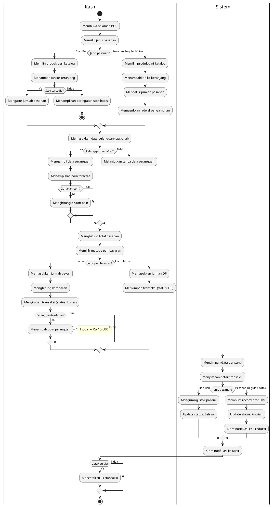
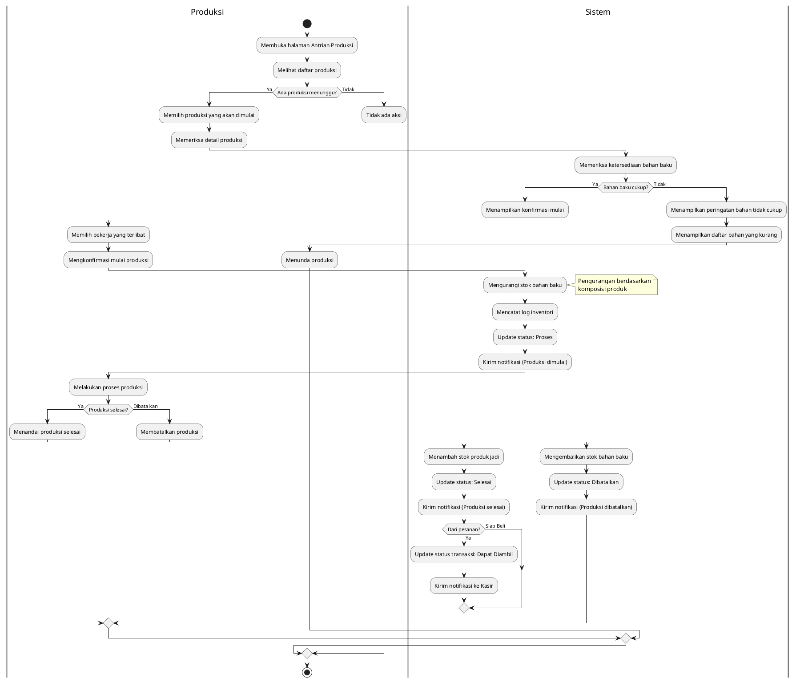
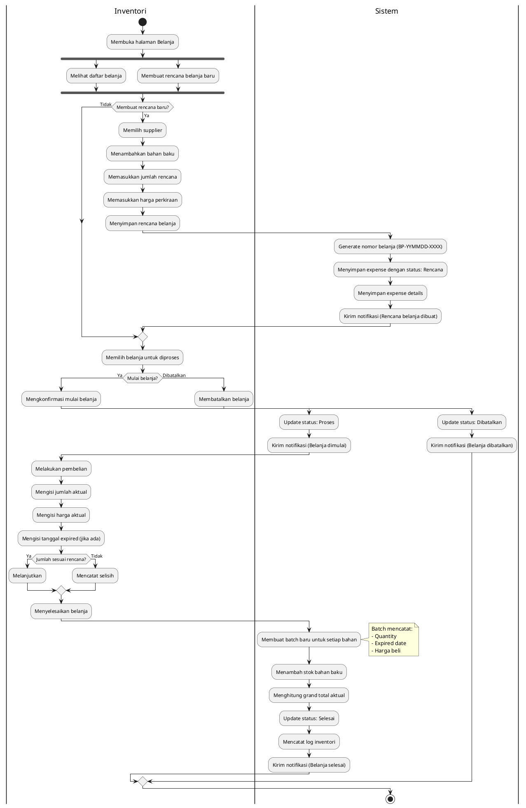
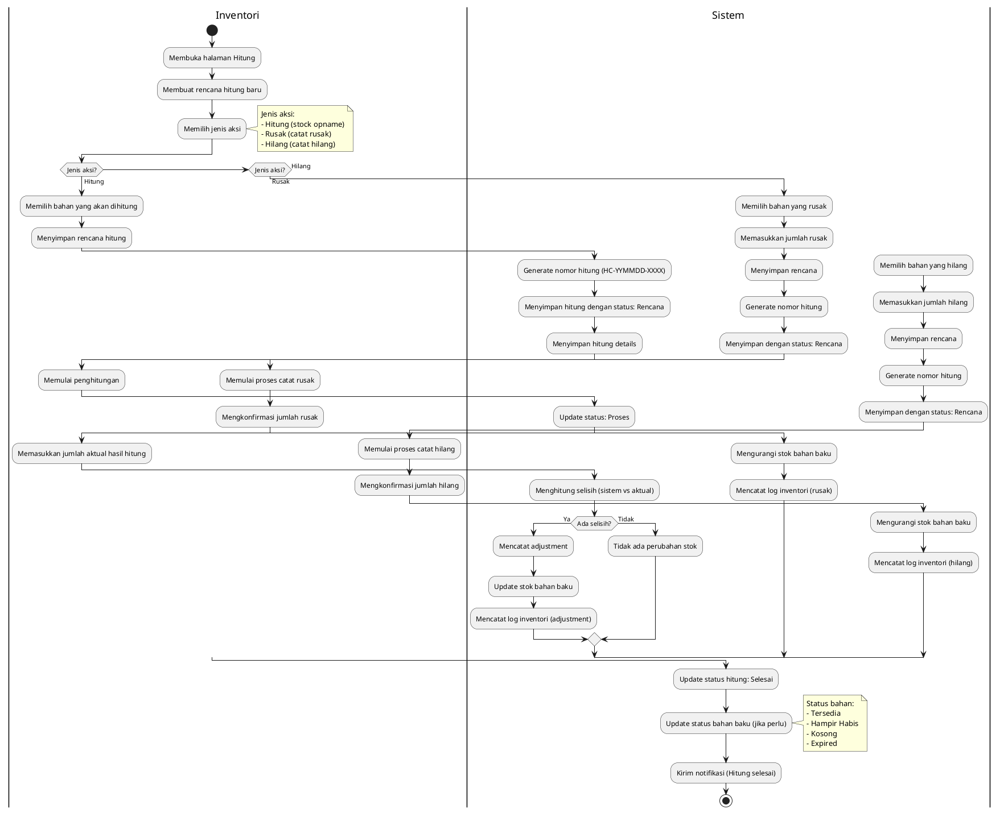
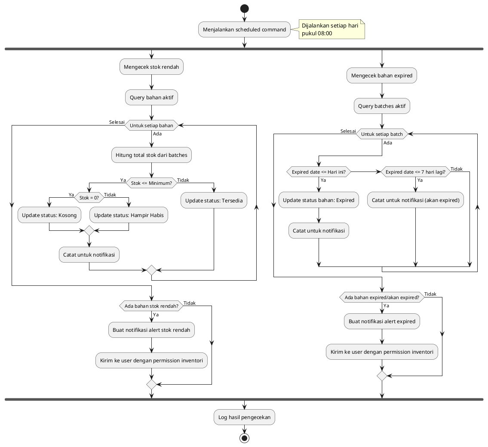
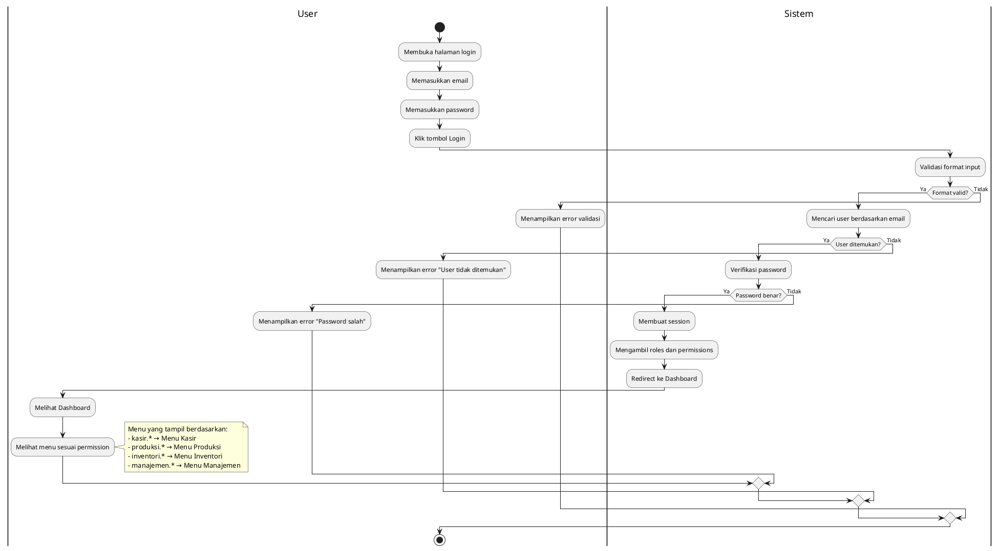
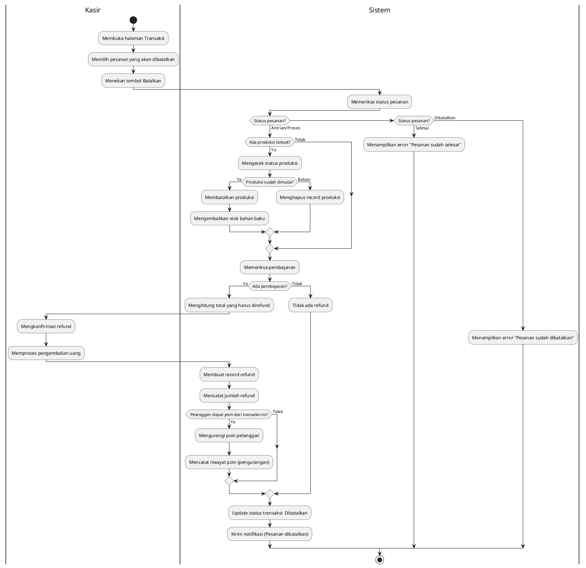
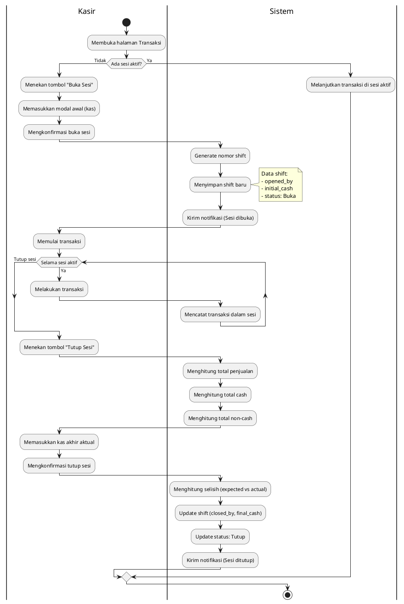
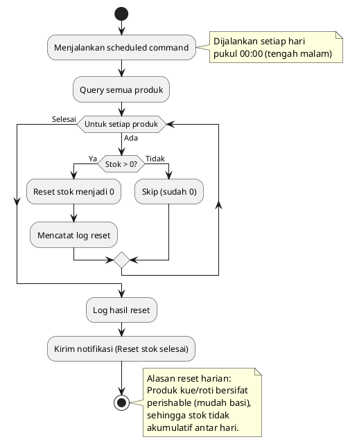

# ACTIVITY DIAGRAM

## Sistem Informasi Manajemen Toko Kue

---

## 1. Activity Diagram: Proses Transaksi Penjualan

---

## 2. Activity Diagram: Proses Produksi

---

## 3. Activity Diagram: Proses Belanja Bahan Baku

---

## 4. Activity Diagram: Proses Hitung Stok

---

## 5. Activity Diagram: Proses Notifikasi Otomatis (Alert Stok & Expired)

---

## 6. Activity Diagram: Proses Login dan Otorisasi

---

## 7. Activity Diagram: Proses Pembatalan Pesanan dengan Refund

---

## 8. Activity Diagram: Proses Sesi Penjualan (Shift)

---

## 9. Activity Diagram: Proses Reset Stok Produk Harian

