# ACTIVITY DIAGRAM

## Sistem Informasi Manajemen Toko Kue

---

## Daftar Activity Diagram

| No  | Nama Diagram                            | Modul       | Aktor Utama |
| --- | --------------------------------------- | ----------- | ----------- |
| 1   | Proses Login dan Otorisasi              | Autentikasi | User        |
| 2   | Proses Aktivasi Akun                    | Autentikasi | Pekerja     |
| 3   | Proses Transaksi Penjualan              | Kasir       | Kasir       |
| 4   | Proses Sesi Penjualan (Shift)           | Kasir       | Kasir       |
| 5   | Proses Pelunasan Pembayaran             | Kasir       | Kasir       |
| 6   | Proses Pembatalan Pesanan dengan Refund | Kasir       | Kasir       |
| 7   | Proses Produksi                         | Produksi    | Produksi    |
| 8   | Proses Belanja Bahan Baku               | Inventori   | Inventori   |
| 9   | Proses Hitung Stok                      | Inventori   | Inventori   |
| 10  | Proses Mengelola Produk                 | Inventori   | Inventori   |
| 11  | Proses Mengelola Bahan Baku             | Inventori   | Inventori   |
| 12  | Proses Mengelola Kategori Produk        | Inventori   | Inventori   |
| 13  | Proses Mengelola Satuan                 | Inventori   | Inventori   |
| 14  | Proses Mengelola Supplier               | Inventori   | Inventori   |
| 15  | Proses Mengelola Pekerja                | Manajemen   | Pemilik     |
| 16  | Proses Mengelola Peran                  | Manajemen   | Pemilik     |
| 17  | Proses Mengelola Pelanggan              | Manajemen   | Pemilik     |
| 18  | Proses Mengelola Metode Pembayaran      | Manajemen   | Pemilik     |
| 19  | Proses Mengelola Profil Usaha           | Manajemen   | Pemilik     |
| 20  | Proses Notifikasi Otomatis              | Notifikasi  | Sistem      |
| 21  | Proses Reset Stok Produk Harian         | Sistem      | Sistem      |

---

## 1. Activity Diagram: Proses Login dan Otorisasi

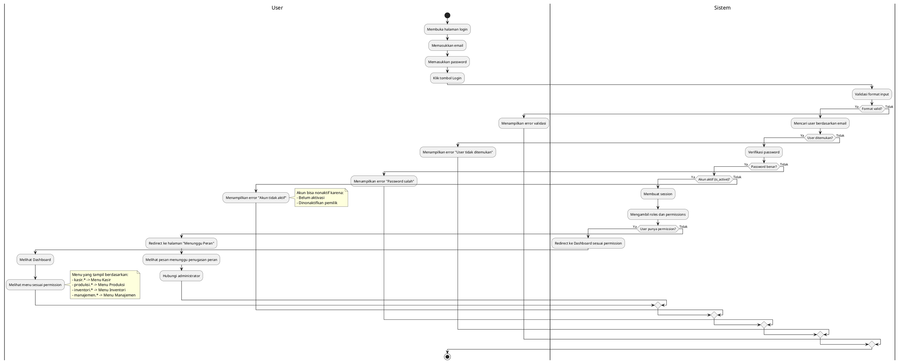
```plantuml
@startuml Activity Diagram - Login dan Otorisasi

|User|
start
:Membuka halaman login;
:Memasukkan email;
:Memasukkan password;
:Klik tombol Login;

|Sistem|
:Validasi format input;

if (Format valid?) then (Ya)
    :Mencari user berdasarkan email;

    if (User ditemukan?) then (Ya)
        :Verifikasi password;

        if (Password benar?) then (Ya)
            if (Akun aktif (is_active)?) then (Ya)
                :Membuat session;
                :Mengambil roles dan permissions;

                if (User punya permission?) then (Ya)
                    :Redirect ke Dashboard sesuai permission;

                    |User|
                    :Melihat Dashboard;
                    :Melihat menu sesuai permission;
                    note right
                      Menu yang tampil berdasarkan:
                      - kasir.* -> Menu Kasir
                      - produksi.* -> Menu Produksi
                      - inventori.* -> Menu Inventori
                      - manajemen.* -> Menu Manajemen
                    end note
                else (Tidak)
                    :Redirect ke halaman "Menunggu Peran";
                    |User|
                    :Melihat pesan menunggu penugasan peran;
                    :Hubungi administrator;
                endif

            else (Tidak)
                :Menampilkan error "Akun tidak aktif";
                note right
                  Akun bisa nonaktif karena:
                  - Belum aktivasi
                  - Dinonaktifkan pemilik
                end note
            endif

        else (Tidak)
            :Menampilkan error "Password salah";
        endif

    else (Tidak)
        :Menampilkan error "User tidak ditemukan";
    endif

else (Tidak)
    :Menampilkan error validasi;
endif

stop

@enduml
```

---

## 2. Activity Diagram: Proses Aktivasi Akun

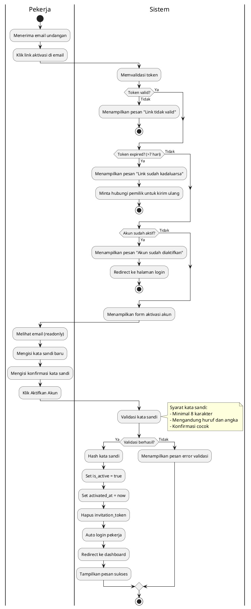
```plantuml
@startuml Activity Diagram - Proses Aktivasi Akun Pekerja

|Pekerja|
start
:Menerima email undangan;
:Klik link aktivasi di email;

|Sistem|
:Memvalidasi token;

if (Token valid?) then (Tidak)
    :Menampilkan pesan "Link tidak valid";
    stop
else (Ya)
endif

if (Token expired? (>7 hari)) then (Ya)
    :Menampilkan pesan "Link sudah kadaluarsa";
    :Minta hubungi pemilik untuk kirim ulang;
    stop
else (Tidak)
endif

if (Akun sudah aktif?) then (Ya)
    :Menampilkan pesan "Akun sudah diaktifkan";
    :Redirect ke halaman login;
    stop
else (Tidak)
endif

:Menampilkan form aktivasi akun;

|Pekerja|
:Melihat email (readonly);
:Mengisi kata sandi baru;
:Mengisi konfirmasi kata sandi;
:Klik Aktifkan Akun;

|Sistem|
:Validasi kata sandi;
note right
  Syarat kata sandi:
  - Minimal 8 karakter
  - Mengandung huruf dan angka
  - Konfirmasi cocok
end note

if (Validasi berhasil?) then (Ya)
    :Hash kata sandi;
    :Set is_active = true;
    :Set activated_at = now;
    :Hapus invitation_token;
    :Auto login pekerja;
    :Redirect ke dashboard;
    :Tampilkan pesan sukses;
else (Tidak)
    :Menampilkan pesan error validasi;
endif

stop

@enduml
```

---

## 3. Activity Diagram: Proses Transaksi Penjualan

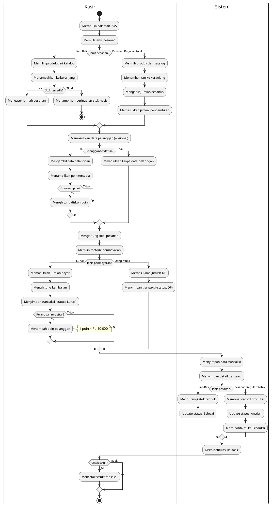
```plantuml
@startuml Activity Diagram - Proses Transaksi Penjualan

|Kasir|
start
:Membuka halaman POS;
:Memilih jenis pesanan;

if (Jenis pesanan?) then (Siap Beli)
    :Memilih produk dari katalog;
    :Menambahkan ke keranjang;

    if (Stok tersedia?) then (Ya)
        :Mengatur jumlah pesanan;
    else (Tidak)
        :Menampilkan peringatan stok habis;
        stop
    endif

else (Pesanan Reguler/Kotak)
    :Memilih produk dari katalog;
    :Menambahkan ke keranjang;
    :Mengatur jumlah pesanan;
    :Memasukkan jadwal pengambilan;
endif

:Memasukkan data pelanggan (opsional);

if (Pelanggan terdaftar?) then (Ya)
    :Mengambil data pelanggan;
    :Menampilkan poin tersedia;

    if (Gunakan poin?) then (Ya)
        :Menghitung diskon poin;
    else (Tidak)
    endif
else (Tidak)
    :Melanjutkan tanpa data pelanggan;
endif

:Menghitung total pesanan;
:Memilih metode pembayaran;

if (Jenis pembayaran?) then (Lunas)
    :Memasukkan jumlah bayar;
    :Menghitung kembalian;
    :Menyimpan transaksi (status: Lunas);

    if (Pelanggan terdaftar?) then (Ya)
        :Menambah poin pelanggan;
        note right
          1 poin = Rp 10.000
        end note
    else (Tidak)
    endif

else (Uang Muka)
    :Memasukkan jumlah DP;
    :Menyimpan transaksi (status: DP);
endif

|Sistem|
:Menyimpan data transaksi;
:Menyimpan detail transaksi;

if (Jenis pesanan?) then (Siap Beli)
    :Mengurangi stok produk;
    :Update status: Selesai;
else (Pesanan Reguler/Kotak)
    :Membuat record produksi;
    :Update status: Antrian;
    :Kirim notifikasi ke Produksi;
endif

:Kirim notifikasi ke Kasir;

|Kasir|
if (Cetak struk?) then (Ya)
    :Mencetak struk transaksi;
else (Tidak)
endif

stop

@enduml
```

---

## 4. Activity Diagram: Proses Sesi Penjualan (Shift)

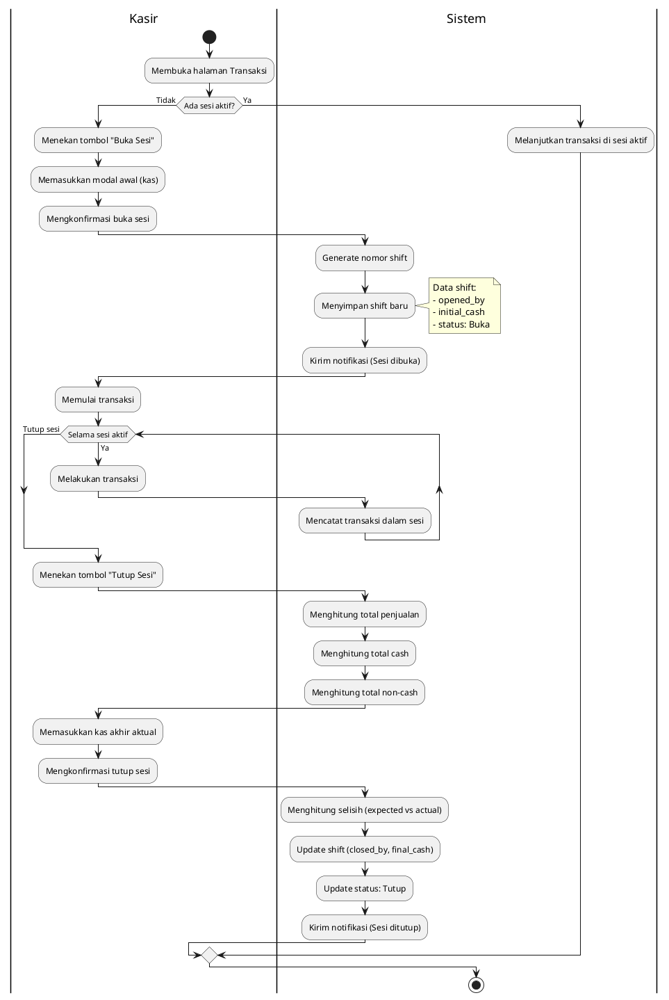
```plantuml
@startuml Activity Diagram - Sesi Penjualan (Shift)

|Kasir|
start
:Membuka halaman Transaksi;

if (Ada sesi aktif?) then (Tidak)
    :Menekan tombol "Buka Sesi";
    :Memasukkan modal awal (kas);
    :Mengkonfirmasi buka sesi;

    |Sistem|
    :Generate nomor shift;
    :Menyimpan shift baru;
    note right
      Data shift:
      - opened_by
      - initial_cash
      - status: Buka
    end note
    :Kirim notifikasi (Sesi dibuka);

    |Kasir|
    :Memulai transaksi;

    while (Selama sesi aktif) is (Ya)
        :Melakukan transaksi;

        |Sistem|
        :Mencatat transaksi dalam sesi;
    endwhile (Tutup sesi)

    |Kasir|
    :Menekan tombol "Tutup Sesi";

    |Sistem|
    :Menghitung total penjualan;
    :Menghitung total cash;
    :Menghitung total non-cash;

    |Kasir|
    :Memasukkan kas akhir aktual;
    :Mengkonfirmasi tutup sesi;

    |Sistem|
    :Menghitung selisih (expected vs actual);
    :Update shift (closed_by, final_cash);
    :Update status: Tutup;
    :Kirim notifikasi (Sesi ditutup);

else (Ya)
    :Melanjutkan transaksi di sesi aktif;
endif

stop

@enduml
```

---

## 5. Activity Diagram: Proses Pelunasan Pembayaran

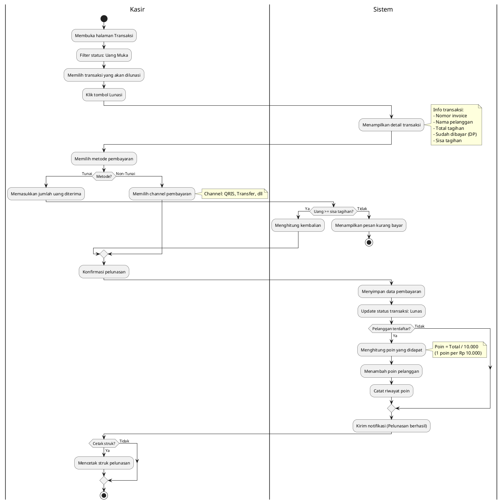
```plantuml
@startuml Activity Diagram - Proses Pelunasan Pembayaran

|Kasir|
start
:Membuka halaman Transaksi;
:Filter status: Uang Muka;

:Memilih transaksi yang akan dilunasi;
:Klik tombol Lunasi;

|Sistem|
:Menampilkan detail transaksi;
note right
  Info transaksi:
  - Nomor invoice
  - Nama pelanggan
  - Total tagihan
  - Sudah dibayar (DP)
  - Sisa tagihan
end note

|Kasir|
:Memilih metode pembayaran;

if (Metode?) then (Tunai)
    :Memasukkan jumlah uang diterima;

    |Sistem|
    if (Uang >= sisa tagihan?) then (Ya)
        :Menghitung kembalian;
    else (Tidak)
        :Menampilkan pesan kurang bayar;
        stop
    endif

else (Non-Tunai)
    |Kasir|
    :Memilih channel pembayaran;
    note right
      Channel: QRIS, Transfer, dll
    end note
endif

|Kasir|
:Konfirmasi pelunasan;

|Sistem|
:Menyimpan data pembayaran;
:Update status transaksi: Lunas;

if (Pelanggan terdaftar?) then (Ya)
    :Menghitung poin yang didapat;
    note right
      Poin = Total / 10.000
      (1 poin per Rp 10.000)
    end note
    :Menambah poin pelanggan;
    :Catat riwayat poin;
else (Tidak)
endif

:Kirim notifikasi (Pelunasan berhasil);

|Kasir|
if (Cetak struk?) then (Ya)
    :Mencetak struk pelunasan;
else (Tidak)
endif

stop

@enduml
```

---

## 6. Activity Diagram: Proses Pembatalan Pesanan dengan Refund

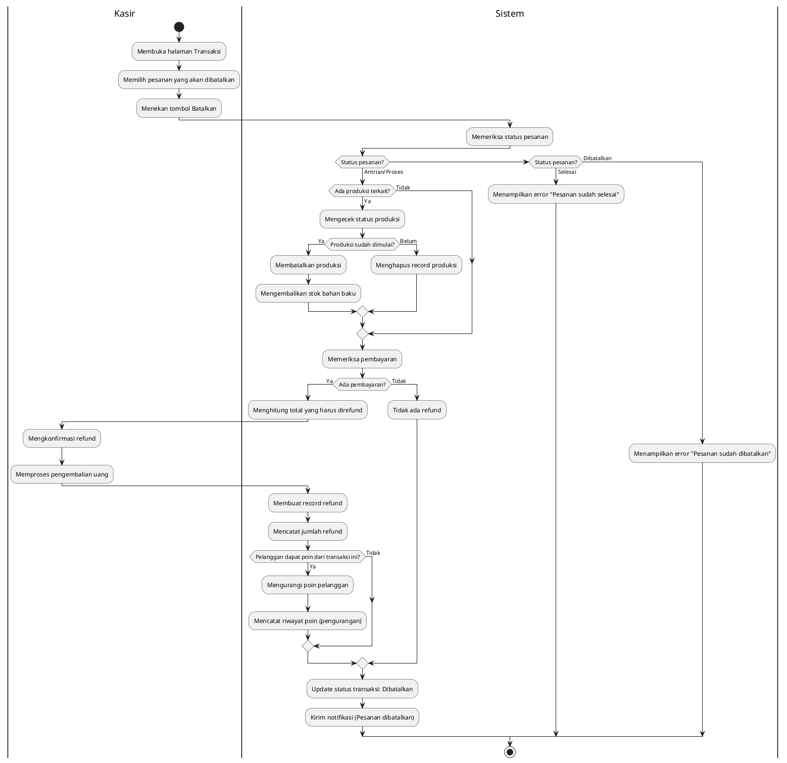
```plantuml
@startuml Activity Diagram - Pembatalan Pesanan dengan Refund

|Kasir|
start
:Membuka halaman Transaksi;
:Memilih pesanan yang akan dibatalkan;
:Menekan tombol Batalkan;

|Sistem|
:Memeriksa status pesanan;

if (Status pesanan?) then (Antrian/Proses)
    if (Ada produksi terkait?) then (Ya)
        :Mengecek status produksi;

        if (Produksi sudah dimulai?) then (Ya)
            :Membatalkan produksi;
            :Mengembalikan stok bahan baku;
        else (Belum)
            :Menghapus record produksi;
        endif
    else (Tidak)
    endif

    :Memeriksa pembayaran;

    if (Ada pembayaran?) then (Ya)
        :Menghitung total yang harus direfund;

        |Kasir|
        :Mengkonfirmasi refund;
        :Memproses pengembalian uang;

        |Sistem|
        :Membuat record refund;
        :Mencatat jumlah refund;

        if (Pelanggan dapat poin dari transaksi ini?) then (Ya)
            :Mengurangi poin pelanggan;
            :Mencatat riwayat poin (pengurangan);
        else (Tidak)
        endif

    else (Tidak)
        :Tidak ada refund;
    endif

    :Update status transaksi: Dibatalkan;
    :Kirim notifikasi (Pesanan dibatalkan);

elseif (Status pesanan?) then (Selesai)
    :Menampilkan error "Pesanan sudah selesai";
else (Dibatalkan)
    :Menampilkan error "Pesanan sudah dibatalkan";
endif

stop

@enduml
```

---

## 7. Activity Diagram: Proses Produksi

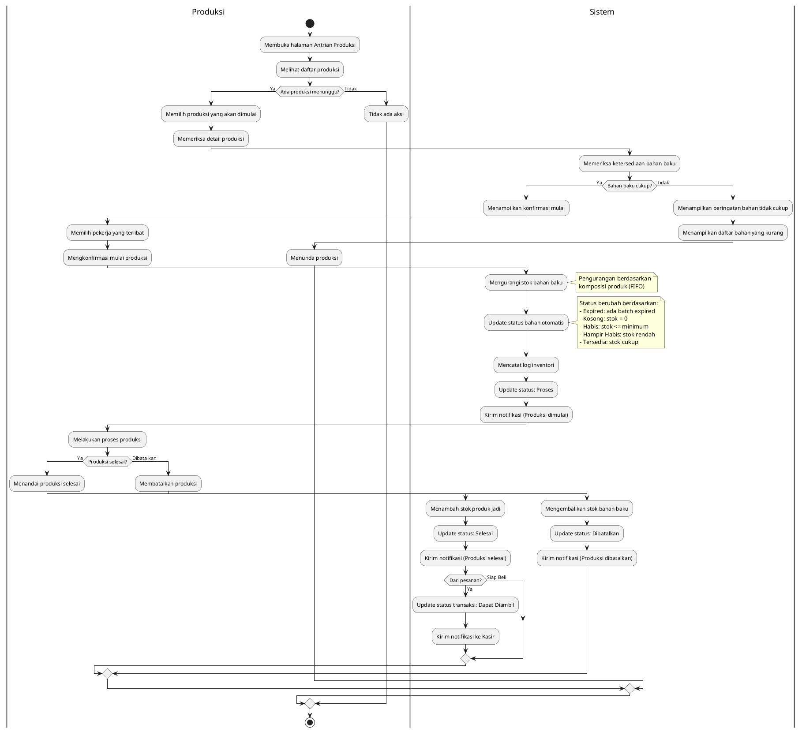
```plantuml
@startuml Activity Diagram - Proses Produksi

|Produksi|
start
:Membuka halaman Antrian Produksi;
:Melihat daftar produksi;

if (Ada produksi menunggu?) then (Ya)
    :Memilih produksi yang akan dimulai;
    :Memeriksa detail produksi;

    |Sistem|
    :Memeriksa ketersediaan bahan baku;

    if (Bahan baku cukup?) then (Ya)
        :Menampilkan konfirmasi mulai;

        |Produksi|
        :Memilih pekerja yang terlibat;
        :Mengkonfirmasi mulai produksi;

        |Sistem|
        :Mengurangi stok bahan baku;
        note right
          Pengurangan berdasarkan
          komposisi produk (FIFO)
        end note
        :Update status bahan otomatis;
        note right
          Status berubah berdasarkan:
          - Expired: ada batch expired
          - Kosong: stok = 0
          - Habis: stok <= minimum
          - Hampir Habis: stok rendah
          - Tersedia: stok cukup
        end note
        :Mencatat log inventori;
        :Update status: Proses;
        :Kirim notifikasi (Produksi dimulai);

        |Produksi|
        :Melakukan proses produksi;

        if (Produksi selesai?) then (Ya)
            :Menandai produksi selesai;

            |Sistem|
            :Menambah stok produk jadi;
            :Update status: Selesai;
            :Kirim notifikasi (Produksi selesai);

            if (Dari pesanan?) then (Ya)
                :Update status transaksi: Dapat Diambil;
                :Kirim notifikasi ke Kasir;
            else (Siap Beli)
            endif

        else (Dibatalkan)
            |Produksi|
            :Membatalkan produksi;

            |Sistem|
            :Mengembalikan stok bahan baku;
            :Update status: Dibatalkan;
            :Kirim notifikasi (Produksi dibatalkan);
        endif

    else (Tidak)
        |Sistem|
        :Menampilkan peringatan bahan tidak cukup;
        :Menampilkan daftar bahan yang kurang;

        |Produksi|
        :Menunda produksi;
    endif

else (Tidak)
    :Tidak ada aksi;
endif

stop

@enduml
```

---

## 8. Activity Diagram: Proses Belanja Bahan Baku

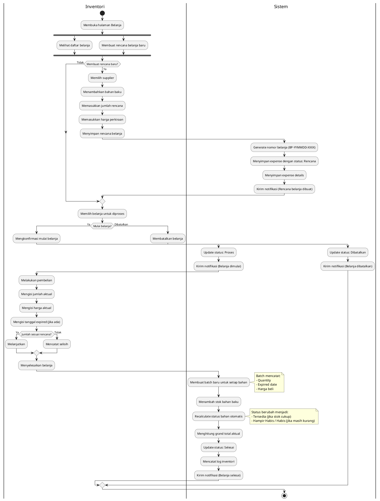
```plantuml
@startuml Activity Diagram - Proses Belanja Bahan Baku

|Inventori|
start
:Membuka halaman Belanja;

fork
    :Melihat daftar belanja;
fork again
    :Membuat rencana belanja baru;
end fork

if (Membuat rencana baru?) then (Ya)
    :Memilih supplier;
    :Menambahkan bahan baku;
    :Memasukkan jumlah rencana;
    :Memasukkan harga perkiraan;
    :Menyimpan rencana belanja;

    |Sistem|
    :Generate nomor belanja (BP-YYMMDD-XXXX);
    :Menyimpan expense dengan status: Rencana;
    :Menyimpan expense details;
    :Kirim notifikasi (Rencana belanja dibuat);

else (Tidak)
endif

|Inventori|
:Memilih belanja untuk diproses;

if (Mulai belanja?) then (Ya)
    :Mengkonfirmasi mulai belanja;

    |Sistem|
    :Update status: Proses;
    :Kirim notifikasi (Belanja dimulai);

    |Inventori|
    :Melakukan pembelian;
    :Mengisi jumlah aktual;
    :Mengisi harga aktual;
    :Mengisi tanggal expired (jika ada);

    if (Jumlah sesuai rencana?) then (Ya)
        :Melanjutkan;
    else (Tidak)
        :Mencatat selisih;
    endif

    :Menyelesaikan belanja;

    |Sistem|
    :Membuat batch baru untuk setiap bahan;
    note right
      Batch mencatat:
      - Quantity
      - Expired date
      - Harga beli
    end note
    :Menambah stok bahan baku;
    :Recalculate status bahan otomatis;
    note right
      Status berubah menjadi:
      - Tersedia (jika stok cukup)
      - Hampir Habis / Habis (jika masih kurang)
    end note
    :Menghitung grand total aktual;
    :Update status: Selesai;
    :Mencatat log inventori;
    :Kirim notifikasi (Belanja selesai);

else (Dibatalkan)
    |Inventori|
    :Membatalkan belanja;

    |Sistem|
    :Update status: Dibatalkan;
    :Kirim notifikasi (Belanja dibatalkan);
endif

stop

@enduml
```

---

## 9. Activity Diagram: Proses Hitung Stok

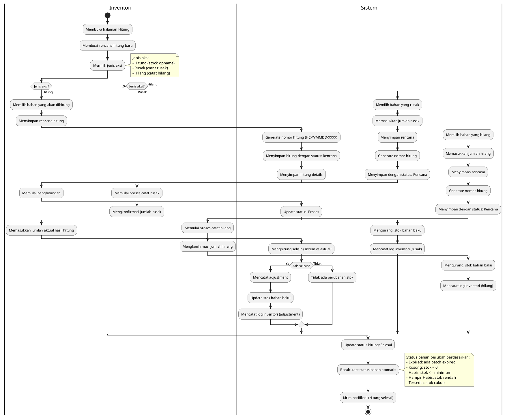
```plantuml
@startuml Activity Diagram - Proses Hitung Stok

|Inventori|
start
:Membuka halaman Hitung;
:Membuat rencana hitung baru;

:Memilih jenis aksi;
note right
  Jenis aksi:
  - Hitung (stock opname)
  - Rusak (catat rusak)
  - Hilang (catat hilang)
end note

if (Jenis aksi?) then (Hitung)
    :Memilih bahan yang akan dihitung;
    :Menyimpan rencana hitung;

    |Sistem|
    :Generate nomor hitung (HC-YYMMDD-XXXX);
    :Menyimpan hitung dengan status: Rencana;
    :Menyimpan hitung details;

    |Inventori|
    :Memulai penghitungan;

    |Sistem|
    :Update status: Proses;

    |Inventori|
    :Memasukkan jumlah aktual hasil hitung;

    |Sistem|
    :Menghitung selisih (sistem vs aktual);

    if (Ada selisih?) then (Ya)
        :Mencatat adjustment;
        :Update stok bahan baku;
        :Mencatat log inventori (adjustment);
    else (Tidak)
        :Tidak ada perubahan stok;
    endif

elseif (Jenis aksi?) then (Rusak)
    :Memilih bahan yang rusak;
    :Memasukkan jumlah rusak;
    :Menyimpan rencana;

    |Sistem|
    :Generate nomor hitung;
    :Menyimpan dengan status: Rencana;

    |Inventori|
    :Memulai proses catat rusak;
    :Mengkonfirmasi jumlah rusak;

    |Sistem|
    :Mengurangi stok bahan baku;
    :Mencatat log inventori (rusak);

else (Hilang)
    :Memilih bahan yang hilang;
    :Memasukkan jumlah hilang;
    :Menyimpan rencana;

    |Sistem|
    :Generate nomor hitung;
    :Menyimpan dengan status: Rencana;

    |Inventori|
    :Memulai proses catat hilang;
    :Mengkonfirmasi jumlah hilang;

    |Sistem|
    :Mengurangi stok bahan baku;
    :Mencatat log inventori (hilang);
endif

|Sistem|
:Update status hitung: Selesai;
:Recalculate status bahan otomatis;
note right
  Status bahan berubah berdasarkan:
  - Expired: ada batch expired
  - Kosong: stok = 0
  - Habis: stok <= minimum
  - Hampir Habis: stok rendah
  - Tersedia: stok cukup
end note
:Kirim notifikasi (Hitung selesai);

stop

@enduml
```

---

## 10. Activity Diagram: Proses Mengelola Produk

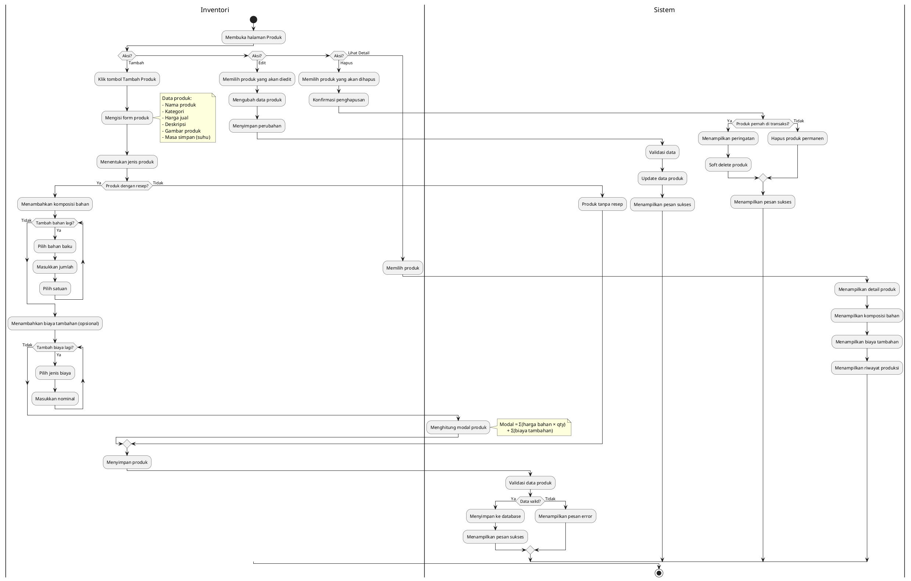
```plantuml
@startuml Activity Diagram - Proses Mengelola Produk

|Inventori|
start
:Membuka halaman Produk;

if (Aksi?) then (Tambah)
    :Klik tombol Tambah Produk;
    :Mengisi form produk;
    note right
      Data produk:
      - Nama produk
      - Kategori
      - Harga jual
      - Deskripsi
      - Gambar produk
      - Masa simpan (suhu)
    end note

    :Menentukan jenis produk;

    if (Produk dengan resep?) then (Ya)
        :Menambahkan komposisi bahan;

        while (Tambah bahan lagi?) is (Ya)
            :Pilih bahan baku;
            :Masukkan jumlah;
            :Pilih satuan;
        endwhile (Tidak)

        :Menambahkan biaya tambahan (opsional);

        while (Tambah biaya lagi?) is (Ya)
            :Pilih jenis biaya;
            :Masukkan nominal;
        endwhile (Tidak)

        |Sistem|
        :Menghitung modal produk;
        note right
          Modal = Σ(harga bahan × qty)
                + Σ(biaya tambahan)
        end note

    else (Tidak)
        :Produk tanpa resep;
    endif

    |Inventori|
    :Menyimpan produk;

    |Sistem|
    :Validasi data produk;

    if (Data valid?) then (Ya)
        :Menyimpan ke database;
        :Menampilkan pesan sukses;
    else (Tidak)
        :Menampilkan pesan error;
    endif

else if (Aksi?) then (Edit)
    |Inventori|
    :Memilih produk yang akan diedit;
    :Mengubah data produk;
    :Menyimpan perubahan;

    |Sistem|
    :Validasi data;
    :Update data produk;
    :Menampilkan pesan sukses;

else if (Aksi?) then (Hapus)
    |Inventori|
    :Memilih produk yang akan dihapus;
    :Konfirmasi penghapusan;

    |Sistem|
    if (Produk pernah di transaksi?) then (Ya)
        :Menampilkan peringatan;
        :Soft delete produk;
    else (Tidak)
        :Hapus produk permanen;
    endif
    :Menampilkan pesan sukses;

else (Lihat Detail)
    |Inventori|
    :Memilih produk;

    |Sistem|
    :Menampilkan detail produk;
    :Menampilkan komposisi bahan;
    :Menampilkan biaya tambahan;
    :Menampilkan riwayat produksi;
endif

stop

@enduml
```

---

## 11. Activity Diagram: Proses Mengelola Bahan Baku

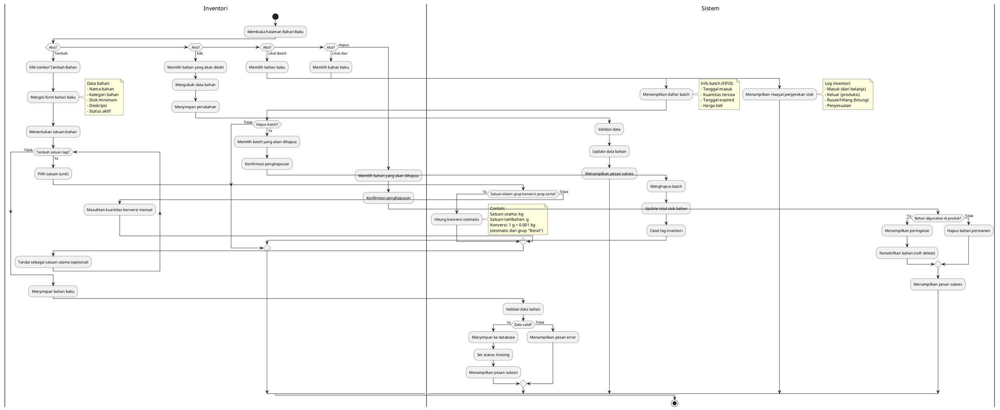
```plantuml
@startuml Activity Diagram - Proses Mengelola Bahan Baku

|Inventori|
start
:Membuka halaman Bahan Baku;

if (Aksi?) then (Tambah)
    :Klik tombol Tambah Bahan;
    :Mengisi form bahan baku;
    note right
      Data bahan:
      - Nama bahan
      - Kategori bahan
      - Stok minimum
      - Deskripsi
      - Status aktif
    end note

    :Menentukan satuan bahan;

    while (Tambah satuan lagi?) is (Ya)
        :Pilih satuan (unit);

        |Sistem|
        if (Satuan dalam grup konversi yang sama?) then (Ya)
            :Hitung konversi otomatis;
            note right
              Contoh:
              Satuan utama: kg
              Satuan tambahan: g
              Konversi: 1 g = 0.001 kg
              (otomatis dari grup "Berat")
            end note
        else (Tidak)
            |Inventori|
            :Masukkan kuantitas konversi manual;
        endif

        |Inventori|
        :Tandai sebagai satuan utama (opsional);
    endwhile (Tidak)

    :Menyimpan bahan baku;

    |Sistem|
    :Validasi data bahan;

    if (Data valid?) then (Ya)
        :Menyimpan ke database;
        :Set status: Kosong;
        :Menampilkan pesan sukses;
    else (Tidak)
        :Menampilkan pesan error;
    endif

else if (Aksi?) then (Edit)
    |Inventori|
    :Memilih bahan yang akan diedit;
    :Mengubah data bahan;
    :Menyimpan perubahan;

    |Sistem|
    :Validasi data;
    :Update data bahan;
    :Menampilkan pesan sukses;

else if (Aksi?) then (Lihat Batch)
    |Inventori|
    :Memilih bahan baku;

    |Sistem|
    :Menampilkan daftar batch;
    note right
      Info batch (FIFO):
      - Tanggal masuk
      - Kuantitas tersisa
      - Tanggal expired
      - Harga beli
    end note

    |Inventori|
    if (Hapus batch?) then (Ya)
        :Memilih batch yang akan dihapus;
        :Konfirmasi penghapusan;

        |Sistem|
        :Menghapus batch;
        :Update total stok bahan;
        :Catat log inventori;
    else (Tidak)
    endif

else if (Aksi?) then (Lihat Alur)
    |Inventori|
    :Memilih bahan baku;

    |Sistem|
    :Menampilkan riwayat pergerakan stok;
    note right
      Log inventori:
      - Masuk (dari belanja)
      - Keluar (produksi)
      - Rusak/Hilang (hitung)
      - Penyesuaian
    end note

else (Hapus)
    |Inventori|
    :Memilih bahan yang akan dihapus;
    :Konfirmasi penghapusan;

    |Sistem|
    if (Bahan digunakan di produk?) then (Ya)
        :Menampilkan peringatan;
        :Nonaktifkan bahan (soft delete);
    else (Tidak)
        :Hapus bahan permanen;
    endif
    :Menampilkan pesan sukses;
endif

stop

@enduml
```

---

## 12. Activity Diagram: Proses Mengelola Kategori Produk

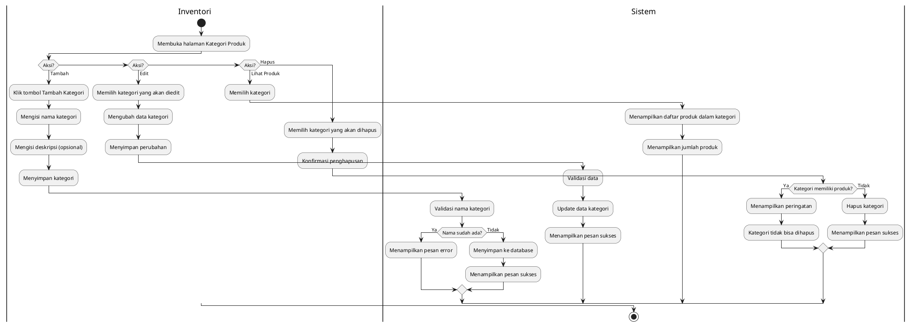
```plantuml
@startuml Activity Diagram - Proses Mengelola Kategori Produk

|Inventori|
start
:Membuka halaman Kategori Produk;

if (Aksi?) then (Tambah)
    :Klik tombol Tambah Kategori;
    :Mengisi nama kategori;
    :Mengisi deskripsi (opsional);
    :Menyimpan kategori;

    |Sistem|
    :Validasi nama kategori;

    if (Nama sudah ada?) then (Ya)
        :Menampilkan pesan error;
    else (Tidak)
        :Menyimpan ke database;
        :Menampilkan pesan sukses;
    endif

else if (Aksi?) then (Edit)
    |Inventori|
    :Memilih kategori yang akan diedit;
    :Mengubah data kategori;
    :Menyimpan perubahan;

    |Sistem|
    :Validasi data;
    :Update data kategori;
    :Menampilkan pesan sukses;

else if (Aksi?) then (Lihat Produk)
    |Inventori|
    :Memilih kategori;

    |Sistem|
    :Menampilkan daftar produk dalam kategori;
    :Menampilkan jumlah produk;

else (Hapus)
    |Inventori|
    :Memilih kategori yang akan dihapus;
    :Konfirmasi penghapusan;

    |Sistem|
    if (Kategori memiliki produk?) then (Ya)
        :Menampilkan peringatan;
        :Kategori tidak bisa dihapus;
    else (Tidak)
        :Hapus kategori;
        :Menampilkan pesan sukses;
    endif
endif

stop

@enduml
```

---

## 13. Activity Diagram: Proses Mengelola Satuan

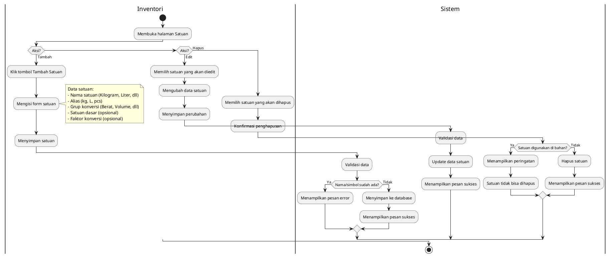
```plantuml
@startuml Activity Diagram - Proses Mengelola Satuan

|Inventori|
start
:Membuka halaman Satuan;

if (Aksi?) then (Tambah)
    :Klik tombol Tambah Satuan;
    :Mengisi form satuan;
    note right
      Data satuan:
      - Nama satuan (Kilogram, Liter, dll)
      - Alias (kg, L, pcs)
      - Grup konversi (Berat, Volume, dll)
      - Satuan dasar (opsional)
      - Faktor konversi (opsional)
    end note

    :Menyimpan satuan;

    |Sistem|
    :Validasi data;

    if (Nama/simbol sudah ada?) then (Ya)
        :Menampilkan pesan error;
    else (Tidak)
        :Menyimpan ke database;
        :Menampilkan pesan sukses;
    endif

else if (Aksi?) then (Edit)
    |Inventori|
    :Memilih satuan yang akan diedit;
    :Mengubah data satuan;
    :Menyimpan perubahan;

    |Sistem|
    :Validasi data;
    :Update data satuan;
    :Menampilkan pesan sukses;

else (Hapus)
    |Inventori|
    :Memilih satuan yang akan dihapus;
    :Konfirmasi penghapusan;

    |Sistem|
    if (Satuan digunakan di bahan?) then (Ya)
        :Menampilkan peringatan;
        :Satuan tidak bisa dihapus;
    else (Tidak)
        :Hapus satuan;
        :Menampilkan pesan sukses;
    endif
endif

stop

@enduml
```

---

## 14. Activity Diagram: Proses Mengelola Supplier

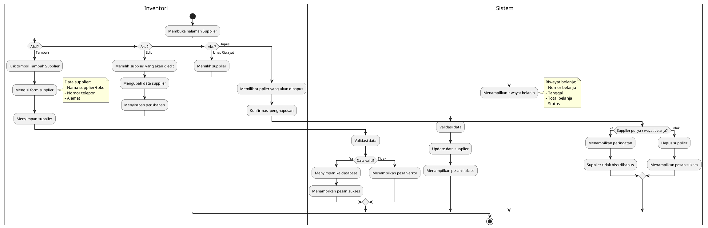
```plantuml
@startuml Activity Diagram - Proses Mengelola Supplier

|Inventori|
start
:Membuka halaman Supplier;

if (Aksi?) then (Tambah)
    :Klik tombol Tambah Supplier;
    :Mengisi form supplier;
    note right
      Data supplier:
      - Nama supplier/toko
      - Nomor telepon
      - Alamat
    end note

    :Menyimpan supplier;

    |Sistem|
    :Validasi data;

    if (Data valid?) then (Ya)
        :Menyimpan ke database;
        :Menampilkan pesan sukses;
    else (Tidak)
        :Menampilkan pesan error;
    endif

else if (Aksi?) then (Edit)
    |Inventori|
    :Memilih supplier yang akan diedit;
    :Mengubah data supplier;
    :Menyimpan perubahan;

    |Sistem|
    :Validasi data;
    :Update data supplier;
    :Menampilkan pesan sukses;

else if (Aksi?) then (Lihat Riwayat)
    |Inventori|
    :Memilih supplier;

    |Sistem|
    :Menampilkan riwayat belanja;
    note right
      Riwayat belanja:
      - Nomor belanja
      - Tanggal
      - Total belanja
      - Status
    end note

else (Hapus)
    |Inventori|
    :Memilih supplier yang akan dihapus;
    :Konfirmasi penghapusan;

    |Sistem|
    if (Supplier punya riwayat belanja?) then (Ya)
        :Menampilkan peringatan;
        :Supplier tidak bisa dihapus;
    else (Tidak)
        :Hapus supplier;
        :Menampilkan pesan sukses;
    endif
endif

stop

@enduml
```

---

## 15. Activity Diagram: Proses Mengelola Pekerja

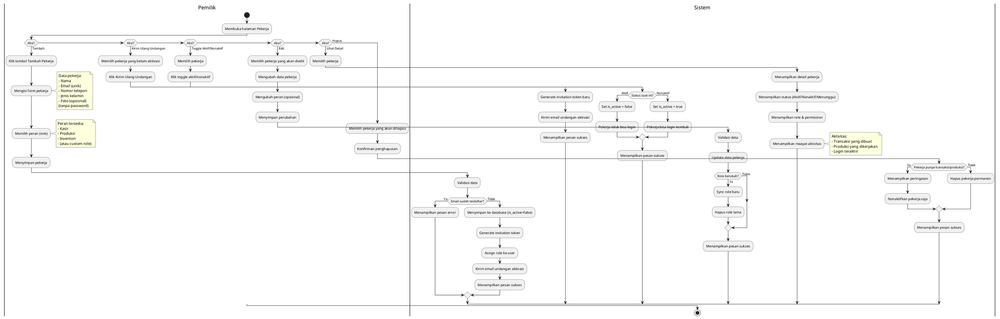
```plantuml
@startuml Activity Diagram - Proses Mengelola Pekerja

|Pemilik|
start
:Membuka halaman Pekerja;

if (Aksi?) then (Tambah)
    :Klik tombol Tambah Pekerja;
    :Mengisi form pekerja;
    note right
      Data pekerja:
      - Nama
      - Email (unik)
      - Nomor telepon
      - Jenis kelamin
      - Foto (opsional)
      (tanpa password)
    end note

    :Memilih peran (role);
    note right
      Peran tersedia:
      - Kasir
      - Produksi
      - Inventori
      - (atau custom role)
    end note

    :Menyimpan pekerja;

    |Sistem|
    :Validasi data;

    if (Email sudah terdaftar?) then (Ya)
        :Menampilkan pesan error;
    else (Tidak)
        :Menyimpan ke database (is_active=false);
        :Generate invitation token;
        :Assign role ke user;
        :Kirim email undangan aktivasi;
        :Menampilkan pesan sukses;
    endif

else if (Aksi?) then (Kirim Ulang Undangan)
    |Pemilik|
    :Memilih pekerja yang belum aktivasi;
    :Klik Kirim Ulang Undangan;

    |Sistem|
    :Generate invitation token baru;
    :Kirim email undangan aktivasi;
    :Menampilkan pesan sukses;

else if (Aksi?) then (Toggle Aktif/Nonaktif)
    |Pemilik|
    :Memilih pekerja;
    :Klik toggle aktif/nonaktif;

    |Sistem|
    if (Status saat ini?) then (Aktif)
        :Set is_active = false;
        :Pekerja tidak bisa login;
    else (Nonaktif)
        :Set is_active = true;
        :Pekerja bisa login kembali;
    endif
    :Menampilkan pesan sukses;

else if (Aksi?) then (Edit)
    |Pemilik|
    :Memilih pekerja yang akan diedit;
    :Mengubah data pekerja;
    :Mengubah peran (opsional);
    :Menyimpan perubahan;

    |Sistem|
    :Validasi data;
    :Update data pekerja;

    if (Role berubah?) then (Ya)
        :Sync role baru;
        :Hapus role lama;
    else (Tidak)
    endif

    :Menampilkan pesan sukses;

else if (Aksi?) then (Lihat Detail)
    |Pemilik|
    :Memilih pekerja;

    |Sistem|
    :Menampilkan detail pekerja;
    :Menampilkan status (Aktif/Nonaktif/Menunggu);
    :Menampilkan role & permission;
    :Menampilkan riwayat aktivitas;
    note right
      Aktivitas:
      - Transaksi yang dibuat
      - Produksi yang dikerjakan
      - Login terakhir
    end note

else (Hapus)
    |Pemilik|
    :Memilih pekerja yang akan dihapus;
    :Konfirmasi penghapusan;

    |Sistem|
    if (Pekerja punya transaksi/produksi?) then (Ya)
        :Menampilkan peringatan;
        :Nonaktifkan pekerja saja;
    else (Tidak)
        :Hapus pekerja permanen;
    endif
    :Menampilkan pesan sukses;
endif

stop

@enduml
```

---

## 16. Activity Diagram: Proses Mengelola Peran

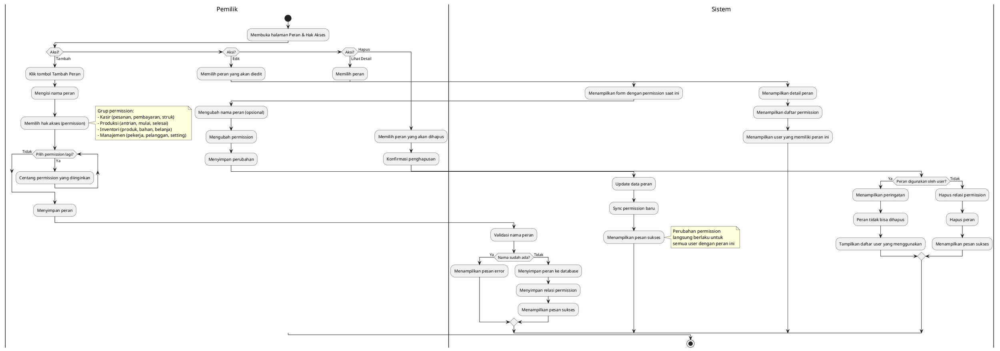
```plantuml
@startuml Activity Diagram - Proses Mengelola Peran

|Pemilik|
start
:Membuka halaman Peran & Hak Akses;

if (Aksi?) then (Tambah)
    :Klik tombol Tambah Peran;
    :Mengisi nama peran;

    :Memilih hak akses (permission);
    note right
      Grup permission:
      - Kasir (pesanan, pembayaran, struk)
      - Produksi (antrian, mulai, selesai)
      - Inventori (produk, bahan, belanja)
      - Manajemen (pekerja, pelanggan, setting)
    end note

    while (Pilih permission lagi?) is (Ya)
        :Centang permission yang diinginkan;
    endwhile (Tidak)

    :Menyimpan peran;

    |Sistem|
    :Validasi nama peran;

    if (Nama sudah ada?) then (Ya)
        :Menampilkan pesan error;
    else (Tidak)
        :Menyimpan peran ke database;
        :Menyimpan relasi permission;
        :Menampilkan pesan sukses;
    endif

else if (Aksi?) then (Edit)
    |Pemilik|
    :Memilih peran yang akan diedit;

    |Sistem|
    :Menampilkan form dengan permission saat ini;

    |Pemilik|
    :Mengubah nama peran (opsional);
    :Mengubah permission;
    :Menyimpan perubahan;

    |Sistem|
    :Update data peran;
    :Sync permission baru;
    :Menampilkan pesan sukses;

    note right
      Perubahan permission
      langsung berlaku untuk
      semua user dengan peran ini
    end note

else if (Aksi?) then (Lihat Detail)
    |Pemilik|
    :Memilih peran;

    |Sistem|
    :Menampilkan detail peran;
    :Menampilkan daftar permission;
    :Menampilkan user yang memiliki peran ini;

else (Hapus)
    |Pemilik|
    :Memilih peran yang akan dihapus;
    :Konfirmasi penghapusan;

    |Sistem|
    if (Peran digunakan oleh user?) then (Ya)
        :Menampilkan peringatan;
        :Peran tidak bisa dihapus;
        :Tampilkan daftar user yang menggunakan;
    else (Tidak)
        :Hapus relasi permission;
        :Hapus peran;
        :Menampilkan pesan sukses;
    endif
endif

stop

@enduml
```

---

## 17. Activity Diagram: Proses Mengelola Pelanggan

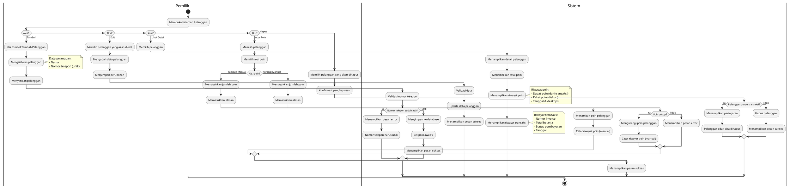
```plantuml
@startuml Activity Diagram - Proses Mengelola Pelanggan

|Pemilik|
start
:Membuka halaman Pelanggan;

if (Aksi?) then (Tambah)
    :Klik tombol Tambah Pelanggan;
    :Mengisi form pelanggan;
    note right
      Data pelanggan:
      - Nama
      - Nomor telepon (unik)
    end note

    :Menyimpan pelanggan;

    |Sistem|
    :Validasi nomor telepon;

    if (Nomor telepon sudah ada?) then (Ya)
        :Menampilkan pesan error;
        :Nomor telepon harus unik;
    else (Tidak)
        :Menyimpan ke database;
        :Set poin awal: 0;
        :Menampilkan pesan sukses;
    endif

else if (Aksi?) then (Edit)
    |Pemilik|
    :Memilih pelanggan yang akan diedit;
    :Mengubah data pelanggan;
    :Menyimpan perubahan;

    |Sistem|
    :Validasi data;
    :Update data pelanggan;
    :Menampilkan pesan sukses;

else if (Aksi?) then (Lihat Detail)
    |Pemilik|
    :Memilih pelanggan;

    |Sistem|
    :Menampilkan detail pelanggan;
    :Menampilkan total poin;

    :Menampilkan riwayat poin;
    note right
      Riwayat poin:
      - Dapat poin (dari transaksi)
      - Pakai poin (diskon)
      - Tanggal & deskripsi
    end note

    :Menampilkan riwayat transaksi;
    note right
      Riwayat transaksi:
      - Nomor invoice
      - Total belanja
      - Status pembayaran
      - Tanggal
    end note

else if (Aksi?) then (Atur Poin)
    |Pemilik|
    :Memilih pelanggan;
    :Memilih aksi poin;

    if (Aksi poin?) then (Tambah Manual)
        :Memasukkan jumlah poin;
        :Memasukkan alasan;

        |Sistem|
        :Menambah poin pelanggan;
        :Catat riwayat poin (manual);

    else (Kurangi Manual)
        |Pemilik|
        :Memasukkan jumlah poin;
        :Memasukkan alasan;

        |Sistem|
        if (Poin cukup?) then (Ya)
            :Mengurangi poin pelanggan;
            :Catat riwayat poin (manual);
        else (Tidak)
            :Menampilkan pesan error;
        endif
    endif

    |Sistem|
    :Menampilkan pesan sukses;

else (Hapus)
    |Pemilik|
    :Memilih pelanggan yang akan dihapus;
    :Konfirmasi penghapusan;

    |Sistem|
    if (Pelanggan punya transaksi?) then (Ya)
        :Menampilkan peringatan;
        :Pelanggan tidak bisa dihapus;
    else (Tidak)
        :Hapus pelanggan;
        :Menampilkan pesan sukses;
    endif
endif

stop

@enduml
```

---

## 18. Activity Diagram: Proses Mengelola Metode Pembayaran

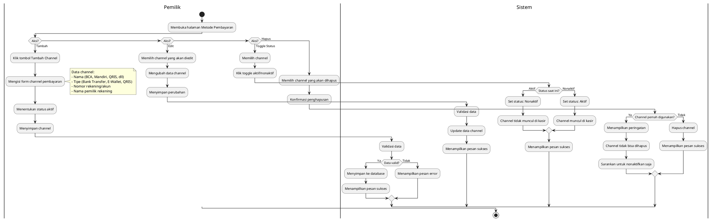
```plantuml
@startuml Activity Diagram - Proses Mengelola Metode Pembayaran

|Pemilik|
start
:Membuka halaman Metode Pembayaran;

if (Aksi?) then (Tambah)
    :Klik tombol Tambah Channel;
    :Mengisi form channel pembayaran;
    note right
      Data channel:
      - Nama (BCA, Mandiri, QRIS, dll)
      - Tipe (Bank Transfer, E-Wallet, QRIS)
      - Nomor rekening/akun
      - Nama pemilik rekening
    end note

    :Menentukan status aktif;
    :Menyimpan channel;

    |Sistem|
    :Validasi data;

    if (Data valid?) then (Ya)
        :Menyimpan ke database;
        :Menampilkan pesan sukses;
    else (Tidak)
        :Menampilkan pesan error;
    endif

else if (Aksi?) then (Edit)
    |Pemilik|
    :Memilih channel yang akan diedit;
    :Mengubah data channel;
    :Menyimpan perubahan;

    |Sistem|
    :Validasi data;
    :Update data channel;
    :Menampilkan pesan sukses;

else if (Aksi?) then (Toggle Status)
    |Pemilik|
    :Memilih channel;
    :Klik toggle aktif/nonaktif;

    |Sistem|
    if (Status saat ini?) then (Aktif)
        :Set status: Nonaktif;
        :Channel tidak muncul di kasir;
    else (Nonaktif)
        :Set status: Aktif;
        :Channel muncul di kasir;
    endif
    :Menampilkan pesan sukses;

else (Hapus)
    |Pemilik|
    :Memilih channel yang akan dihapus;
    :Konfirmasi penghapusan;

    |Sistem|
    if (Channel pernah digunakan?) then (Ya)
        :Menampilkan peringatan;
        :Channel tidak bisa dihapus;
        :Sarankan untuk nonaktifkan saja;
    else (Tidak)
        :Hapus channel;
        :Menampilkan pesan sukses;
    endif
endif

stop

@enduml
```

---

## 19. Activity Diagram: Proses Mengelola Profil Usaha

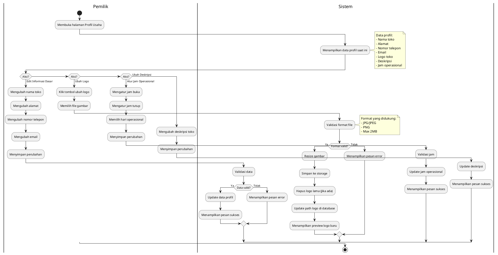
```plantuml
@startuml Activity Diagram - Proses Mengelola Profil Usaha

|Pemilik|
start
:Membuka halaman Profil Usaha;

|Sistem|
:Menampilkan data profil saat ini;
note right
  Data profil:
  - Nama toko
  - Alamat
  - Nomor telepon
  - Email
  - Logo toko
  - Deskripsi
  - Jam operasional
end note

|Pemilik|
if (Aksi?) then (Edit Informasi Dasar)
    :Mengubah nama toko;
    :Mengubah alamat;
    :Mengubah nomor telepon;
    :Mengubah email;
    :Menyimpan perubahan;

    |Sistem|
    :Validasi data;

    if (Data valid?) then (Ya)
        :Update data profil;
        :Menampilkan pesan sukses;
    else (Tidak)
        :Menampilkan pesan error;
    endif

else if (Aksi?) then (Ubah Logo)
    |Pemilik|
    :Klik tombol ubah logo;
    :Memilih file gambar;

    |Sistem|
    :Validasi format file;
    note right
      Format yang didukung:
      - JPG/JPEG
      - PNG
      - Max 2MB
    end note

    if (Format valid?) then (Ya)
        :Resize gambar;
        :Simpan ke storage;
        :Hapus logo lama (jika ada);
        :Update path logo di database;
        :Menampilkan preview logo baru;
    else (Tidak)
        :Menampilkan pesan error;
    endif

else if (Aksi?) then (Atur Jam Operasional)
    |Pemilik|
    :Mengatur jam buka;
    :Mengatur jam tutup;
    :Memilih hari operasional;
    :Menyimpan perubahan;

    |Sistem|
    :Validasi jam;
    :Update jam operasional;
    :Menampilkan pesan sukses;

else (Ubah Deskripsi)
    |Pemilik|
    :Mengubah deskripsi toko;
    :Menyimpan perubahan;

    |Sistem|
    :Update deskripsi;
    :Menampilkan pesan sukses;
endif

stop

@enduml
```

---

## 20. Activity Diagram: Proses Notifikasi Otomatis

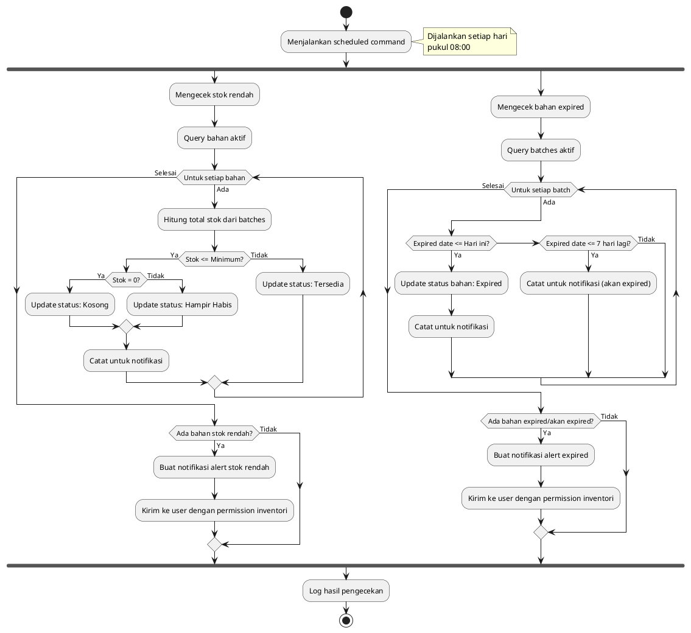
```plantuml
@startuml Activity Diagram - Notifikasi Otomatis

|Sistem (Scheduler)|
start
:Menjalankan scheduled command;
note right
  Dijalankan setiap hari
  pukul 08:00
end note

fork
    :Mengecek stok rendah;

    :Query bahan aktif;
    while (Untuk setiap bahan) is (Ada)
        :Hitung total stok dari batches;

        if (Stok <= Minimum?) then (Ya)
            if (Stok = 0?) then (Ya)
                :Update status: Kosong;
            else (Tidak)
                :Update status: Hampir Habis;
            endif
            :Catat untuk notifikasi;
        else (Tidak)
            :Update status: Tersedia;
        endif
    endwhile (Selesai)

    if (Ada bahan stok rendah?) then (Ya)
        :Buat notifikasi alert stok rendah;
        :Kirim ke user dengan permission inventori;
    else (Tidak)
    endif

fork again
    :Mengecek bahan expired;

    :Query batches aktif;
    while (Untuk setiap batch) is (Ada)
        if (Expired date <= Hari ini?) then (Ya)
            :Update status bahan: Expired;
            :Catat untuk notifikasi;
        elseif (Expired date <= 7 hari lagi?) then (Ya)
            :Catat untuk notifikasi (akan expired);
        else (Tidak)
        endif
    endwhile (Selesai)

    if (Ada bahan expired/akan expired?) then (Ya)
        :Buat notifikasi alert expired;
        :Kirim ke user dengan permission inventori;
    else (Tidak)
    endif

end fork

:Log hasil pengecekan;
stop

@enduml
```

---

## 21. Activity Diagram: Proses Reset Stok Produk Harian

```plantuml
@startuml Activity Diagram - Reset Stok Produk Harian

|Sistem (Scheduler)|
start
:Menjalankan scheduled command;
note right
  Dijalankan setiap hari
  pukul 00:00 (tengah malam)
end note

:Query semua produk;

while (Untuk setiap produk) is (Ada)
    if (Stok > 0?) then (Ya)
        :Reset stok menjadi 0;
        :Mencatat log reset;
    else (Tidak)
        :Skip (sudah 0);
    endif
endwhile (Selesai)

:Log hasil reset;
:Kirim notifikasi (Reset stok selesai);

stop

note right
  Alasan reset harian:
  Produk kue/roti bersifat
  perishable (mudah basi),
  sehingga stok tidak
  akumulatif antar hari.
end note

@enduml
```
