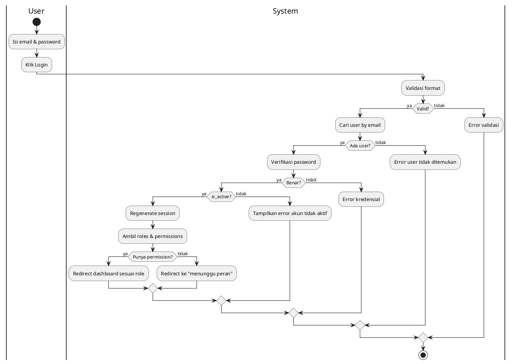
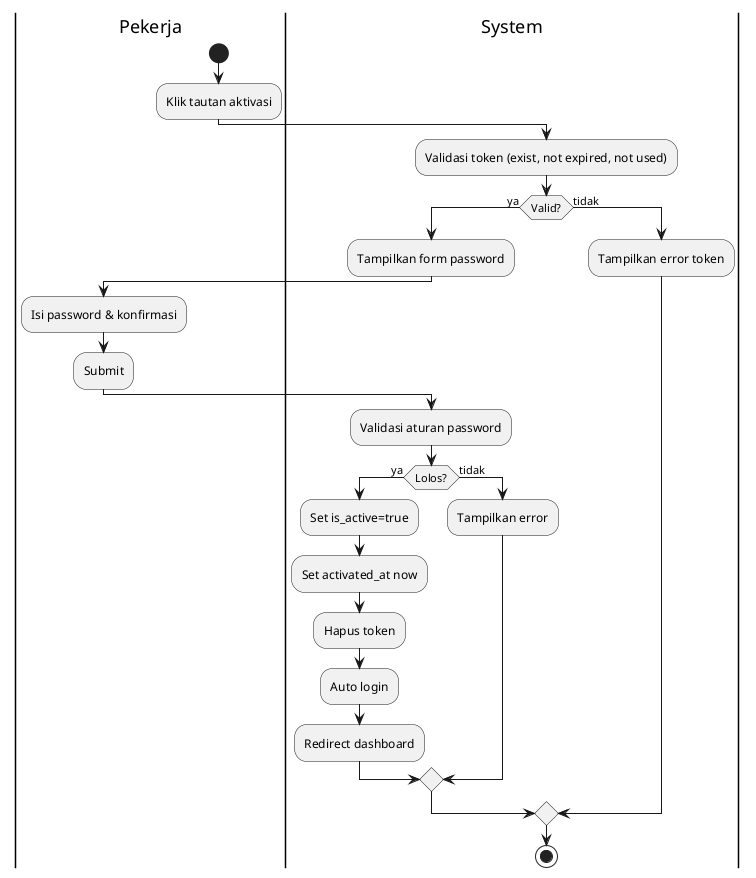
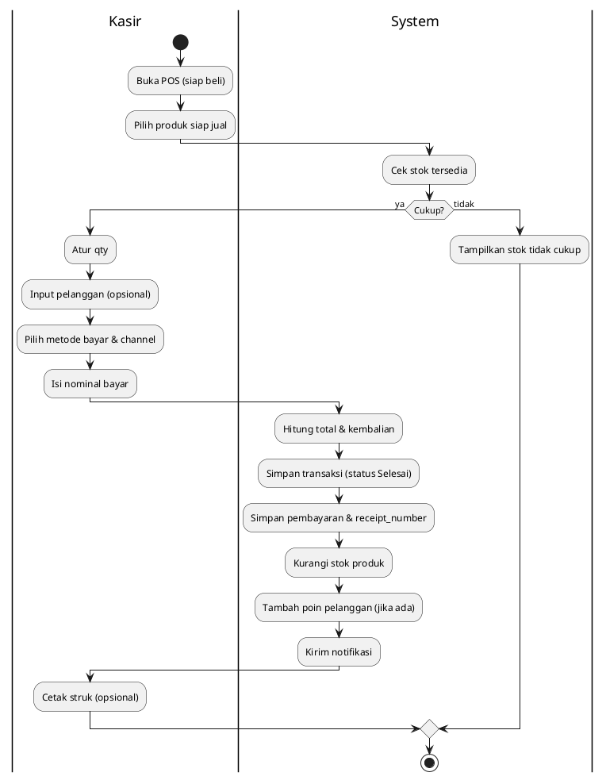
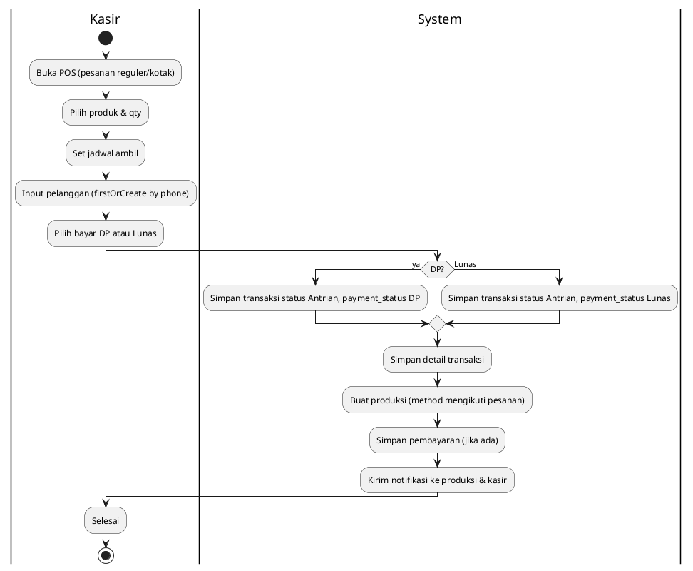
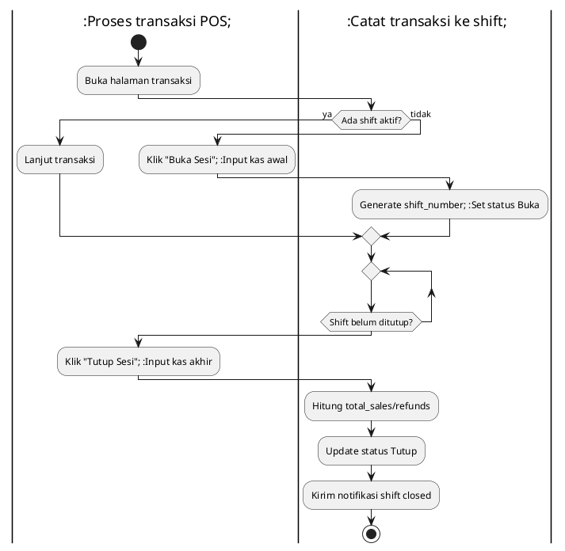
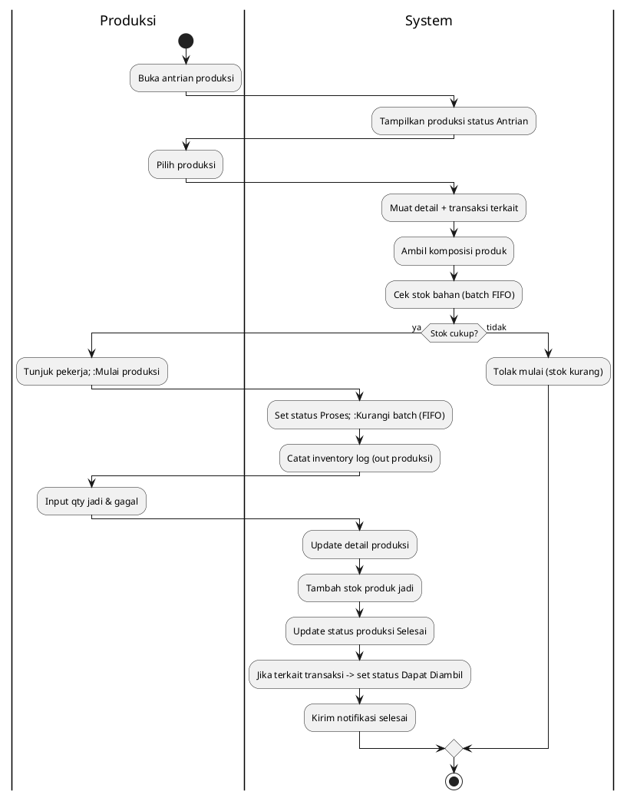
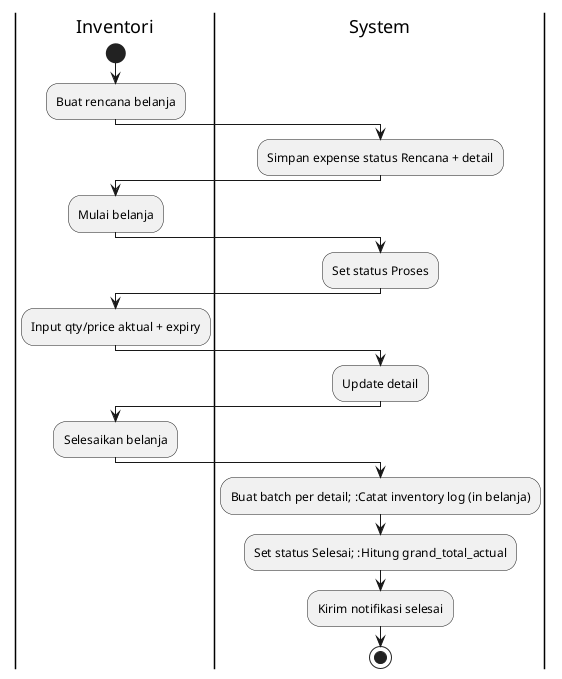
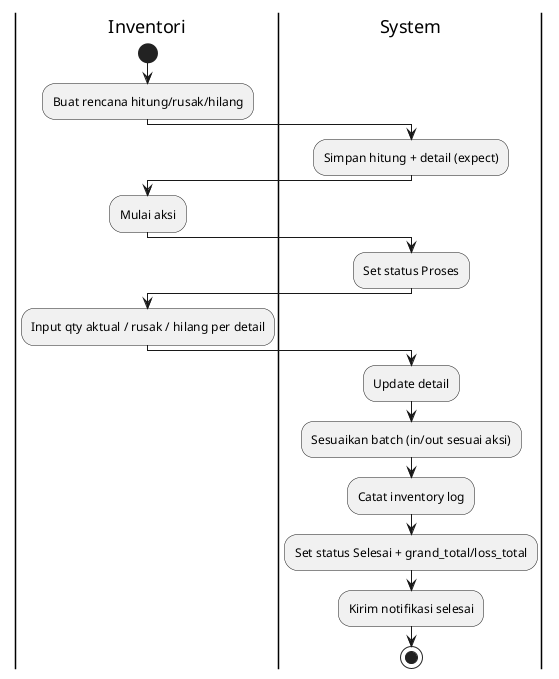

# ACTIVITY DIAGRAM

## Sistem Informasi Manajemen Toko Kue (revisi Des 2025)

Ringkasan alur bisnis utama berdasarkan state aplikasi terbaru. Setiap diagram memakai PlantUML.

| No  | Nama Diagram                 | Modul             | Aktor     |
| --- | ---------------------------- | ----------------- | --------- |
| 1   | Login & Otorisasi            | Autentikasi       | Pekerja   |
| 2   | Aktivasi Akun                | Autentikasi       | Pekerja   |
| 3   | Transaksi Siap Beli          | Kasir             | Kasir     |
| 4   | Transaksi Pesanan (DP/Lunas) | Kasir -> Produksi | Kasir     |
| 5   | Shift Kasir (Buka/Tutup)     | Kasir             | Kasir     |
| 6   | Produksi (Pesanan/Siap Beli) | Produksi          | Produksi  |
| 7   | Belanja Bahan Baku           | Inventori         | Inventori |
| 8   | Hitung Stok / Rusak / Hilang | Inventori         | Inventori |
| 9   | Refund Transaksi             | Kasir             | Kasir     |

---

## 1) Login & Otorisasi



---

## 2) Aktivasi Akun



---

## 3) Transaksi Siap Beli



---

## 4) Transaksi Pesanan (DP/Lunas)



---

## 5) Shift Kasir (Buka/Tutup)



---

## 6) Produksi (Pesanan / Siap Beli)



---

## 7) Belanja Bahan Baku



---

## 8) Hitung Stok / Rusak / Hilang



---

## 9) Refund Transaksi

```plantuml
@startuml Activity - Refund
|Kasir|
start
:Pilih transaksi;
:Input alasan + metode refund;
|System|
:Muat payments & channel aktif (jika non-tunai);
:Buat record refund; :Update transaksi status Dibatalkan + total_refund;
:Kaitkan refund_by_shift (jika shift aktif);
:Kirim notifikasi refund;
|Kasir|
:Selesai;
stop
Ya)
        :Buat notifikasi alert expired;
        :Kirim ke user dengan permission inventori;
    else (Tidak)
    endif

end fork

:Log hasil pengecekan;
stop

@enduml
```
