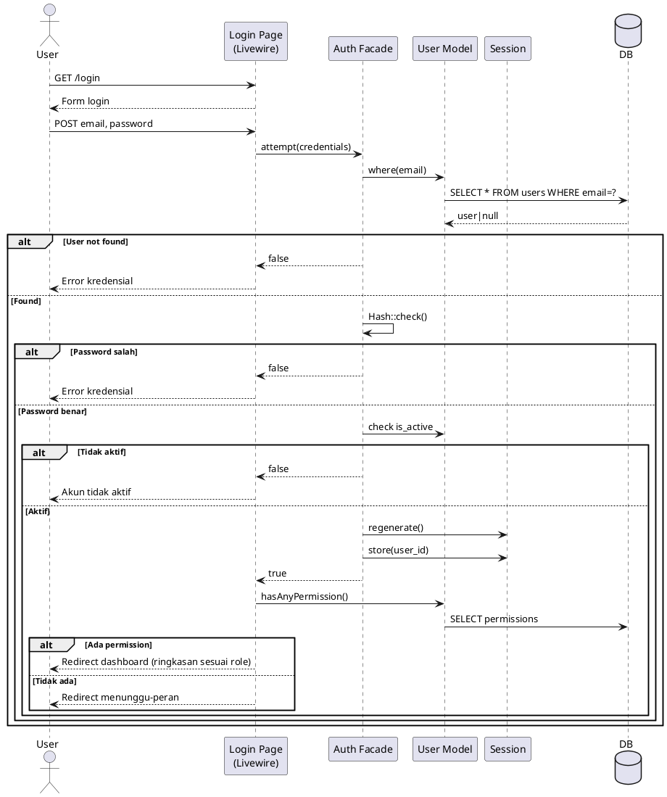
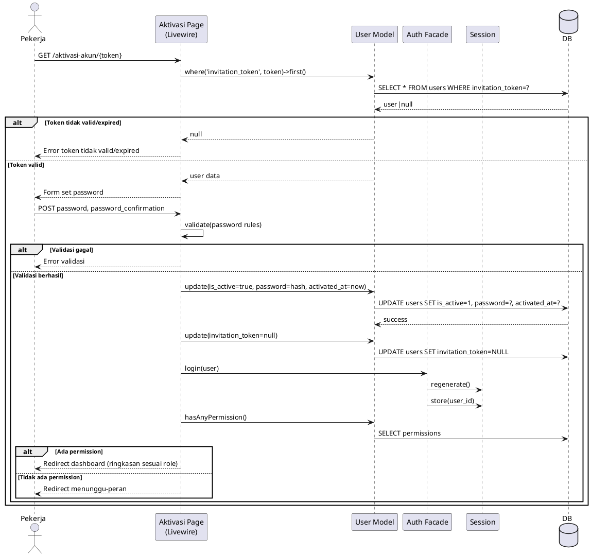
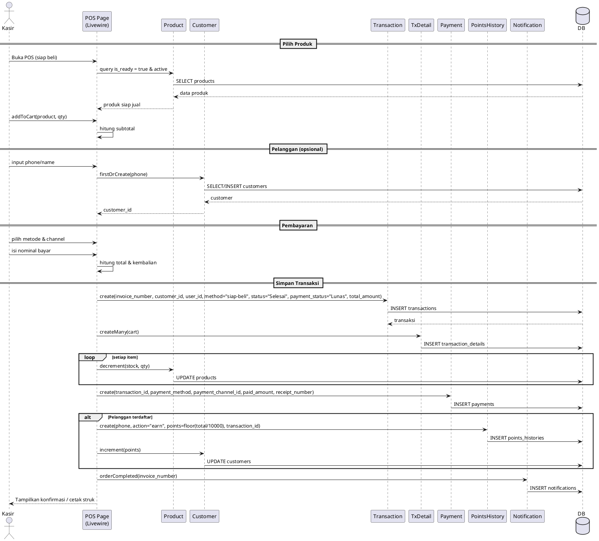
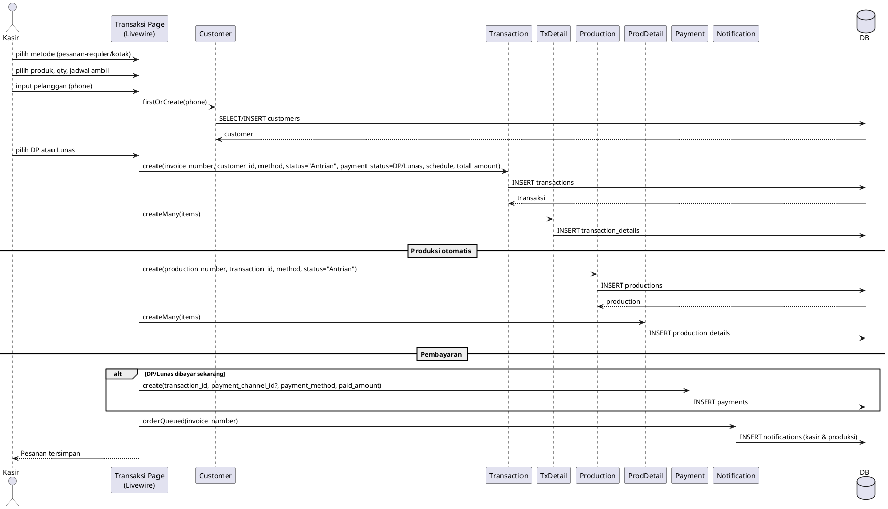
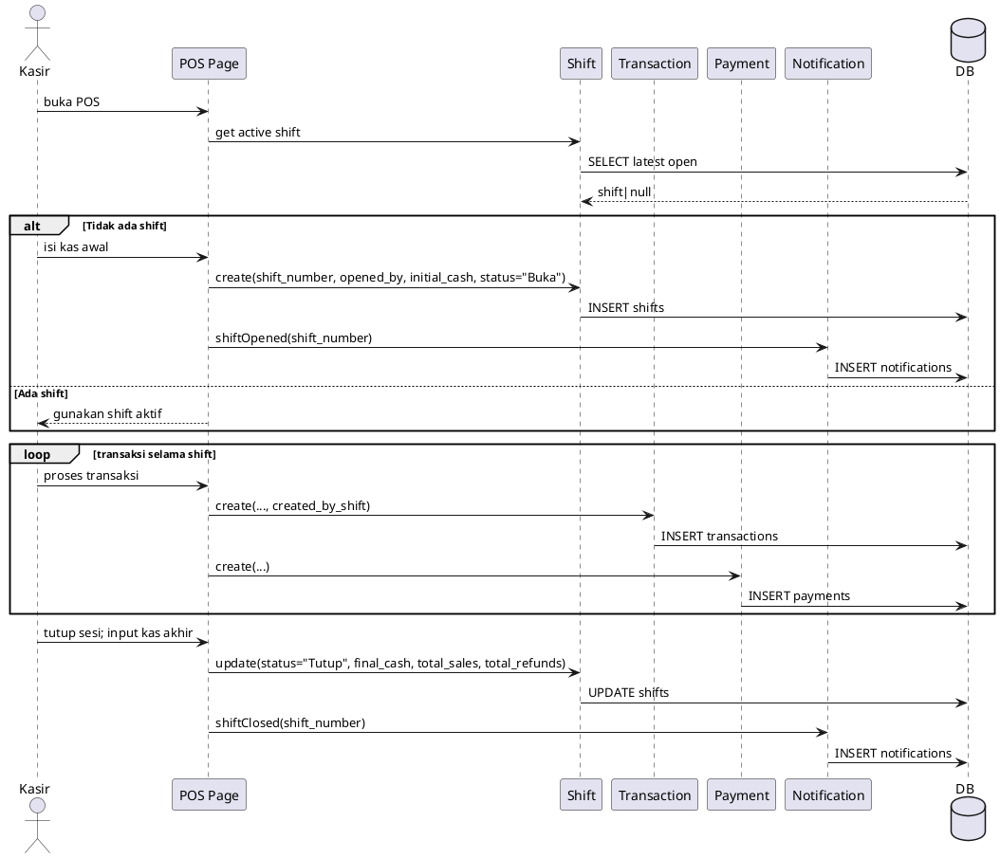
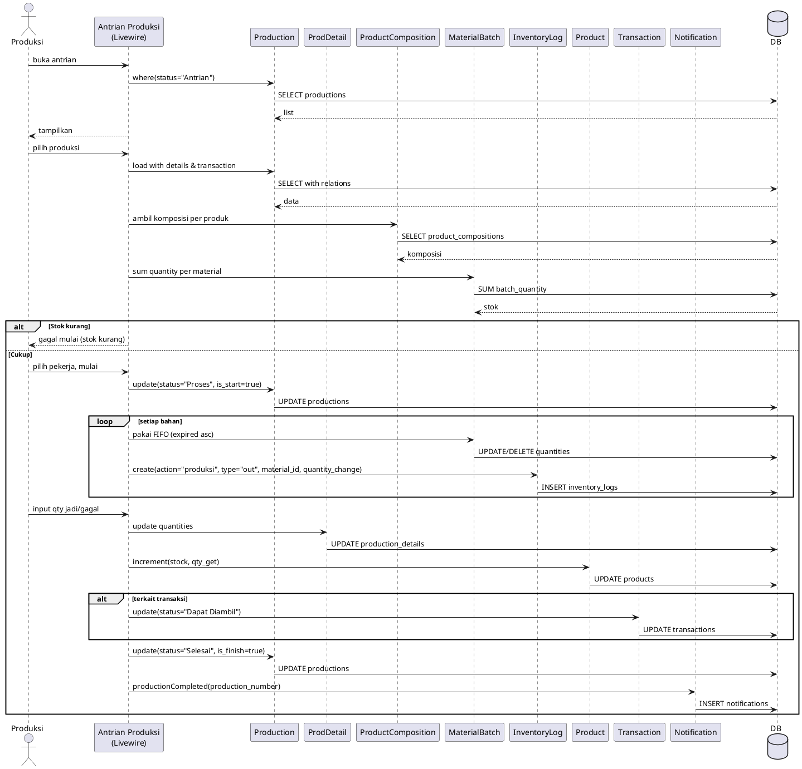
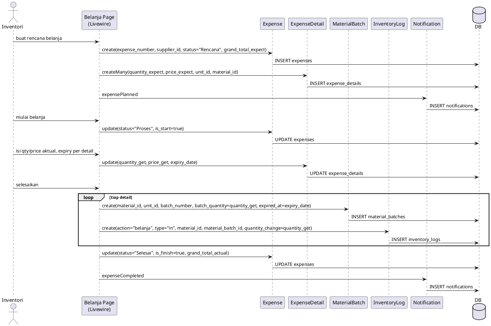
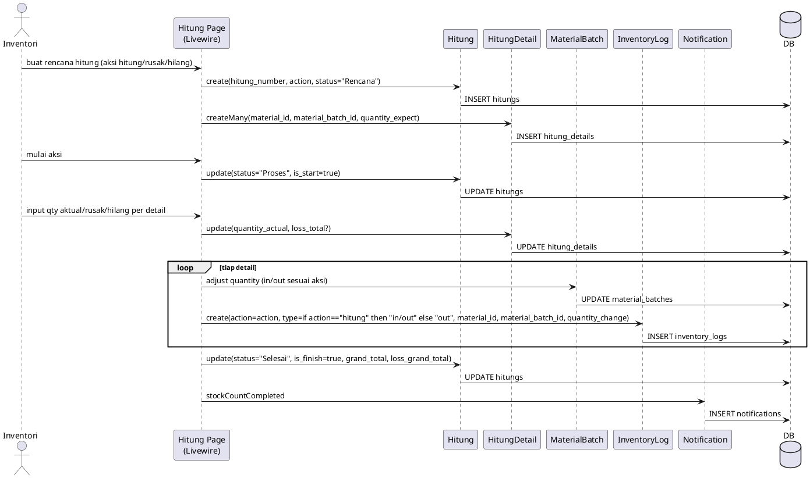
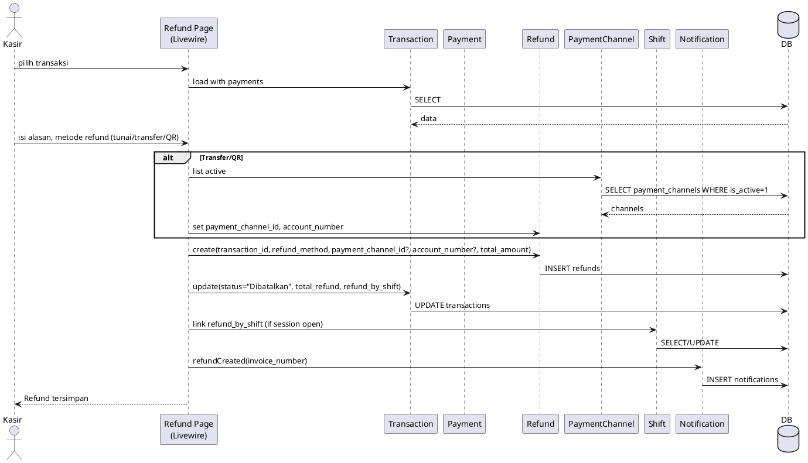

# SEQUENCE DIAGRAM

## Sistem Informasi Manajemen Toko Kue (revisi)

Di bawah ini urutan interaksi utama yang mencerminkan state aplikasi saat ini.

| No  | Diagram                      | Modul             | Aktor     |
| --- | ---------------------------- | ----------------- | --------- |
| 1   | Login & Otorisasi            | Autentikasi       | Pekerja   |
| 2   | Aktivasi Akun                | Autentikasi       | Pekerja   |
| 3   | Transaksi Siap Beli          | Kasir             | Kasir     |
| 4   | Transaksi Pesanan (DP/Lunas) | Kasir -> Produksi | Kasir     |
| 5   | Shift Kasir (Buka/Tutup)     | Kasir             | Kasir     |
| 6   | Produksi (Pesanan/Siap Beli) | Produksi          | Produksi  |
| 7   | Belanja Bahan Baku           | Inventori         | Inventori |
| 8   | Hitung Stok / Rusak / Hilang | Inventori         | Inventori |
| 9   | Refund Transaksi             | Kasir             | Kasir     |

---

## 1) Login & Otorisasi

---

## 2) Aktivasi Akun

---

## 3) Transaksi Siap Beli

---

## 4) Transaksi Pesanan (DP/Lunas)

---

## 5) Shift Kasir (Buka/Tutup)

---

## 6) Produksi (Pesanan / Siap Beli)

---

## 7) Belanja Bahan Baku

---

## 8) Hitung Stok / Rusak / Hilang

---

## 9) Refund Transaksi

