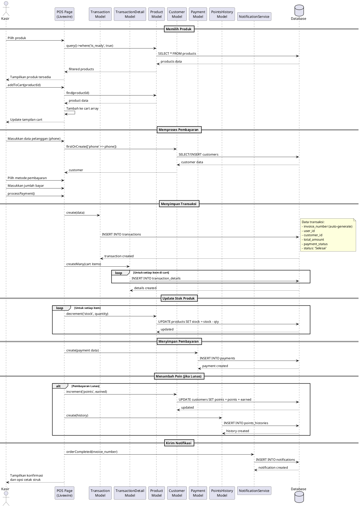
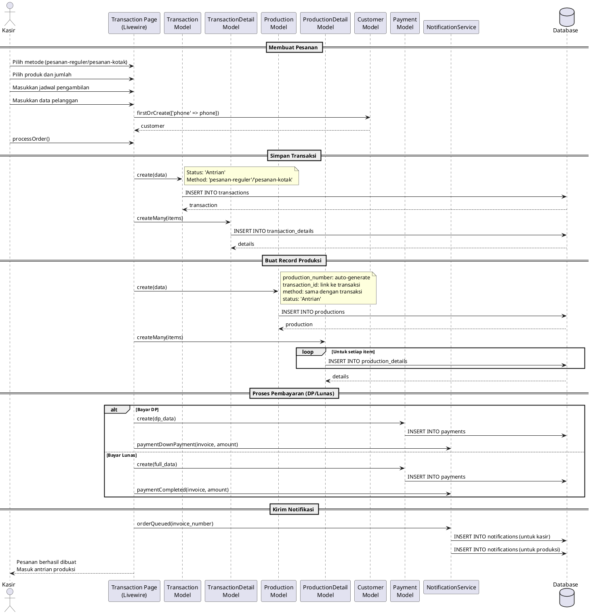
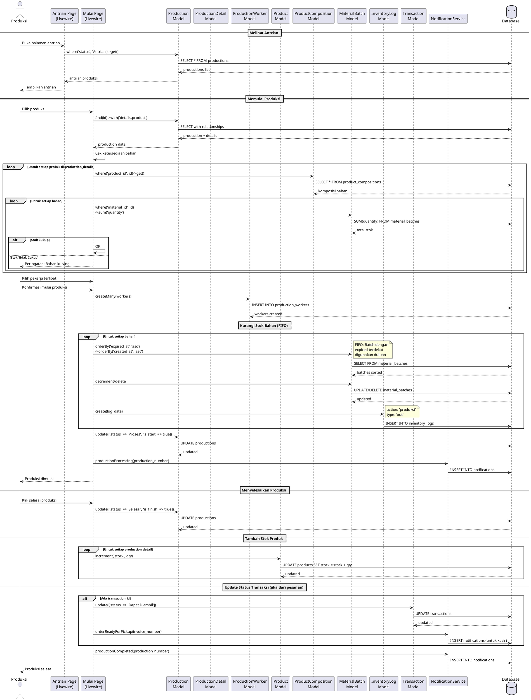
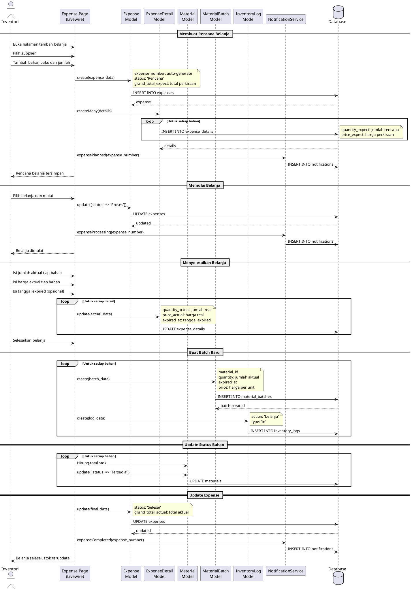
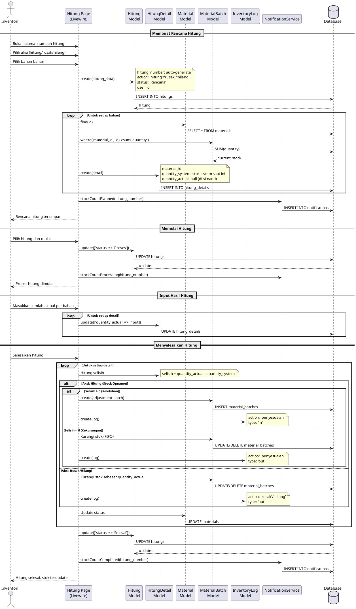
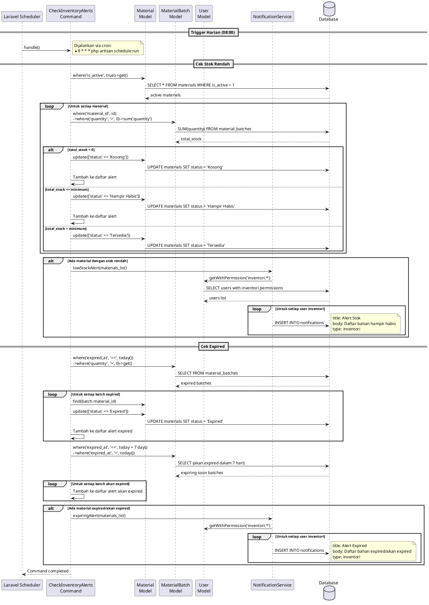
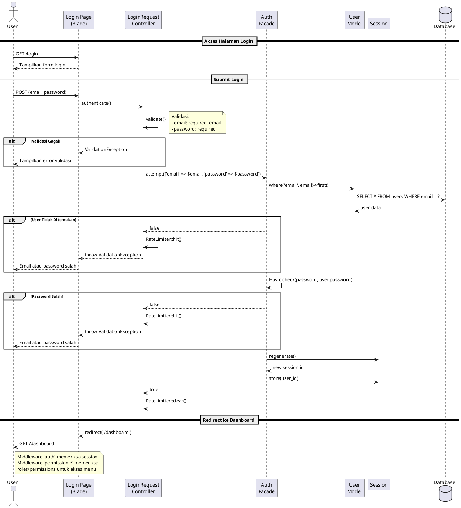
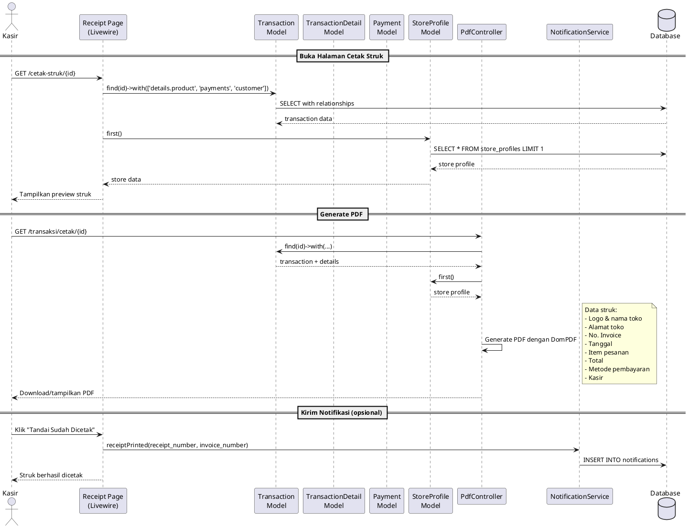
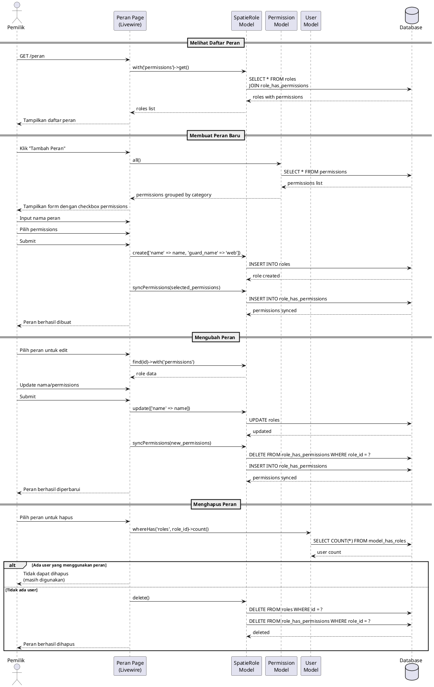

# SEQUENCE DIAGRAM

## Sistem Informasi Manajemen Toko Kue

---

## 1. Sequence Diagram: Membuat Pesanan Siap Beli

---

## 2. Sequence Diagram: Membuat Pesanan Reguler/Kotak

---

## 3. Sequence Diagram: Memulai dan Menyelesaikan Produksi

---

## 4. Sequence Diagram: Proses Belanja Bahan Baku

---

## 5. Sequence Diagram: Proses Hitung Stok (Stock Opname)

---

## 6. Sequence Diagram: Pengecekan Otomatis Stok & Expired

---

## 7. Sequence Diagram: Login dan Autentikasi

---

## 8. Sequence Diagram: Mencetak Struk

---

## 9. Sequence Diagram: Mengelola Peran dan Hak Akses

