# SEQUENCE DIAGRAM

## Sistem Informasi Manajemen Toko Kue

---

## Daftar Sequence Diagram

| No  | Nama Diagram                       | Modul       | Aktor Utama |
| --- | ---------------------------------- | ----------- | ----------- |
| 1   | Login dan Otorisasi                | Autentikasi | User        |
| 2   | Transaksi Siap Beli                | Kasir       | Kasir       |
| 3   | Transaksi Pesanan (Reguler/Kotak)  | Kasir       | Kasir       |
| 4   | Pelunasan Pembayaran               | Kasir       | Kasir       |
| 5   | Proses Produksi                    | Produksi    | Produksi    |
| 6   | Proses Belanja Bahan Baku          | Inventori   | Inventori   |
| 7   | Proses Hitung Stok                 | Inventori   | Inventori   |
| 8   | Pengecekan Otomatis Stok & Expired | Sistem      | Scheduler   |
| 9   | Cetak Struk                        | Kasir       | Kasir       |
| 10  | Mengelola Produk                   | Inventori   | Inventori   |
| 11  | Mengelola Bahan Baku               | Inventori   | Inventori   |
| 12  | Mengelola Kategori Produk          | Inventori   | Inventori   |
| 13  | Mengelola Satuan                   | Inventori   | Inventori   |
| 14  | Mengelola Supplier                 | Inventori   | Inventori   |
| 15  | Mengelola Pelanggan                | Manajemen   | Pemilik     |
| 16  | Mengelola Metode Pembayaran        | Manajemen   | Pemilik     |
| 17  | Mengelola Peran                    | Manajemen   | Pemilik     |
| 18  | Mengelola Pekerja                  | Manajemen   | Pemilik     |
| 19  | Mengelola Profil Usaha             | Manajemen   | Pemilik     |

---

## 1. Sequence Diagram: Login dan Otorisasi

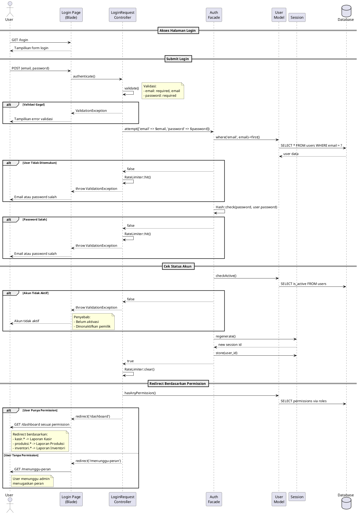
```plantuml
@startuml Sequence Diagram - Login

actor User
participant "Login Page\n(Blade)" as Login
participant "LoginRequest\nController" as LoginReq
participant "Auth\nFacade" as Auth
participant "User\nModel" as UserModel
participant "Session" as Session
database Database as DB

== Akses Halaman Login ==
User -> Login: GET /login
Login --> User: Tampilkan form login

== Submit Login ==
User -> Login: POST (email, password)
Login -> LoginReq: authenticate()

LoginReq -> LoginReq: validate()
note right
  Validasi:
  - email: required, email
  - password: required
end note

alt Validasi Gagal
    LoginReq --> Login: ValidationException
    Login --> User: Tampilkan error validasi
end

LoginReq -> Auth: attempt(['email' => $email, 'password' => $password])

Auth -> UserModel: where('email', email)->first()
UserModel -> DB: SELECT * FROM users WHERE email = ?
DB --> UserModel: user data

alt User Tidak Ditemukan
    Auth --> LoginReq: false
    LoginReq -> LoginReq: RateLimiter::hit()
    LoginReq --> Login: throw ValidationException
    Login --> User: Email atau password salah
end

Auth -> Auth: Hash::check(password, user.password)

alt Password Salah
    Auth --> LoginReq: false
    LoginReq -> LoginReq: RateLimiter::hit()
    LoginReq --> Login: throw ValidationException
    Login --> User: Email atau password salah
end

== Cek Status Akun ==
Auth -> UserModel: checkActive()
UserModel -> DB: SELECT is_active FROM users

alt Akun Tidak Aktif
    Auth --> LoginReq: false
    LoginReq --> Login: throw ValidationException
    Login --> User: Akun tidak aktif
    note right
      Penyebab:
      - Belum aktivasi
      - Dinonaktifkan pemilik
    end note
end

Auth -> Session: regenerate()
Session --> Auth: new session id

Auth -> Session: store(user_id)
Auth --> LoginReq: true

LoginReq -> LoginReq: RateLimiter::clear()

== Redirect Berdasarkan Permission ==
LoginReq -> UserModel: hasAnyPermission()
UserModel -> DB: SELECT permissions via roles

alt User Punya Permission
    LoginReq --> Login: redirect('/dashboard')
    Login -> User: GET /dashboard sesuai permission
    note right of User
      Redirect berdasarkan:
      - kasir.* -> Laporan Kasir
      - produksi.* -> Laporan Produksi
      - inventori.* -> Laporan Inventori
    end note
else User Tanpa Permission
    LoginReq --> Login: redirect('/menunggu-peran')
    Login -> User: GET /menunggu-peran
    note right of User
      User menunggu admin
      menugaskan peran
    end note
end

@enduml
```

---

## 2. Sequence Diagram: Transaksi Siap Beli

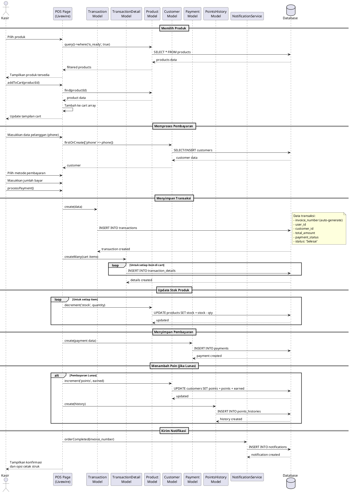
```plantuml
@startuml Sequence Diagram - Transaksi Siap Beli

actor Kasir
participant "POS Page\n(Livewire)" as POS
participant "Transaction\nModel" as Transaction
participant "TransactionDetail\nModel" as TxDetail
participant "Product\nModel" as Product
participant "Customer\nModel" as Customer
participant "Payment\nModel" as Payment
participant "PointsHistory\nModel" as Points
participant "NotificationService" as Notif
database Database as DB

== Memilih Produk ==
Kasir -> POS: Pilih produk
POS -> Product: query()->where('is_ready', true)
Product -> DB: SELECT * FROM products
DB --> Product: products data
Product --> POS: filtered products
POS --> Kasir: Tampilkan produk tersedia

Kasir -> POS: addToCart(productId)
POS -> Product: find(productId)
Product --> POS: product data
POS -> POS: Tambah ke cart array
POS --> Kasir: Update tampilan cart

== Memproses Pembayaran ==
Kasir -> POS: Masukkan data pelanggan (phone)
POS -> Customer: firstOrCreate(['phone' => phone])
Customer -> DB: SELECT/INSERT customers
DB --> Customer: customer data
Customer --> POS: customer

Kasir -> POS: Pilih metode pembayaran
Kasir -> POS: Masukkan jumlah bayar
Kasir -> POS: processPayment()

== Menyimpan Transaksi ==
POS -> Transaction: create(data)
Transaction -> DB: INSERT INTO transactions
note right
  Data transaksi:
  - invoice_number (auto-generate)
  - user_id
  - customer_id
  - total_amount
  - payment_status
  - status: 'Selesai'
end note
DB --> Transaction: transaction created

POS -> TxDetail: createMany(cart items)
loop Untuk setiap item di cart
    TxDetail -> DB: INSERT INTO transaction_details
end
DB --> TxDetail: details created

== Update Stok Produk ==
loop Untuk setiap item
    POS -> Product: decrement('stock', quantity)
    Product -> DB: UPDATE products SET stock = stock - qty
    DB --> Product: updated
end

== Menyimpan Pembayaran ==
POS -> Payment: create(payment data)
Payment -> DB: INSERT INTO payments
DB --> Payment: payment created

== Menambah Poin (jika Lunas) ==
alt Pembayaran Lunas
    POS -> Customer: increment('points', earned)
    Customer -> DB: UPDATE customers SET points = points + earned
    DB --> Customer: updated

    POS -> Points: create(history)
    Points -> DB: INSERT INTO points_histories
    DB --> Points: history created
end

== Kirim Notifikasi ==
POS -> Notif: orderCompleted(invoice_number)
Notif -> DB: INSERT INTO notifications
DB --> Notif: notification created

POS --> Kasir: Tampilkan konfirmasi\ndan opsi cetak struk

@enduml
```

---

## 3. Sequence Diagram: Transaksi Pesanan

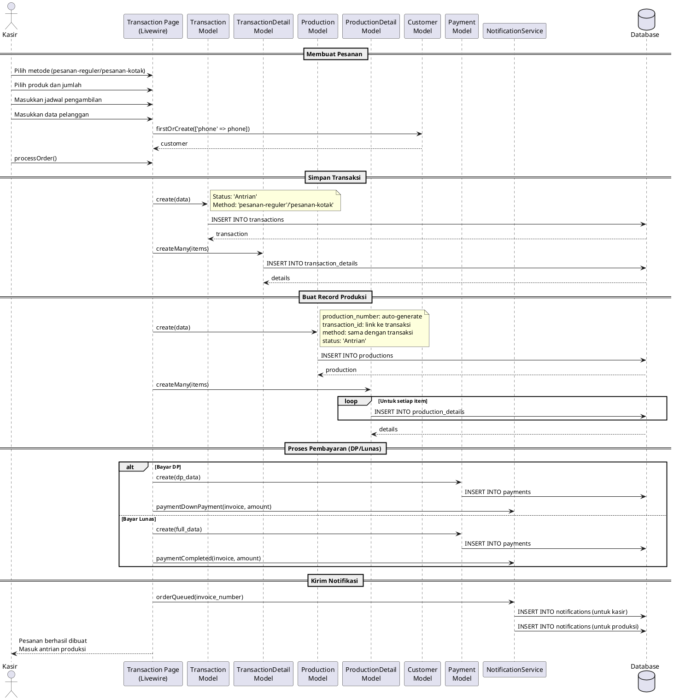
```plantuml
@startuml Sequence Diagram - Transaksi Pesanan

actor Kasir
participant "Transaction Page\n(Livewire)" as TxPage
participant "Transaction\nModel" as Transaction
participant "TransactionDetail\nModel" as TxDetail
participant "Production\nModel" as Production
participant "ProductionDetail\nModel" as ProdDetail
participant "Customer\nModel" as Customer
participant "Payment\nModel" as Payment
participant "NotificationService" as Notif
database Database as DB

== Membuat Pesanan ==
Kasir -> TxPage: Pilih metode (pesanan-reguler/pesanan-kotak)
Kasir -> TxPage: Pilih produk dan jumlah
Kasir -> TxPage: Masukkan jadwal pengambilan
Kasir -> TxPage: Masukkan data pelanggan

TxPage -> Customer: firstOrCreate(['phone' => phone])
Customer --> TxPage: customer

Kasir -> TxPage: processOrder()

== Simpan Transaksi ==
TxPage -> Transaction: create(data)
note right
  Status: 'Antrian'
  Method: 'pesanan-reguler'/'pesanan-kotak'
end note
Transaction -> DB: INSERT INTO transactions
DB --> Transaction: transaction

TxPage -> TxDetail: createMany(items)
TxDetail -> DB: INSERT INTO transaction_details
DB --> TxDetail: details

== Buat Record Produksi ==
TxPage -> Production: create(data)
note right
  production_number: auto-generate
  transaction_id: link ke transaksi
  method: sama dengan transaksi
  status: 'Antrian'
end note
Production -> DB: INSERT INTO productions
DB --> Production: production

TxPage -> ProdDetail: createMany(items)
loop Untuk setiap item
    ProdDetail -> DB: INSERT INTO production_details
end
DB --> ProdDetail: details

== Proses Pembayaran (DP/Lunas) ==
alt Bayar DP
    TxPage -> Payment: create(dp_data)
    Payment -> DB: INSERT INTO payments
    TxPage -> Notif: paymentDownPayment(invoice, amount)
else Bayar Lunas
    TxPage -> Payment: create(full_data)
    Payment -> DB: INSERT INTO payments
    TxPage -> Notif: paymentCompleted(invoice, amount)
end

== Kirim Notifikasi ==
TxPage -> Notif: orderQueued(invoice_number)
Notif -> DB: INSERT INTO notifications (untuk kasir)
Notif -> DB: INSERT INTO notifications (untuk produksi)

TxPage --> Kasir: Pesanan berhasil dibuat\nMasuk antrian produksi

@enduml
```

---

## 4. Sequence Diagram: Pelunasan Pembayaran

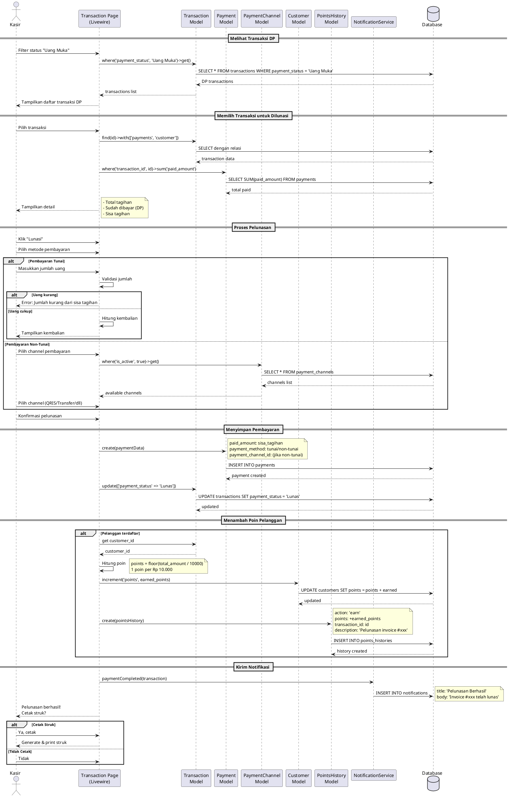
```plantuml
@startuml Sequence Diagram - Pelunasan Pembayaran

actor Kasir
participant "Transaction Page\n(Livewire)" as Page
participant "Transaction\nModel" as Transaction
participant "Payment\nModel" as Payment
participant "PaymentChannel\nModel" as Channel
participant "Customer\nModel" as Customer
participant "PointsHistory\nModel" as Points
participant "NotificationService" as Notif
database Database as DB

== Melihat Transaksi DP ==
Kasir -> Page: Filter status "Uang Muka"
Page -> Transaction: where('payment_status', 'Uang Muka')->get()
Transaction -> DB: SELECT * FROM transactions WHERE payment_status = 'Uang Muka'
DB --> Transaction: DP transactions
Transaction --> Page: transactions list

Page --> Kasir: Tampilkan daftar transaksi DP

== Memilih Transaksi untuk Dilunasi ==
Kasir -> Page: Pilih transaksi
Page -> Transaction: find(id)->with(['payments', 'customer'])
Transaction -> DB: SELECT dengan relasi
DB --> Transaction: transaction data

Page -> Payment: where('transaction_id', id)->sum('paid_amount')
Payment -> DB: SELECT SUM(paid_amount) FROM payments
DB --> Payment: total paid

Page --> Kasir: Tampilkan detail
note right
  - Total tagihan
  - Sudah dibayar (DP)
  - Sisa tagihan
end note

== Proses Pelunasan ==
Kasir -> Page: Klik "Lunasi"
Kasir -> Page: Pilih metode pembayaran

alt Pembayaran Tunai
    Kasir -> Page: Masukkan jumlah uang

    Page -> Page: Validasi jumlah
    alt Uang kurang
        Page --> Kasir: Error: Jumlah kurang dari sisa tagihan
    else Uang cukup
        Page -> Page: Hitung kembalian
        Page --> Kasir: Tampilkan kembalian
    end

else Pembayaran Non-Tunai
    Kasir -> Page: Pilih channel pembayaran
    Page -> Channel: where('is_active', true)->get()
    Channel -> DB: SELECT * FROM payment_channels
    DB --> Channel: channels list
    Channel --> Page: available channels

    Kasir -> Page: Pilih channel (QRIS/Transfer/dll)
end

Kasir -> Page: Konfirmasi pelunasan

== Menyimpan Pembayaran ==
Page -> Payment: create(paymentData)
note right
  paid_amount: sisa_tagihan
  payment_method: tunai/non-tunai
  payment_channel_id: (jika non-tunai)
end note
Payment -> DB: INSERT INTO payments
DB --> Payment: payment created

Page -> Transaction: update(['payment_status' => 'Lunas'])
Transaction -> DB: UPDATE transactions SET payment_status = 'Lunas'
DB --> Transaction: updated

== Menambah Poin Pelanggan ==
alt Pelanggan terdaftar
    Page -> Transaction: get customer_id
    Transaction --> Page: customer_id

    Page -> Page: Hitung poin
    note right
      points = floor(total_amount / 10000)
      1 poin per Rp 10.000
    end note

    Page -> Customer: increment('points', earned_points)
    Customer -> DB: UPDATE customers SET points = points + earned
    DB --> Customer: updated

    Page -> Points: create(pointsHistory)
    note right
      action: 'earn'
      points: +earned_points
      transaction_id: id
      description: 'Pelunasan invoice #xxx'
    end note
    Points -> DB: INSERT INTO points_histories
    DB --> Points: history created
end

== Kirim Notifikasi ==
Page -> Notif: paymentCompleted(transaction)
Notif -> DB: INSERT INTO notifications
note right
  title: 'Pelunasan Berhasil'
  body: 'Invoice #xxx telah lunas'
end note

Page --> Kasir: Pelunasan berhasil!\nCetak struk?

alt Cetak Struk
    Kasir -> Page: Ya, cetak
    Page --> Kasir: Generate & print struk
else Tidak Cetak
    Kasir -> Page: Tidak
end

@enduml
```

---

## 5. Sequence Diagram: Proses Produksi

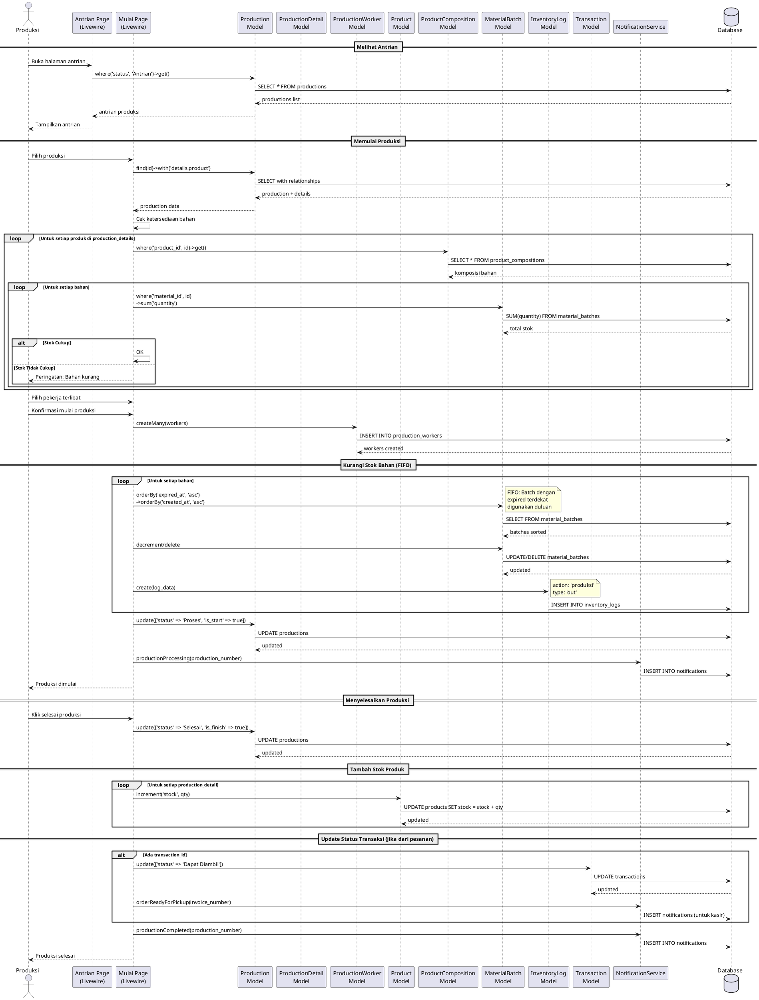
```plantuml
@startuml Sequence Diagram - Proses Produksi

actor Produksi as User
participant "Antrian Page\n(Livewire)" as Queue
participant "Mulai Page\n(Livewire)" as Start
participant "Production\nModel" as Production
participant "ProductionDetail\nModel" as ProdDetail
participant "ProductionWorker\nModel" as Worker
participant "Product\nModel" as Product
participant "ProductComposition\nModel" as Composition
participant "MaterialBatch\nModel" as Batch
participant "InventoryLog\nModel" as Log
participant "Transaction\nModel" as Transaction
participant "NotificationService" as Notif
database Database as DB

== Melihat Antrian ==
User -> Queue: Buka halaman antrian
Queue -> Production: where('status', 'Antrian')->get()
Production -> DB: SELECT * FROM productions
DB --> Production: productions list
Production --> Queue: antrian produksi
Queue --> User: Tampilkan antrian

== Memulai Produksi ==
User -> Start: Pilih produksi
Start -> Production: find(id)->with('details.product')
Production -> DB: SELECT with relationships
DB --> Production: production + details
Production --> Start: production data

Start -> Start: Cek ketersediaan bahan

loop Untuk setiap produk di production_details
    Start -> Composition: where('product_id', id)->get()
    Composition -> DB: SELECT * FROM product_compositions
    DB --> Composition: komposisi bahan

    loop Untuk setiap bahan
        Start -> Batch: where('material_id', id)\n->sum('quantity')
        Batch -> DB: SUM(quantity) FROM material_batches
        DB --> Batch: total stok

        alt Stok Cukup
            Start -> Start: OK
        else Stok Tidak Cukup
            Start --> User: Peringatan: Bahan kurang
        end
    end
end

User -> Start: Pilih pekerja terlibat
User -> Start: Konfirmasi mulai produksi

Start -> Worker: createMany(workers)
Worker -> DB: INSERT INTO production_workers
DB --> Worker: workers created

== Kurangi Stok Bahan (FIFO) ==
loop Untuk setiap bahan
    Start -> Batch: orderBy('expired_at', 'asc')\n->orderBy('created_at', 'asc')
    note right
      FIFO: Batch dengan
      expired terdekat
      digunakan duluan
    end note
    Batch -> DB: SELECT FROM material_batches
    DB --> Batch: batches sorted

    Start -> Batch: decrement/delete
    Batch -> DB: UPDATE/DELETE material_batches
    DB --> Batch: updated

    Start -> Log: create(log_data)
    note right
      action: 'produksi'
      type: 'out'
    end note
    Log -> DB: INSERT INTO inventory_logs
end

Start -> Production: update(['status' => 'Proses', 'is_start' => true])
Production -> DB: UPDATE productions
DB --> Production: updated

Start -> Notif: productionProcessing(production_number)
Notif -> DB: INSERT INTO notifications
Start --> User: Produksi dimulai

== Menyelesaikan Produksi ==
User -> Start: Klik selesai produksi

Start -> Production: update(['status' => 'Selesai', 'is_finish' => true])
Production -> DB: UPDATE productions
DB --> Production: updated

== Tambah Stok Produk ==
loop Untuk setiap production_detail
    Start -> Product: increment('stock', qty)
    Product -> DB: UPDATE products SET stock = stock + qty
    DB --> Product: updated
end

== Update Status Transaksi (jika dari pesanan) ==
alt Ada transaction_id
    Start -> Transaction: update(['status' => 'Dapat Diambil'])
    Transaction -> DB: UPDATE transactions
    DB --> Transaction: updated

    Start -> Notif: orderReadyForPickup(invoice_number)
    Notif -> DB: INSERT notifications (untuk kasir)
end

Start -> Notif: productionCompleted(production_number)
Notif -> DB: INSERT INTO notifications

Start --> User: Produksi selesai

@enduml
```

---

## 6. Sequence Diagram: Proses Belanja Bahan Baku

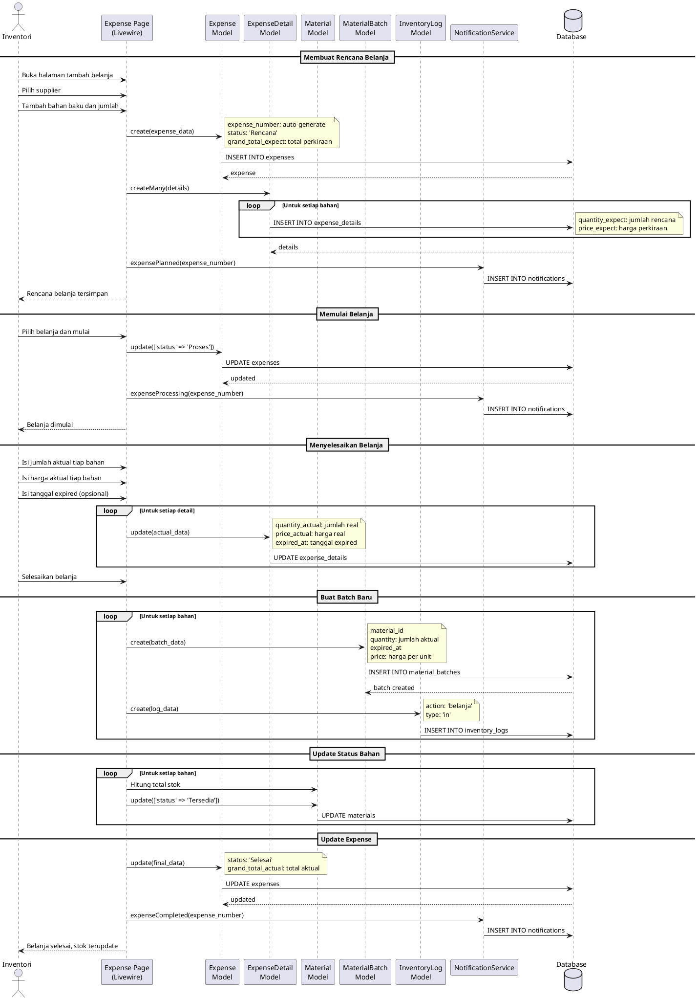
```plantuml
@startuml Sequence Diagram - Proses Belanja

actor Inventori as User
participant "Expense Page\n(Livewire)" as ExpPage
participant "Expense\nModel" as Expense
participant "ExpenseDetail\nModel" as ExpDetail
participant "Material\nModel" as Material
participant "MaterialBatch\nModel" as Batch
participant "InventoryLog\nModel" as Log
participant "NotificationService" as Notif
database Database as DB

== Membuat Rencana Belanja ==
User -> ExpPage: Buka halaman tambah belanja
User -> ExpPage: Pilih supplier
User -> ExpPage: Tambah bahan baku dan jumlah

ExpPage -> Expense: create(expense_data)
note right
  expense_number: auto-generate
  status: 'Rencana'
  grand_total_expect: total perkiraan
end note
Expense -> DB: INSERT INTO expenses
DB --> Expense: expense

ExpPage -> ExpDetail: createMany(details)
loop Untuk setiap bahan
    ExpDetail -> DB: INSERT INTO expense_details
    note right
      quantity_expect: jumlah rencana
      price_expect: harga perkiraan
    end note
end
DB --> ExpDetail: details

ExpPage -> Notif: expensePlanned(expense_number)
Notif -> DB: INSERT INTO notifications

ExpPage --> User: Rencana belanja tersimpan

== Memulai Belanja ==
User -> ExpPage: Pilih belanja dan mulai
ExpPage -> Expense: update(['status' => 'Proses'])
Expense -> DB: UPDATE expenses
DB --> Expense: updated

ExpPage -> Notif: expenseProcessing(expense_number)
Notif -> DB: INSERT INTO notifications

ExpPage --> User: Belanja dimulai

== Menyelesaikan Belanja ==
User -> ExpPage: Isi jumlah aktual tiap bahan
User -> ExpPage: Isi harga aktual tiap bahan
User -> ExpPage: Isi tanggal expired (opsional)

loop Untuk setiap detail
    ExpPage -> ExpDetail: update(actual_data)
    note right
      quantity_actual: jumlah real
      price_actual: harga real
      expired_at: tanggal expired
    end note
    ExpDetail -> DB: UPDATE expense_details
end

User -> ExpPage: Selesaikan belanja

== Buat Batch Baru ==
loop Untuk setiap bahan
    ExpPage -> Batch: create(batch_data)
    note right
      material_id
      quantity: jumlah aktual
      expired_at
      price: harga per unit
    end note
    Batch -> DB: INSERT INTO material_batches
    DB --> Batch: batch created

    ExpPage -> Log: create(log_data)
    note right
      action: 'belanja'
      type: 'in'
    end note
    Log -> DB: INSERT INTO inventory_logs
end

== Update Status Bahan ==
loop Untuk setiap bahan
    ExpPage -> Material: Hitung total stok
    ExpPage -> Material: update(['status' => 'Tersedia'])
    Material -> DB: UPDATE materials
end

== Update Expense ==
ExpPage -> Expense: update(final_data)
note right
  status: 'Selesai'
  grand_total_actual: total aktual
end note
Expense -> DB: UPDATE expenses
DB --> Expense: updated

ExpPage -> Notif: expenseCompleted(expense_number)
Notif -> DB: INSERT INTO notifications

ExpPage --> User: Belanja selesai, stok terupdate

@enduml
```

---

## 7. Sequence Diagram: Proses Hitung Stok

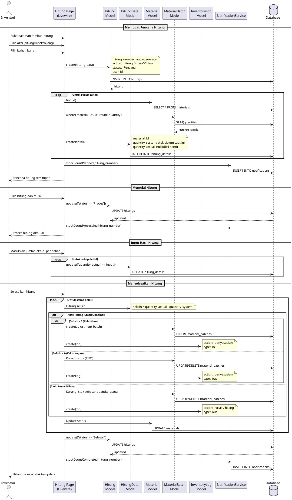
```plantuml
@startuml Sequence Diagram - Hitung Stok

actor Inventori as User
participant "Hitung Page\n(Livewire)" as HitungPage
participant "Hitung\nModel" as Hitung
participant "HitungDetail\nModel" as HitungDetail
participant "Material\nModel" as Material
participant "MaterialBatch\nModel" as Batch
participant "InventoryLog\nModel" as Log
participant "NotificationService" as Notif
database Database as DB

== Membuat Rencana Hitung ==
User -> HitungPage: Buka halaman tambah hitung
User -> HitungPage: Pilih aksi (hitung/rusak/hilang)
User -> HitungPage: Pilih bahan-bahan

HitungPage -> Hitung: create(hitung_data)
note right
  hitung_number: auto-generate
  action: 'hitung'/'rusak'/'hilang'
  status: 'Rencana'
  user_id
end note
Hitung -> DB: INSERT INTO hitungs
DB --> Hitung: hitung

loop Untuk setiap bahan
    HitungPage -> Material: find(id)
    Material -> DB: SELECT * FROM materials

    HitungPage -> Batch: where('material_id', id)->sum('quantity')
    Batch -> DB: SUM(quantity)
    DB --> Batch: current_stock

    HitungPage -> HitungDetail: create(detail)
    note right
      material_id
      quantity_system: stok sistem saat ini
      quantity_actual: null (diisi nanti)
    end note
    HitungDetail -> DB: INSERT INTO hitung_details
end

HitungPage -> Notif: stockCountPlanned(hitung_number)
Notif -> DB: INSERT INTO notifications

HitungPage --> User: Rencana hitung tersimpan

== Memulai Hitung ==
User -> HitungPage: Pilih hitung dan mulai
HitungPage -> Hitung: update(['status' => 'Proses'])
Hitung -> DB: UPDATE hitungs
DB --> Hitung: updated

HitungPage -> Notif: stockCountProcessing(hitung_number)

HitungPage --> User: Proses hitung dimulai

== Input Hasil Hitung ==
User -> HitungPage: Masukkan jumlah aktual per bahan

loop Untuk setiap detail
    HitungPage -> HitungDetail: update(['quantity_actual' => input])
    HitungDetail -> DB: UPDATE hitung_details
end

== Menyelesaikan Hitung ==
User -> HitungPage: Selesaikan hitung

loop Untuk setiap detail
    HitungPage -> HitungDetail: Hitung selisih
    note right
      selisih = quantity_actual - quantity_system
    end note

    alt Aksi: Hitung (Stock Opname)
        alt Selisih > 0 (Kelebihan)
            HitungPage -> Batch: create(adjustment batch)
            Batch -> DB: INSERT material_batches

            HitungPage -> Log: create(log)
            note right
              action: 'penyesuaian'
              type: 'in'
            end note
        else Selisih < 0 (Kekurangan)
            HitungPage -> Batch: Kurangi stok (FIFO)
            Batch -> DB: UPDATE/DELETE material_batches

            HitungPage -> Log: create(log)
            note right
              action: 'penyesuaian'
              type: 'out'
            end note
        end

    else Aksi: Rusak/Hilang
        HitungPage -> Batch: Kurangi stok sebesar quantity_actual
        Batch -> DB: UPDATE/DELETE material_batches

        HitungPage -> Log: create(log)
        note right
          action: 'rusak'/'hilang'
          type: 'out'
        end note
    end

    HitungPage -> Material: Update status
    Material -> DB: UPDATE materials
end

HitungPage -> Hitung: update(['status' => 'Selesai'])
Hitung -> DB: UPDATE hitungs
DB --> Hitung: updated

HitungPage -> Notif: stockCountCompleted(hitung_number)
Notif -> DB: INSERT INTO notifications

HitungPage --> User: Hitung selesai, stok terupdate

@enduml
```

---

## 8. Sequence Diagram: Pengecekan Otomatis Stok & Expired

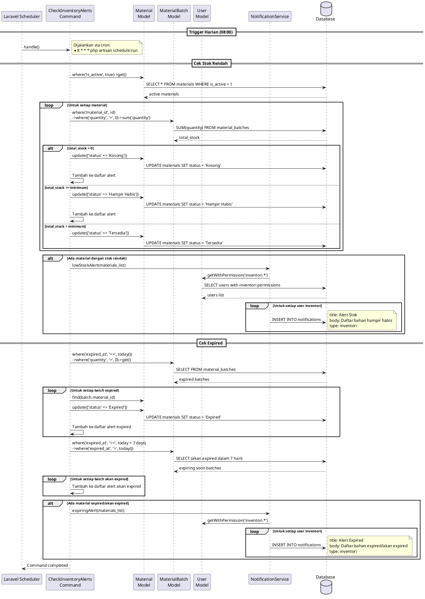
```plantuml
@startuml Sequence Diagram - Pengecekan Otomatis

participant "Laravel Scheduler" as Scheduler
participant "CheckInventoryAlerts\nCommand" as Command
participant "Material\nModel" as Material
participant "MaterialBatch\nModel" as Batch
participant "User\nModel" as User
participant "NotificationService" as Notif
database Database as DB

== Trigger Harian (08:00) ==
Scheduler -> Command: handle()
note right
  Dijalankan via cron:
  * 8 * * * php artisan schedule:run
end note

== Cek Stok Rendah ==
Command -> Material: where('is_active', true)->get()
Material -> DB: SELECT * FROM materials WHERE is_active = 1
DB --> Material: active materials

loop Untuk setiap material
    Command -> Batch: where('material_id', id)\n->where('quantity', '>', 0)->sum('quantity')
    Batch -> DB: SUM(quantity) FROM material_batches
    DB --> Batch: total_stock

    alt total_stock = 0
        Command -> Material: update(['status' => 'Kosong'])
        Material -> DB: UPDATE materials SET status = 'Kosong'
        Command -> Command: Tambah ke daftar alert

    else total_stock <= minimum
        Command -> Material: update(['status' => 'Hampir Habis'])
        Material -> DB: UPDATE materials SET status = 'Hampir Habis'
        Command -> Command: Tambah ke daftar alert

    else total_stock > minimum
        Command -> Material: update(['status' => 'Tersedia'])
        Material -> DB: UPDATE materials SET status = 'Tersedia'
    end
end

alt Ada material dengan stok rendah
    Command -> Notif: lowStockAlert(materials_list)
    Notif -> User: getWithPermission('inventori.*')
    User -> DB: SELECT users with inventori permissions
    DB --> User: users list

    loop Untuk setiap user inventori
        Notif -> DB: INSERT INTO notifications
        note right
          title: Alert Stok
          body: Daftar bahan hampir habis
          type: inventori
        end note
    end
end

== Cek Expired ==
Command -> Batch: where('expired_at', '<=', today())\n->where('quantity', '>', 0)->get()
Batch -> DB: SELECT FROM material_batches
DB --> Batch: expired batches

loop Untuk setiap batch expired
    Command -> Material: find(batch.material_id)
    Command -> Material: update(['status' => 'Expired'])
    Material -> DB: UPDATE materials SET status = 'Expired'
    Command -> Command: Tambah ke daftar alert expired
end

Command -> Batch: where('expired_at', '<=', today + 7 days)\n->where('expired_at', '>', today())
Batch -> DB: SELECT (akan expired dalam 7 hari)
DB --> Batch: expiring soon batches

loop Untuk setiap batch akan expired
    Command -> Command: Tambah ke daftar alert akan expired
end

alt Ada material expired/akan expired
    Command -> Notif: expiringAlert(materials_list)
    Notif -> User: getWithPermission('inventori.*')

    loop Untuk setiap user inventori
        Notif -> DB: INSERT INTO notifications
        note right
          title: Alert Expired
          body: Daftar bahan expired/akan expired
          type: inventori
        end note
    end
end

Command --> Scheduler: Command completed

@enduml
```

---

## 9. Sequence Diagram: Cetak Struk

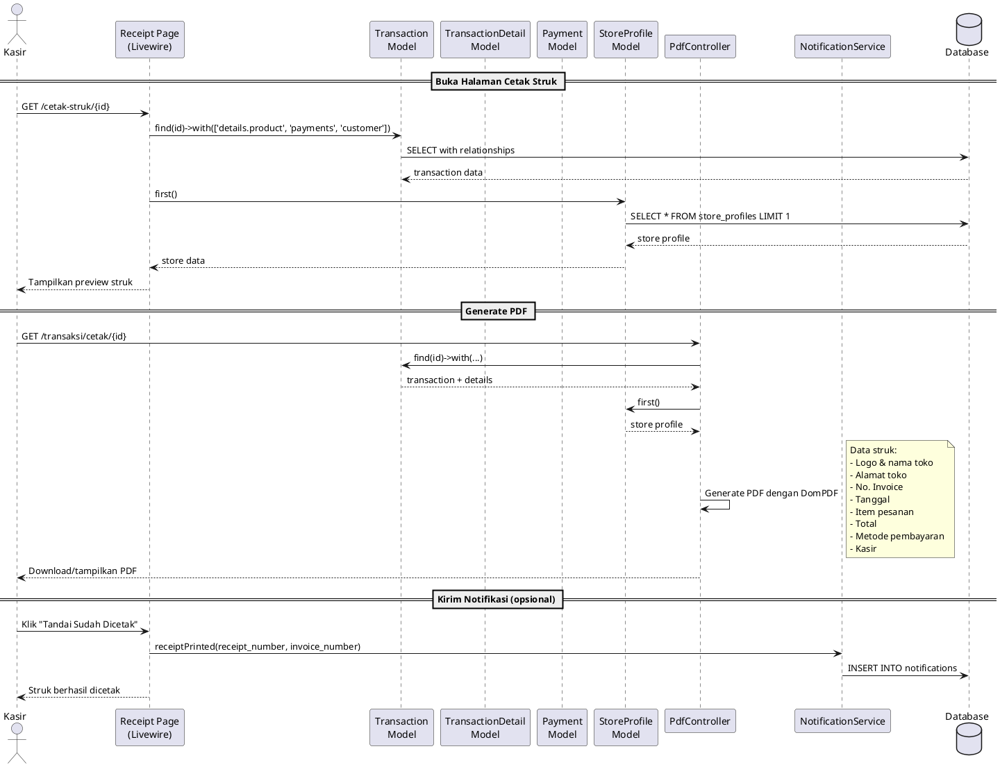
```plantuml
@startuml Sequence Diagram - Cetak Struk

actor Kasir
participant "Receipt Page\n(Livewire)" as Receipt
participant "Transaction\nModel" as Transaction
participant "TransactionDetail\nModel" as TxDetail
participant "Payment\nModel" as Payment
participant "StoreProfile\nModel" as Store
participant "PdfController" as PDF
participant "NotificationService" as Notif
database Database as DB

== Buka Halaman Cetak Struk ==
Kasir -> Receipt: GET /cetak-struk/{id}

Receipt -> Transaction: find(id)->with(['details.product', 'payments', 'customer'])
Transaction -> DB: SELECT with relationships
DB --> Transaction: transaction data

Receipt -> Store: first()
Store -> DB: SELECT * FROM store_profiles LIMIT 1
DB --> Store: store profile
Store --> Receipt: store data

Receipt --> Kasir: Tampilkan preview struk

== Generate PDF ==
Kasir -> PDF: GET /transaksi/cetak/{id}

PDF -> Transaction: find(id)->with(...)
Transaction --> PDF: transaction + details

PDF -> Store: first()
Store --> PDF: store profile

PDF -> PDF: Generate PDF dengan DomPDF
note right
  Data struk:
  - Logo & nama toko
  - Alamat toko
  - No. Invoice
  - Tanggal
  - Item pesanan
  - Total
  - Metode pembayaran
  - Kasir
end note

PDF --> Kasir: Download/tampilkan PDF

== Kirim Notifikasi (opsional) ==
Kasir -> Receipt: Klik "Tandai Sudah Dicetak"
Receipt -> Notif: receiptPrinted(receipt_number, invoice_number)
Notif -> DB: INSERT INTO notifications

Receipt --> Kasir: Struk berhasil dicetak

@enduml
```

---

## 10. Sequence Diagram: Mengelola Produk

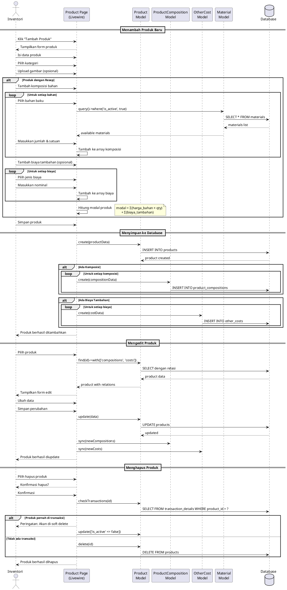
```plantuml
@startuml Sequence Diagram - Mengelola Produk

actor Inventori
participant "Product Page\n(Livewire)" as Page
participant "Product\nModel" as Product
participant "ProductComposition\nModel" as Composition
participant "OtherCost\nModel" as Cost
participant "Material\nModel" as Material
database Database as DB

== Menambah Produk Baru ==
Inventori -> Page: Klik "Tambah Produk"
Page --> Inventori: Tampilkan form produk

Inventori -> Page: Isi data produk
Inventori -> Page: Pilih kategori
Inventori -> Page: Upload gambar (opsional)

alt Produk dengan Resep
    Inventori -> Page: Tambah komposisi bahan

    loop Untuk setiap bahan
        Inventori -> Page: Pilih bahan baku
        Page -> Material: query()->where('is_active', true)
        Material -> DB: SELECT * FROM materials
        DB --> Material: materials list
        Material --> Page: available materials

        Inventori -> Page: Masukkan jumlah & satuan
        Page -> Page: Tambah ke array komposisi
    end

    Inventori -> Page: Tambah biaya tambahan (opsional)

    loop Untuk setiap biaya
        Inventori -> Page: Pilih jenis biaya
        Inventori -> Page: Masukkan nominal
        Page -> Page: Tambah ke array biaya
    end

    Page -> Page: Hitung modal produk
    note right
      modal = Σ(harga_bahan × qty)
            + Σ(biaya_tambahan)
    end note
end

Inventori -> Page: Simpan produk

== Menyimpan ke Database ==
Page -> Product: create(productData)
Product -> DB: INSERT INTO products
DB --> Product: product created

alt Ada Komposisi
    loop Untuk setiap komposisi
        Page -> Composition: create(compositionData)
        Composition -> DB: INSERT INTO product_compositions
    end
end

alt Ada Biaya Tambahan
    loop Untuk setiap biaya
        Page -> Cost: create(costData)
        Cost -> DB: INSERT INTO other_costs
    end
end

Page --> Inventori: Produk berhasil ditambahkan

== Mengedit Produk ==
Inventori -> Page: Pilih produk
Page -> Product: find(id)->with(['compositions', 'costs'])
Product -> DB: SELECT dengan relasi
DB --> Product: product data
Product --> Page: product with relations
Page --> Inventori: Tampilkan form edit

Inventori -> Page: Ubah data
Inventori -> Page: Simpan perubahan

Page -> Product: update(data)
Product -> DB: UPDATE products
DB --> Product: updated

Page -> Composition: sync(newCompositions)
Page -> Cost: sync(newCosts)

Page --> Inventori: Produk berhasil diupdate

== Menghapus Produk ==
Inventori -> Page: Pilih hapus produk
Page --> Inventori: Konfirmasi hapus?
Inventori -> Page: Konfirmasi

Page -> Product: checkTransactions(id)
Product -> DB: SELECT FROM transaction_details WHERE product_id = ?

alt Produk pernah di transaksi
    Page --> Inventori: Peringatan: Akan di-soft delete
    Page -> Product: update(['is_active' => false])
else Tidak ada transaksi
    Page -> Product: delete(id)
    Product -> DB: DELETE FROM products
end

Page --> Inventori: Produk berhasil dihapus

@enduml
```

---

## 11. Sequence Diagram: Mengelola Bahan Baku

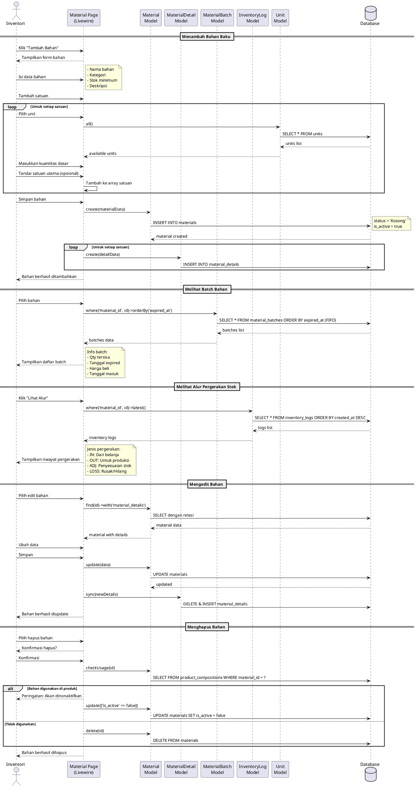
```plantuml
@startuml Sequence Diagram - Mengelola Bahan Baku

actor Inventori
participant "Material Page\n(Livewire)" as Page
participant "Material\nModel" as Material
participant "MaterialDetail\nModel" as Detail
participant "MaterialBatch\nModel" as Batch
participant "InventoryLog\nModel" as Log
participant "Unit\nModel" as Unit
database Database as DB

== Menambah Bahan Baku ==
Inventori -> Page: Klik "Tambah Bahan"
Page --> Inventori: Tampilkan form bahan

Inventori -> Page: Isi data bahan
note right
  - Nama bahan
  - Kategori
  - Stok minimum
  - Deskripsi
end note

Inventori -> Page: Tambah satuan

loop Untuk setiap satuan
    Inventori -> Page: Pilih unit
    Page -> Unit: all()
    Unit -> DB: SELECT * FROM units
    DB --> Unit: units list
    Unit --> Page: available units

    Inventori -> Page: Masukkan kuantitas dasar
    Inventori -> Page: Tandai satuan utama (opsional)
    Page -> Page: Tambah ke array satuan
end

Inventori -> Page: Simpan bahan

Page -> Material: create(materialData)
Material -> DB: INSERT INTO materials
note right
  status = 'Kosong'
  is_active = true
end note
DB --> Material: material created

loop Untuk setiap satuan
    Page -> Detail: create(detailData)
    Detail -> DB: INSERT INTO material_details
end

Page --> Inventori: Bahan berhasil ditambahkan

== Melihat Batch Bahan ==
Inventori -> Page: Pilih bahan
Page -> Batch: where('material_id', id)->orderBy('expired_at')
Batch -> DB: SELECT * FROM material_batches ORDER BY expired_at (FIFO)
DB --> Batch: batches list
Batch --> Page: batches data

Page --> Inventori: Tampilkan daftar batch
note right
  Info batch:
  - Qty tersisa
  - Tanggal expired
  - Harga beli
  - Tanggal masuk
end note

== Melihat Alur Pergerakan Stok ==
Inventori -> Page: Klik "Lihat Alur"
Page -> Log: where('material_id', id)->latest()
Log -> DB: SELECT * FROM inventory_logs ORDER BY created_at DESC
DB --> Log: logs list
Log --> Page: inventory logs

Page --> Inventori: Tampilkan riwayat pergerakan
note right
  Jenis pergerakan:
  - IN: Dari belanja
  - OUT: Untuk produksi
  - ADJ: Penyesuaian stok
  - LOSS: Rusak/Hilang
end note

== Mengedit Bahan ==
Inventori -> Page: Pilih edit bahan
Page -> Material: find(id)->with('material_details')
Material -> DB: SELECT dengan relasi
DB --> Material: material data
Material --> Page: material with details

Inventori -> Page: Ubah data
Inventori -> Page: Simpan

Page -> Material: update(data)
Material -> DB: UPDATE materials
DB --> Material: updated

Page -> Detail: sync(newDetails)
Detail -> DB: DELETE & INSERT material_details

Page --> Inventori: Bahan berhasil diupdate

== Menghapus Bahan ==
Inventori -> Page: Pilih hapus bahan
Page --> Inventori: Konfirmasi hapus?
Inventori -> Page: Konfirmasi

Page -> Material: checkUsage(id)
Material -> DB: SELECT FROM product_compositions WHERE material_id = ?

alt Bahan digunakan di produk
    Page --> Inventori: Peringatan: Akan dinonaktifkan
    Page -> Material: update(['is_active' => false])
    Material -> DB: UPDATE materials SET is_active = false
else Tidak digunakan
    Page -> Material: delete(id)
    Material -> DB: DELETE FROM materials
end

Page --> Inventori: Bahan berhasil dihapus

@enduml
```

---

## 12. Sequence Diagram: Mengelola Kategori Produk

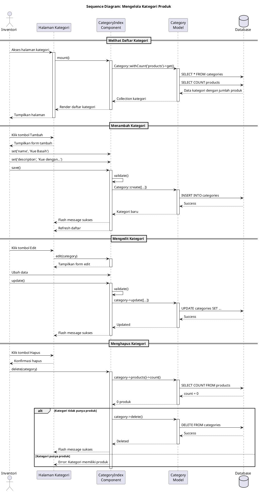
```plantuml
@startuml Sequence Diagram - Mengelola Kategori Produk

title Sequence Diagram: Mengelola Kategori Produk

actor Inventori as I
participant "Halaman Kategori" as H
participant "CategoryIndex\nComponent" as C
participant "Category\nModel" as M
database "Database" as DB

== Melihat Daftar Kategori ==

I -> H: Akses halaman kategori
activate H
H -> C: mount()
activate C
C -> M: Category::withCount('products')->get()
activate M
M -> DB: SELECT * FROM categories
M -> DB: SELECT COUNT products
DB --> M: Data kategori dengan jumlah produk
M --> C: Collection kategori
deactivate M
C --> H: Render daftar kategori
deactivate C
H --> I: Tampilkan halaman
deactivate H

== Menambah Kategori ==

I -> H: Klik tombol Tambah
H --> I: Tampilkan form tambah
I -> C: set('name', 'Kue Basah')
I -> C: set('description', 'Kue dengan...')
I -> C: save()
activate C
C -> C: validate()
C -> M: Category::create([...])
activate M
M -> DB: INSERT INTO categories
DB --> M: Success
M --> C: Kategori baru
deactivate M
C --> H: Flash message sukses
C --> H: Refresh daftar
deactivate C

== Mengedit Kategori ==

I -> H: Klik tombol Edit
H -> C: edit(category)
activate C
C --> H: Tampilkan form edit
deactivate C
I -> C: Ubah data
I -> C: update()
activate C
C -> C: validate()
C -> M: category->update([...])
activate M
M -> DB: UPDATE categories SET ...
DB --> M: Success
M --> C: Updated
deactivate M
C --> H: Flash message sukses
deactivate C

== Menghapus Kategori ==

I -> H: Klik tombol Hapus
H --> I: Konfirmasi hapus
I -> C: delete(category)
activate C
C -> M: category->products()->count()
activate M
M -> DB: SELECT COUNT FROM products
DB --> M: count = 0
M --> C: 0 produk
deactivate M

alt Kategori tidak punya produk
    C -> M: category->delete()
    activate M
    M -> DB: DELETE FROM categories
    DB --> M: Success
    M --> C: Deleted
    deactivate M
    C --> H: Flash message sukses
else Kategori punya produk
    C --> H: Error: Kategori memiliki produk
end

deactivate C

@enduml
```

---

## 13. Sequence Diagram: Mengelola Satuan

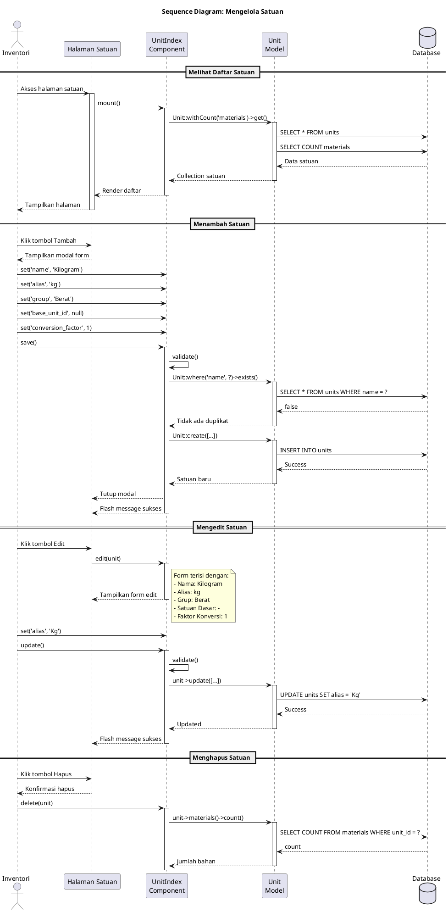
```plantuml
@startuml Sequence Diagram - Mengelola Satuan

title Sequence Diagram: Mengelola Satuan

actor Inventori as I
participant "Halaman Satuan" as H
participant "UnitIndex\nComponent" as U
participant "Unit\nModel" as M
database "Database" as DB

== Melihat Daftar Satuan ==

I -> H: Akses halaman satuan
activate H
H -> U: mount()
activate U
U -> M: Unit::withCount('materials')->get()
activate M
M -> DB: SELECT * FROM units
M -> DB: SELECT COUNT materials
DB --> M: Data satuan
M --> U: Collection satuan
deactivate M
U --> H: Render daftar
deactivate U
H --> I: Tampilkan halaman
deactivate H

== Menambah Satuan ==

I -> H: Klik tombol Tambah
H --> I: Tampilkan modal form
I -> U: set('name', 'Kilogram')
I -> U: set('alias', 'kg')
I -> U: set('group', 'Berat')
I -> U: set('base_unit_id', null)
I -> U: set('conversion_factor', 1)
I -> U: save()
activate U
U -> U: validate()
U -> M: Unit::where('name', ?)->exists()
activate M
M -> DB: SELECT * FROM units WHERE name = ?
DB --> M: false
M --> U: Tidak ada duplikat
deactivate M

U -> M: Unit::create([...])
activate M
M -> DB: INSERT INTO units
DB --> M: Success
M --> U: Satuan baru
deactivate M
U --> H: Tutup modal
U --> H: Flash message sukses
deactivate U

== Mengedit Satuan ==

I -> H: Klik tombol Edit
H -> U: edit(unit)
activate U
U --> H: Tampilkan form edit
deactivate U

note right
  Form terisi dengan:
  - Nama: Kilogram
  - Alias: kg
  - Grup: Berat
  - Satuan Dasar: -
  - Faktor Konversi: 1
end note

I -> U: set('alias', 'Kg')
I -> U: update()
activate U
U -> U: validate()
U -> M: unit->update([...])
activate M
M -> DB: UPDATE units SET alias = 'Kg'
DB --> M: Success
M --> U: Updated
deactivate M
U --> H: Flash message sukses
deactivate U

== Menghapus Satuan ==

I -> H: Klik tombol Hapus
H --> I: Konfirmasi hapus
I -> U: delete(unit)
activate U
U -> M: unit->materials()->count()
activate M
M -> DB: SELECT COUNT FROM materials WHERE unit_id = ?
DB --> M: count
M --> U: jumlah bahan
deactivate M

@enduml
```

---

## 14. Sequence Diagram: Mengelola Supplier

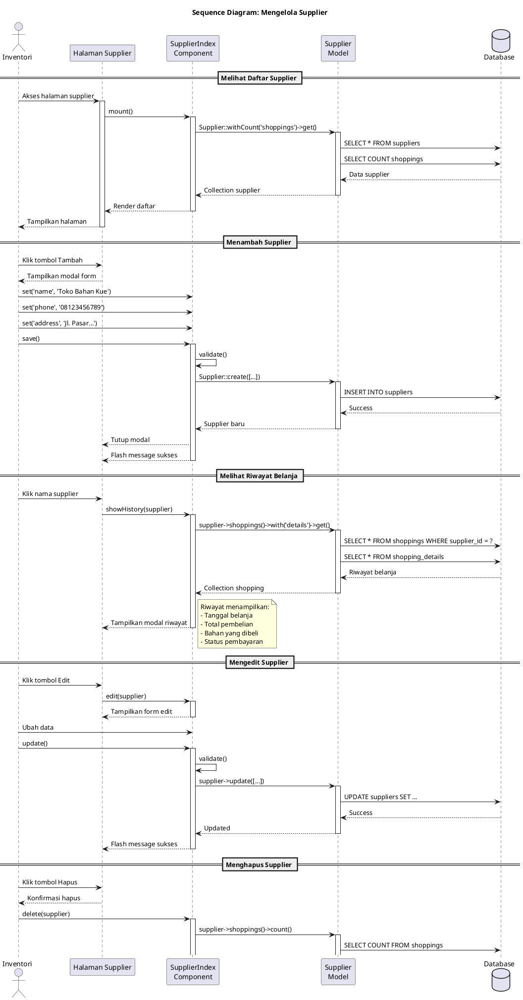
```plantuml
@startuml Sequence Diagram - Mengelola Supplier

title Sequence Diagram: Mengelola Supplier

actor Inventori as I
participant "Halaman Supplier" as H
participant "SupplierIndex\nComponent" as S
participant "Supplier\nModel" as M
database "Database" as DB

== Melihat Daftar Supplier ==

I -> H: Akses halaman supplier
activate H
H -> S: mount()
activate S
S -> M: Supplier::withCount('shoppings')->get()
activate M
M -> DB: SELECT * FROM suppliers
M -> DB: SELECT COUNT shoppings
DB --> M: Data supplier
M --> S: Collection supplier
deactivate M
S --> H: Render daftar
deactivate S
H --> I: Tampilkan halaman
deactivate H

== Menambah Supplier ==

I -> H: Klik tombol Tambah
H --> I: Tampilkan modal form
I -> S: set('name', 'Toko Bahan Kue')
I -> S: set('phone', '08123456789')
I -> S: set('address', 'Jl. Pasar...')
I -> S: save()
activate S
S -> S: validate()
S -> M: Supplier::create([...])
activate M
M -> DB: INSERT INTO suppliers
DB --> M: Success
M --> S: Supplier baru
deactivate M
S --> H: Tutup modal
S --> H: Flash message sukses
deactivate S

== Melihat Riwayat Belanja ==

I -> H: Klik nama supplier
H -> S: showHistory(supplier)
activate S
S -> M: supplier->shoppings()->with('details')->get()
activate M
M -> DB: SELECT * FROM shoppings WHERE supplier_id = ?
M -> DB: SELECT * FROM shopping_details
DB --> M: Riwayat belanja
M --> S: Collection shopping
deactivate M
S --> H: Tampilkan modal riwayat
deactivate S

note right
  Riwayat menampilkan:
  - Tanggal belanja
  - Total pembelian
  - Bahan yang dibeli
  - Status pembayaran
end note

== Mengedit Supplier ==

I -> H: Klik tombol Edit
H -> S: edit(supplier)
activate S
S --> H: Tampilkan form edit
deactivate S
I -> S: Ubah data
I -> S: update()
activate S
S -> S: validate()
S -> M: supplier->update([...])
activate M
M -> DB: UPDATE suppliers SET ...
DB --> M: Success
M --> S: Updated
deactivate M
S --> H: Flash message sukses
deactivate S

== Menghapus Supplier ==

I -> H: Klik tombol Hapus
H --> I: Konfirmasi hapus
I -> S: delete(supplier)
activate S
S -> M: supplier->shoppings()->count()
activate M
M -> DB: SELECT COUNT FROM shoppings

@enduml
```

---

## 15. Sequence Diagram: Mengelola Pelanggan

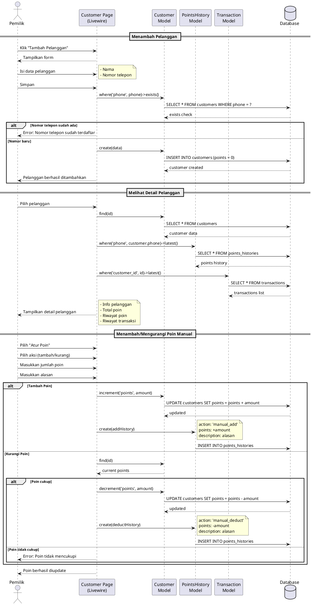
```plantuml
@startuml Sequence Diagram - Mengelola Pelanggan

actor Pemilik
participant "Customer Page\n(Livewire)" as Page
participant "Customer\nModel" as Customer
participant "PointsHistory\nModel" as Points
participant "Transaction\nModel" as Transaction
database Database as DB

== Menambah Pelanggan ==
Pemilik -> Page: Klik "Tambah Pelanggan"
Page --> Pemilik: Tampilkan form

Pemilik -> Page: Isi data pelanggan
note right
  - Nama
  - Nomor telepon
end note

Pemilik -> Page: Simpan

Page -> Customer: where('phone', phone)->exists()
Customer -> DB: SELECT * FROM customers WHERE phone = ?
DB --> Customer: exists check

alt Nomor telepon sudah ada
    Page --> Pemilik: Error: Nomor telepon sudah terdaftar
else Nomor baru
    Page -> Customer: create(data)
    Customer -> DB: INSERT INTO customers (points = 0)
    DB --> Customer: customer created
    Page --> Pemilik: Pelanggan berhasil ditambahkan
end

== Melihat Detail Pelanggan ==
Pemilik -> Page: Pilih pelanggan
Page -> Customer: find(id)
Customer -> DB: SELECT * FROM customers
DB --> Customer: customer data

Page -> Points: where('phone', customer.phone)->latest()
Points -> DB: SELECT * FROM points_histories
DB --> Points: points history

Page -> Transaction: where('customer_id', id)->latest()
Transaction -> DB: SELECT * FROM transactions
DB --> Transaction: transactions list

Page --> Pemilik: Tampilkan detail pelanggan
note right
  - Info pelanggan
  - Total poin
  - Riwayat poin
  - Riwayat transaksi
end note

== Menambah/Mengurangi Poin Manual ==
Pemilik -> Page: Pilih "Atur Poin"
Pemilik -> Page: Pilih aksi (tambah/kurang)
Pemilik -> Page: Masukkan jumlah poin
Pemilik -> Page: Masukkan alasan

alt Tambah Poin
    Page -> Customer: increment('points', amount)
    Customer -> DB: UPDATE customers SET points = points + amount
    DB --> Customer: updated

    Page -> Points: create(addHistory)
    note right
      action: 'manual_add'
      points: +amount
      description: alasan
    end note
    Points -> DB: INSERT INTO points_histories

else Kurangi Poin
    Page -> Customer: find(id)
    Customer --> Page: current points

    alt Poin cukup
        Page -> Customer: decrement('points', amount)
        Customer -> DB: UPDATE customers SET points = points - amount
        DB --> Customer: updated

        Page -> Points: create(deductHistory)
        note right
          action: 'manual_deduct'
          points: -amount
          description: alasan
        end note
        Points -> DB: INSERT INTO points_histories
    else Poin tidak cukup
        Page --> Pemilik: Error: Poin tidak mencukupi
    end
end

Page --> Pemilik: Poin berhasil diupdate

@enduml
```

---

## 16. Sequence Diagram: Mengelola Metode Pembayaran

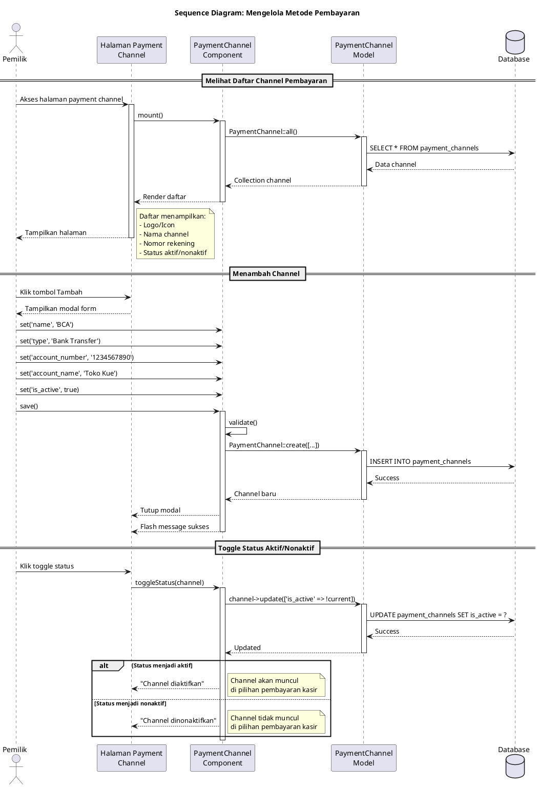
```plantuml
@startuml Sequence Diagram - Mengelola Metode Pembayaran

title Sequence Diagram: Mengelola Metode Pembayaran

actor Pemilik as P
participant "Halaman Payment\nChannel" as H
participant "PaymentChannel\nComponent" as PC
participant "PaymentChannel\nModel" as M
database "Database" as DB

== Melihat Daftar Channel Pembayaran ==

P -> H: Akses halaman payment channel
activate H
H -> PC: mount()
activate PC
PC -> M: PaymentChannel::all()
activate M
M -> DB: SELECT * FROM payment_channels
DB --> M: Data channel
M --> PC: Collection channel
deactivate M
PC --> H: Render daftar
deactivate PC
H --> P: Tampilkan halaman
deactivate H

note right
  Daftar menampilkan:
  - Logo/Icon
  - Nama channel
  - Nomor rekening
  - Status aktif/nonaktif
end note

== Menambah Channel ==

P -> H: Klik tombol Tambah
H --> P: Tampilkan modal form
P -> PC: set('name', 'BCA')
P -> PC: set('type', 'Bank Transfer')
P -> PC: set('account_number', '1234567890')
P -> PC: set('account_name', 'Toko Kue')
P -> PC: set('is_active', true)
P -> PC: save()
activate PC
PC -> PC: validate()
PC -> M: PaymentChannel::create([...])
activate M
M -> DB: INSERT INTO payment_channels
DB --> M: Success
M --> PC: Channel baru
deactivate M
PC --> H: Tutup modal
PC --> H: Flash message sukses
deactivate PC

== Toggle Status Aktif/Nonaktif ==

P -> H: Klik toggle status
H -> PC: toggleStatus(channel)
activate PC
PC -> M: channel->update(['is_active' => !current])
activate M
M -> DB: UPDATE payment_channels SET is_active = ?
DB --> M: Success
M --> PC: Updated
deactivate M

alt Status menjadi aktif
    PC --> H: "Channel diaktifkan"
    note right
      Channel akan muncul
      di pilihan pembayaran kasir
    end note
else Status menjadi nonaktif
    PC --> H: "Channel dinonaktifkan"
    note right
      Channel tidak muncul
      di pilihan pembayaran kasir
    end note
end

deactivate PC

@enduml
```

---

## 17. Sequence Diagram: Mengelola Peran

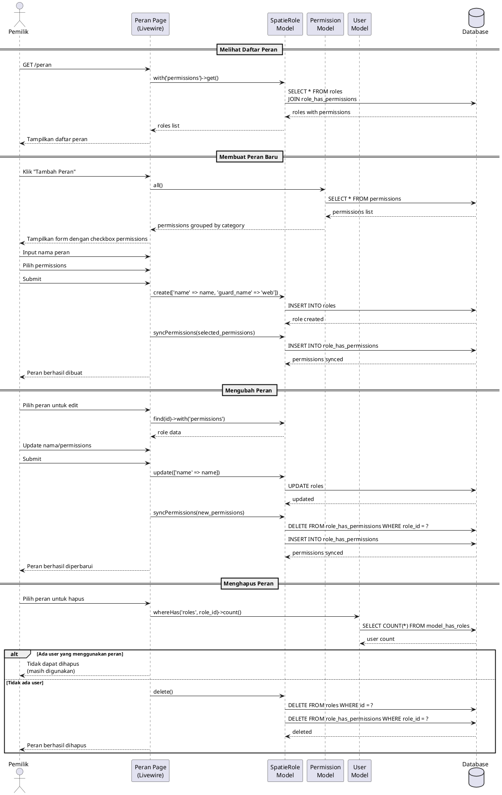
```plantuml
@startuml Sequence Diagram - Kelola Peran

actor Pemilik as User
participant "Peran Page\n(Livewire)" as RolePage
participant "SpatieRole\nModel" as Role
participant "Permission\nModel" as Permission
participant "User\nModel" as UserModel
database Database as DB

== Melihat Daftar Peran ==
User -> RolePage: GET /peran
RolePage -> Role: with('permissions')->get()
Role -> DB: SELECT * FROM roles\nJOIN role_has_permissions
DB --> Role: roles with permissions
Role --> RolePage: roles list
RolePage --> User: Tampilkan daftar peran

== Membuat Peran Baru ==
User -> RolePage: Klik "Tambah Peran"
RolePage -> Permission: all()
Permission -> DB: SELECT * FROM permissions
DB --> Permission: permissions list
Permission --> RolePage: permissions grouped by category
RolePage --> User: Tampilkan form dengan checkbox permissions

User -> RolePage: Input nama peran
User -> RolePage: Pilih permissions
User -> RolePage: Submit

RolePage -> Role: create(['name' => name, 'guard_name' => 'web'])
Role -> DB: INSERT INTO roles
DB --> Role: role created

RolePage -> Role: syncPermissions(selected_permissions)
Role -> DB: INSERT INTO role_has_permissions
DB --> Role: permissions synced

RolePage --> User: Peran berhasil dibuat

== Mengubah Peran ==
User -> RolePage: Pilih peran untuk edit
RolePage -> Role: find(id)->with('permissions')
Role --> RolePage: role data

User -> RolePage: Update nama/permissions
User -> RolePage: Submit

RolePage -> Role: update(['name' => name])
Role -> DB: UPDATE roles
DB --> Role: updated

RolePage -> Role: syncPermissions(new_permissions)
Role -> DB: DELETE FROM role_has_permissions WHERE role_id = ?
Role -> DB: INSERT INTO role_has_permissions
DB --> Role: permissions synced

RolePage --> User: Peran berhasil diperbarui

== Menghapus Peran ==
User -> RolePage: Pilih peran untuk hapus
RolePage -> UserModel: whereHas('roles', role_id)->count()
UserModel -> DB: SELECT COUNT(*) FROM model_has_roles
DB --> UserModel: user count

alt Ada user yang menggunakan peran
    RolePage --> User: Tidak dapat dihapus\n(masih digunakan)
else Tidak ada user
    RolePage -> Role: delete()
    Role -> DB: DELETE FROM roles WHERE id = ?
    Role -> DB: DELETE FROM role_has_permissions WHERE role_id = ?
    DB --> Role: deleted

    RolePage --> User: Peran berhasil dihapus
end

@enduml
```

---

## 18. Sequence Diagram: Mengelola Pekerja

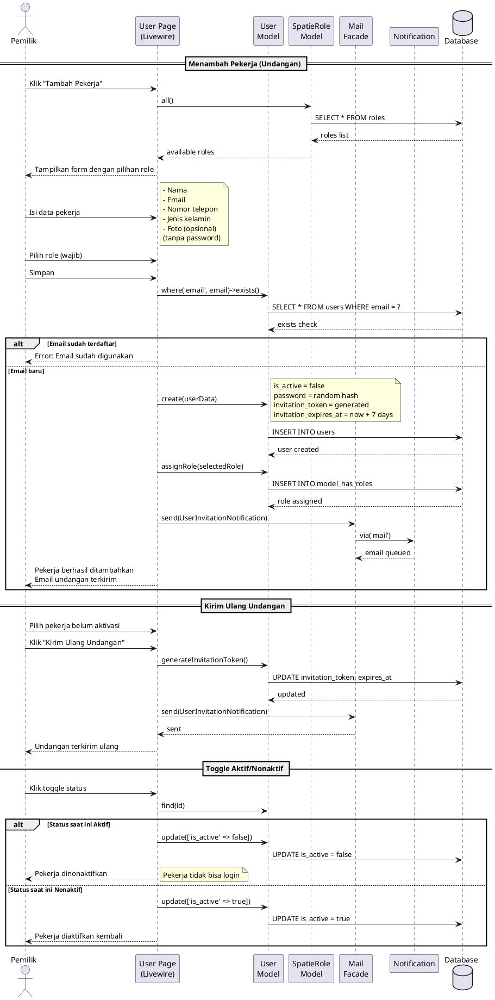
```plantuml
@startuml Sequence Diagram - Mengelola Pekerja

actor Pemilik
participant "User Page\n(Livewire)" as Page
participant "User\nModel" as User
participant "SpatieRole\nModel" as Role
participant "Mail\nFacade" as Mail
participant "Notification" as Notif
database Database as DB

== Menambah Pekerja (Undangan) ==
Pemilik -> Page: Klik "Tambah Pekerja"

Page -> Role: all()
Role -> DB: SELECT * FROM roles
DB --> Role: roles list
Role --> Page: available roles

Page --> Pemilik: Tampilkan form dengan pilihan role

Pemilik -> Page: Isi data pekerja
note right
  - Nama
  - Email
  - Nomor telepon
  - Jenis kelamin
  - Foto (opsional)
  (tanpa password)
end note

Pemilik -> Page: Pilih role (wajib)
Pemilik -> Page: Simpan

Page -> User: where('email', email)->exists()
User -> DB: SELECT * FROM users WHERE email = ?
DB --> User: exists check

alt Email sudah terdaftar
    Page --> Pemilik: Error: Email sudah digunakan
else Email baru
    Page -> User: create(userData)
    note right
      is_active = false
      password = random hash
      invitation_token = generated
      invitation_expires_at = now + 7 days
    end note
    User -> DB: INSERT INTO users
    DB --> User: user created

    Page -> User: assignRole(selectedRole)
    User -> DB: INSERT INTO model_has_roles
    DB --> User: role assigned

    Page -> Mail: send(UserInvitationNotification)
    Mail -> Notif: via('mail')
    Notif --> Mail: email queued

    Page --> Pemilik: Pekerja berhasil ditambahkan\nEmail undangan terkirim
end

== Kirim Ulang Undangan ==
Pemilik -> Page: Pilih pekerja belum aktivasi
Pemilik -> Page: Klik "Kirim Ulang Undangan"

Page -> User: generateInvitationToken()
User -> DB: UPDATE invitation_token, expires_at
DB --> User: updated

Page -> Mail: send(UserInvitationNotification)
Mail --> Page: sent

Page --> Pemilik: Undangan terkirim ulang

== Toggle Aktif/Nonaktif ==
Pemilik -> Page: Klik toggle status
Page -> User: find(id)

alt Status saat ini Aktif
    Page -> User: update(['is_active' => false])
    User -> DB: UPDATE is_active = false
    Page --> Pemilik: Pekerja dinonaktifkan
    note right: Pekerja tidak bisa login
else Status saat ini Nonaktif
    Page -> User: update(['is_active' => true])
    User -> DB: UPDATE is_active = true
    Page --> Pemilik: Pekerja diaktifkan kembali
end

@enduml
```

---

## 19. Sequence Diagram: Mengelola Profil Usaha

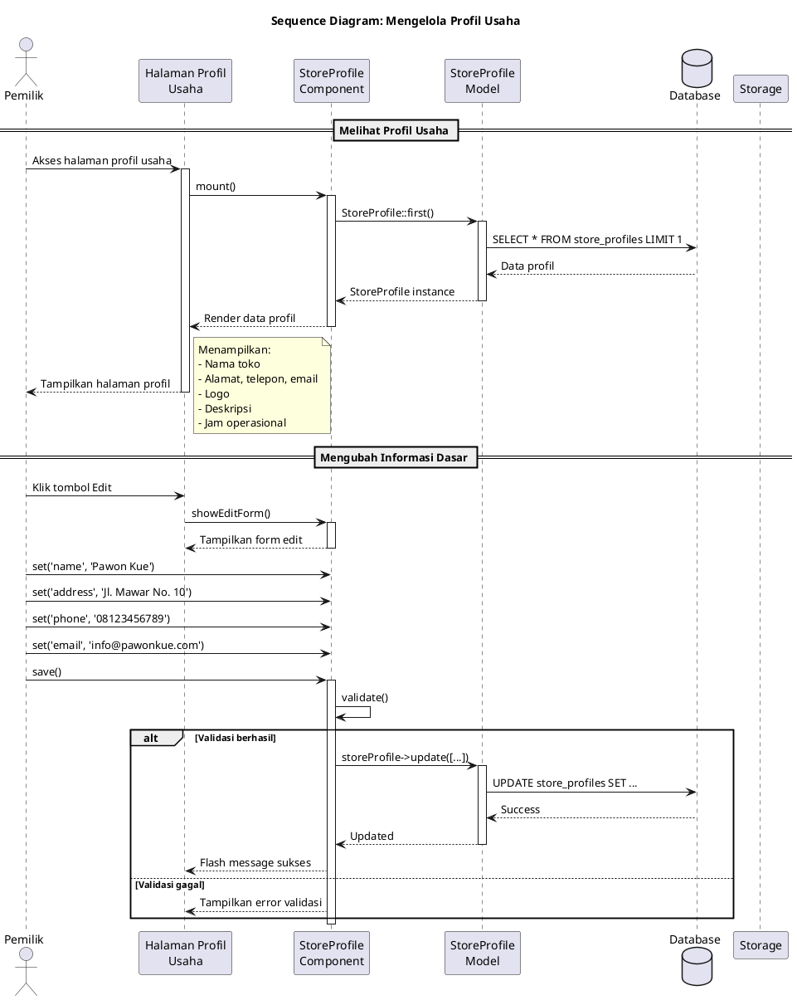
```plantuml
@startuml Sequence Diagram - Mengelola Profil Usaha

title Sequence Diagram: Mengelola Profil Usaha

actor Pemilik as P
participant "Halaman Profil\nUsaha" as H
participant "StoreProfile\nComponent" as S
participant "StoreProfile\nModel" as M
database "Database" as DB
participant "Storage" as ST

== Melihat Profil Usaha ==

P -> H: Akses halaman profil usaha
activate H
H -> S: mount()
activate S
S -> M: StoreProfile::first()
activate M
M -> DB: SELECT * FROM store_profiles LIMIT 1
DB --> M: Data profil
M --> S: StoreProfile instance
deactivate M
S --> H: Render data profil
deactivate S
H --> P: Tampilkan halaman profil
deactivate H

note right
  Menampilkan:
  - Nama toko
  - Alamat, telepon, email
  - Logo
  - Deskripsi
  - Jam operasional
end note

== Mengubah Informasi Dasar ==

P -> H: Klik tombol Edit
H -> S: showEditForm()
activate S
S --> H: Tampilkan form edit
deactivate S

P -> S: set('name', 'Pawon Kue')
P -> S: set('address', 'Jl. Mawar No. 10')
P -> S: set('phone', '08123456789')
P -> S: set('email', 'info@pawonkue.com')
P -> S: save()
activate S
S -> S: validate()

alt Validasi berhasil
    S -> M: storeProfile->update([...])
    activate M
    M -> DB: UPDATE store_profiles SET ...
    DB --> M: Success
    M --> S: Updated
    deactivate M
    S --> H: Flash message sukses
else Validasi gagal
    S --> H: Tampilkan error validasi
end

deactivate S

@enduml
```
