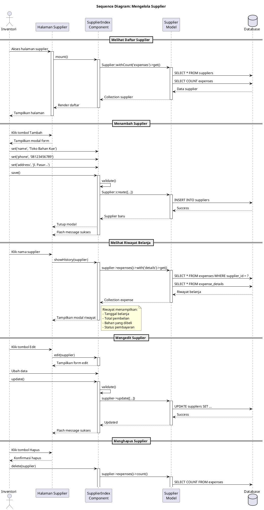

# SEQUENCE DIAGRAM

## Sistem Informasi Manajemen Toko Kue

---

## Daftar Sequence Diagram

| No  | Nama Diagram                       | Modul       | Aktor Utama |
| --- | ---------------------------------- | ----------- | ----------- |
| 1   | Login dan Otorisasi                | Autentikasi | User        |
| 2   | Transaksi Siap Beli                | Kasir       | Kasir       |
| 3   | Transaksi Pesanan (Reguler/Kotak)  | Kasir       | Kasir       |
| 4   | Pelunasan Pembayaran               | Kasir       | Kasir       |
| 5   | Proses Produksi                    | Produksi    | Produksi    |
| 6   | Proses Belanja Bahan Baku          | Inventori   | Inventori   |
| 7   | Proses Hitung Stok                 | Inventori   | Inventori   |
| 8   | Pengecekan Otomatis Stok & Expired | Sistem      | Scheduler   |
| 9   | Cetak Struk                        | Kasir       | Kasir       |
| 10  | Mengelola Produk                   | Inventori   | Inventori   |
| 11  | Mengelola Bahan Baku               | Inventori   | Inventori   |
| 12  | Mengelola Kategori Produk          | Inventori   | Inventori   |
| 13  | Mengelola Satuan                   | Inventori   | Inventori   |
| 14  | Mengelola Supplier                 | Inventori   | Inventori   |
| 15  | Mengelola Pelanggan                | Manajemen   | Pemilik     |
| 16  | Mengelola Metode Pembayaran        | Manajemen   | Pemilik     |
| 17  | Mengelola Peran                    | Manajemen   | Pemilik     |
| 18  | Mengelola Pekerja                  | Manajemen   | Pemilik     |
| 19  | Mengelola Profil Usaha             | Manajemen   | Pemilik     |

---

## 1. Sequence Diagram: Login dan Otorisasi

Sequence diagram berikut menggambarkan alur interaksi antara User, Login Page, LoginRequest Controller, Auth Facade, User Model, Session, dan Database dalam proses login ke sistem. Diawali dengan User yang mengakses halaman login dan memasukkan email serta password. LoginRequest Controller melakukan validasi format input, kemudian Auth Facade mencari user berdasarkan email di database dan memverifikasi password menggunakan Hash. Jika kredensial valid, sistem memeriksa status akun (is_active). Untuk akun aktif, Session di-regenerate dan user_id disimpan. Selanjutnya, sistem memeriksa permission user untuk menentukan redirect: user dengan permission diarahkan ke dashboard sesuai hak akses (kasir, produksi, inventori), sedangkan user tanpa permission diarahkan ke halaman menunggu peran.

---

## 2. Sequence Diagram: Transaksi Siap Beli

Sequence diagram berikut menggambarkan alur interaksi antara Kasir, POS Page (Livewire), Transaction Model, TransactionDetail Model, Product Model, Customer Model, Payment Model, PointsHistory Model, NotificationService, dan Database dalam proses transaksi siap beli. Diawali dengan Kasir yang memilih produk dari katalog yang tersedia (is_ready = true) dan menambahkannya ke keranjang. Selanjutnya, Kasir memasukkan data pelanggan menggunakan nomor telepon dengan metode firstOrCreate, memilih metode pembayaran, dan memasukkan jumlah bayar. Sistem menyimpan transaksi dengan nomor invoice auto-generate dan status "Selesai", membuat detail transaksi untuk setiap item, mengurangi stok produk, dan menyimpan pembayaran. Jika pembayaran lunas dan pelanggan terdaftar, sistem menambah poin dan mencatat histori poin. Terakhir, notifikasi dikirim dan opsi cetak struk ditampilkan.

---

## 3. Sequence Diagram: Transaksi Pesanan

Sequence diagram berikut menggambarkan alur interaksi untuk transaksi pesanan (reguler atau kotak). Proses dimulai ketika Kasir memilih metode pesanan, memilih produk dan jumlah, memasukkan jadwal pengambilan, dan data pelanggan. Sistem menyimpan transaksi dengan status "Antrian" dan method sesuai jenis pesanan. Bersamaan dengan itu, sistem membuat record produksi dengan production_number auto-generate dan status "Antrian", serta production_details untuk setiap item. Untuk pembayaran, Kasir dapat memilih bayar DP (uang muka) atau lunas, yang masing-masing akan memicu notifikasi berbeda. Setelah transaksi berhasil, sistem mengirim notifikasi ke Kasir dan bagian Produksi bahwa pesanan telah masuk antrian produksi.

---

## 4. Sequence Diagram: Pelunasan Pembayaran

Sequence diagram berikut menggambarkan alur interaksi dalam proses pelunasan pembayaran untuk transaksi yang sebelumnya dibayar dengan uang muka (DP). Diawali dengan Kasir yang memfilter transaksi dengan status "Uang Muka" dan memilih transaksi yang akan dilunasi. Sistem menampilkan detail transaksi termasuk total tagihan, jumlah yang sudah dibayar (DP), dan sisa tagihan. Kasir memilih metode pembayaran tunai atau non-tunai. Untuk tunai, sistem menghitung kembalian; untuk non-tunai, Kasir memilih channel pembayaran dari daftar yang aktif di database. Setelah konfirmasi, sistem menyimpan pembayaran baru dan mengupdate status transaksi menjadi "Lunas". Jika pelanggan terdaftar, sistem menghitung dan menambah poin loyalitas (1 poin per Rp 10.000) beserta histori poin. Notifikasi pelunasan dikirim dan opsi cetak struk ditampilkan.

---

## 5. Sequence Diagram: Proses Produksi

Sequence diagram berikut menggambarkan alur interaksi dalam proses produksi secara detail. Diawali dengan bagian Produksi yang melihat antrian produksi dengan status "Antrian". Saat memulai produksi, sistem memeriksa ketersediaan bahan untuk setiap produk melalui ProductComposition dan MaterialBatch. Jika bahan cukup, Produksi memilih pekerja yang terlibat dan mengkonfirmasi mulai produksi. Sistem mencatat production_workers, kemudian mengurangi stok bahan menggunakan metode FIFO (batch dengan expired terdekat digunakan duluan) dan mencatat log inventori dengan action "produksi" dan type "out". Status produksi diubah menjadi "Proses". Saat produksi selesai, sistem menambah stok produk jadi melalui Product Model. Jika produksi berasal dari pesanan (ada transaction_id), status transaksi diubah menjadi "Dapat Diambil" dan notifikasi dikirim ke Kasir.

---

## 6. Sequence Diagram: Proses Belanja Bahan Baku

Sequence diagram berikut menggambarkan alur interaksi dalam proses belanja bahan baku. Proses dimulai saat Inventori membuat rencana belanja dengan memilih supplier dan menambahkan bahan baku beserta jumlah dan harga perkiraan. Sistem menyimpan expense dengan expense_number auto-generate dan status "Rencana" beserta expense_details. Setelah rencana disimpan, notifikasi dikirim. Ketika memulai belanja, status diubah menjadi "Proses". Saat menyelesaikan belanja, Inventori mengisi jumlah aktual, harga aktual, dan tanggal expired untuk setiap bahan. Sistem kemudian membuat MaterialBatch baru untuk setiap bahan dengan informasi quantity, expired_at, dan price, serta mencatat log inventori dengan action "belanja" dan type "in". Status bahan diupdate berdasarkan total stok, dan expense diupdate dengan grand_total_actual dan status "Selesai".

---

## 7. Sequence Diagram: Proses Hitung Stok

Sequence diagram berikut menggambarkan alur interaksi dalam proses penghitungan stok (stock opname). Inventori memulai dengan membuat rencana hitung dengan memilih aksi (hitung/rusak/hilang) dan bahan-bahan yang akan dihitung. Untuk setiap bahan, sistem mencatat quantity_system dari total MaterialBatch saat ini. Status rencana adalah "Rencana" kemudian berubah menjadi "Proses" saat mulai hitung. Inventori memasukkan quantity_actual hasil penghitungan fisik. Sistem menghitung selisih (quantity_actual - quantity_system). Untuk aksi Hitung: jika ada kelebihan (selisih > 0), sistem membuat adjustment batch dan mencatat log "in"; jika ada kekurangan (selisih < 0), stok dikurangi dengan FIFO dan dicatat log "out". Untuk aksi Rusak/Hilang: stok langsung dikurangi dan dicatat dengan log sesuai aksi. Terakhir, status bahan diupdate berdasarkan kondisi stok terbaru.

---

## 8. Sequence Diagram: Pengecekan Otomatis Stok & Expired

Sequence diagram berikut menggambarkan alur interaksi dalam proses pengecekan otomatis yang dijalankan oleh Laravel Scheduler setiap hari pukul 08:00. CheckInventoryAlerts Command memproses dua pengecekan paralel. Pertama, pengecekan stok rendah: sistem query semua material aktif, menghitung total stok dari MaterialBatch untuk setiap bahan, dan mengupdate status menjadi "Kosong" (jika stok = 0), "Hampir Habis" (jika stok <= minimum), atau "Tersedia" (jika stok > minimum). Jika ada bahan dengan stok rendah, notifikasi dikirim ke semua user dengan permission inventori. Kedua, pengecekan expired: sistem query batch yang sudah expired atau akan expired dalam 7 hari, mengupdate status material menjadi "Expired" jika diperlukan, dan mengirim alert ke user inventori. Hasil pengecekan di-log untuk audit.

---

## 9. Sequence Diagram: Cetak Struk

Sequence diagram berikut menggambarkan alur interaksi dalam proses pencetakan struk transaksi. Diawali dengan Kasir yang mengakses halaman cetak struk dengan parameter transaction id. Sistem mengambil data transaksi lengkap dengan relasi details.product, payments, dan customer dari database, serta mengambil data profil toko (store_profile) untuk informasi header struk. Receipt Page menampilkan preview struk kepada Kasir. Saat Kasir meminta cetak PDF, PdfController menggenerate dokumen PDF menggunakan DomPDF dengan data struk yang mencakup logo dan nama toko, alamat, nomor invoice, tanggal, item pesanan, total, metode pembayaran, dan nama kasir. PDF kemudian di-download atau ditampilkan. Kasir juga dapat menandai struk sudah dicetak yang akan memicu notifikasi ke sistem.

---

## 10. Sequence Diagram: Mengelola Produk

Sequence diagram berikut menggambarkan alur interaksi dalam proses pengelolaan data produk. Untuk menambah produk, Inventori mengisi form produk termasuk kategori dan gambar. Jika produk memiliki resep, Inventori menambahkan komposisi bahan dengan memilih dari Material yang aktif dan memasukkan jumlah serta satuan. Biaya tambahan (other costs) juga dapat ditambahkan. Sistem menghitung modal produk berdasarkan formula: modal = Σ(harga_bahan × qty) + Σ(biaya_tambahan). Data disimpan ke tabel products, product_compositions, dan other_costs. Untuk mengedit, sistem mengambil produk dengan relasi compositions dan costs, lalu menyinkronkan data baru. Untuk menghapus, sistem memeriksa apakah produk pernah ada di transaction_details. Jika ada, produk di-soft delete (is_active = false); jika tidak ada, produk dihapus permanen.

---

## 11. Sequence Diagram: Mengelola Bahan Baku

Sequence diagram berikut menggambarkan alur interaksi dalam proses pengelolaan data bahan baku. Untuk menambah bahan, Inventori mengisi data termasuk nama, kategori, stok minimum, dan deskripsi. Selanjutnya, Inventori menentukan satuan dengan mengambil daftar Unit dari database dan memasukkan kuantitas dasar serta menandai satuan utama. Sistem menyimpan material dengan status "Kosong" dan is_active = true, serta material_details untuk setiap satuan. Fitur Lihat Batch menampilkan daftar batch dengan urutan FIFO (expired terdekat duluan) termasuk informasi quantity tersisa, tanggal expired, harga beli, dan tanggal masuk. Fitur Lihat Alur menampilkan inventory_logs dengan jenis pergerakan IN (belanja), OUT (produksi), ADJ (penyesuaian), dan LOSS (rusak/hilang). Untuk menghapus bahan yang digunakan di product_compositions, sistem melakukan soft delete (is_active = false).

---

## 12. Sequence Diagram: Mengelola Kategori Produk

Sequence diagram berikut menggambarkan alur interaksi dalam proses pengelolaan kategori produk. Diawali dengan Inventori yang mengakses halaman kategori. Component melakukan mount dan query Category dengan withCount('products') untuk mendapatkan jumlah produk per kategori. Untuk menambah kategori, Inventori mengisi nama dan deskripsi, kemudian Component melakukan validasi dan menyimpan ke database. Untuk mengedit, Component mengambil data kategori yang dipilih, menampilkan form edit, kemudian menyimpan perubahan. Untuk menghapus, sistem terlebih dahulu memeriksa apakah kategori memiliki produk dengan method products()->count(). Jika kategori tidak memiliki produk, penghapusan diproses. Jika kategori masih memiliki produk, sistem menampilkan error bahwa kategori tidak dapat dihapus untuk menjaga integritas data.

---

## 13. Sequence Diagram: Mengelola Satuan

Sequence diagram berikut menggambarkan alur interaksi dalam proses pengelolaan satuan pengukuran. Inventori mengakses halaman satuan dan Component melakukan mount dengan query Unit::withCount('materials') untuk mendapatkan jumlah bahan yang menggunakan setiap satuan. Untuk menambah satuan, Inventori mengisi nama (Kilogram), alias (kg), group (Berat), base_unit_id, dan conversion_factor. Sistem memeriksa duplikasi dengan query Unit::where('name', ?)->exists() sebelum menyimpan. Untuk mengedit, form terisi dengan data satuan yang dipilih termasuk nama, alias, grup, satuan dasar, dan faktor konversi. Perubahan disimpan setelah validasi. Untuk menghapus, sistem memeriksa apakah satuan digunakan oleh bahan dengan method materials()->count(). Jika satuan masih digunakan, penghapusan tidak diizinkan.

---

## 14. Sequence Diagram: Mengelola Supplier

Sequence diagram berikut menggambarkan alur interaksi dalam proses pengelolaan data supplier. Inventori mengakses halaman supplier dan Component melakukan mount dengan query Supplier::withCount('expenses') untuk mendapatkan jumlah transaksi belanja per supplier. Untuk menambah supplier, Inventori mengisi nama, phone, dan address. Sistem melakukan validasi dan menyimpan ke database. Fitur Lihat Riwayat menampilkan riwayat belanja dari supplier dengan query supplier->expenses()->with('details')->get(), yang menampilkan tanggal belanja, total pembelian, bahan yang dibeli, dan status pembayaran. Untuk mengedit, Component mengambil data supplier, menampilkan form edit, dan menyimpan perubahan. Untuk menghapus, sistem memeriksa apakah supplier memiliki riwayat belanja dengan method expenses()->count(). Jika ada riwayat, penghapusan tidak diizinkan.

---

## 15. Sequence Diagram: Mengelola Pelanggan

Sequence diagram berikut menggambarkan alur interaksi dalam proses pengelolaan data pelanggan dan sistem poin loyalitas. Untuk menambah pelanggan, Pemilik mengisi nama dan nomor telepon. Sistem memeriksa apakah nomor telepon sudah terdaftar dengan query Customer::where('phone', phone)->exists(). Jika nomor baru, data disimpan dengan poin awal 0. Fitur Lihat Detail menampilkan informasi pelanggan, total poin, riwayat poin dari PointsHistory (dengan jenis: dapat dari transaksi atau pakai untuk diskon), dan riwayat transaksi dari Transaction. Fitur Atur Poin memungkinkan Pemilik menambah atau mengurangi poin secara manual. Untuk tambah poin, sistem increment langsung dan mencatat histori dengan action "manual_add". Untuk kurangi poin, sistem memeriksa apakah poin cukup, jika ya maka decrement dan catat histori dengan action "manual_deduct".

---

## 16. Sequence Diagram: Mengelola Metode Pembayaran

Sequence diagram berikut menggambarkan alur interaksi dalam proses pengelolaan metode atau channel pembayaran. Pemilik mengakses halaman payment channel dan Component melakukan mount dengan query PaymentChannel::all() untuk mendapatkan semua channel termasuk logo, nama, nomor rekening, dan status aktif. Untuk menambah channel, Pemilik mengisi nama (BCA), type (Bank Transfer), account_number, account_name, dan is_active. Data disimpan setelah validasi. Fitur Toggle Status memungkinkan Pemilik mengaktifkan atau menonaktifkan channel dengan method channel->update(['is_active' => !current]). Channel yang aktif akan muncul di pilihan pembayaran kasir, sedangkan channel nonaktif tidak akan muncul. Untuk mengedit, Component mengambil data channel, menampilkan form edit, dan menyimpan perubahan.

---

## 17. Sequence Diagram: Mengelola Peran

Sequence diagram berikut menggambarkan alur interaksi dalam proses pengelolaan peran (role) menggunakan Spatie Permission. Pemilik mengakses halaman peran dan sistem melakukan query Role::with('permissions') untuk mendapatkan semua peran beserta permission-nya. Untuk membuat peran baru, sistem query semua Permission yang dikelompokkan berdasarkan kategori (kasir, produksi, inventori, manajemen) dan menampilkan form dengan checkbox permissions. Setelah Pemilik memilih nama dan permissions, sistem create role dengan guard_name 'web' dan syncPermissions ke tabel role_has_permissions. Untuk mengubah peran, sistem mengupdate nama dan menyinkronkan permissions baru (delete lama, insert baru). Untuk menghapus, sistem memeriksa apakah ada user yang menggunakan peran tersebut melalui model_has_roles. Jika ada user, penghapusan tidak diizinkan; jika tidak ada, role dan relasi permission-nya dihapus.

---

## 18. Sequence Diagram: Mengelola Pekerja

Sequence diagram berikut menggambarkan alur interaksi dalam proses pengelolaan data pekerja dengan sistem undangan. Untuk menambah pekerja, sistem query semua Role untuk pilihan. Pemilik mengisi data termasuk nama, email, nomor telepon, jenis kelamin, dan foto (opsional) tanpa password. Sistem memeriksa duplikasi email dengan User::where('email', email)->exists(). Jika email baru, user dibuat dengan is_active = false, password random hash, invitation_token, dan invitation_expires_at (7 hari). Role di-assign melalui assignRole() ke tabel model_has_roles, kemudian email undangan dikirim via Mail Facade. Fitur Kirim Ulang Undangan menggenerate token baru dan mengirim email ulang. Fitur Toggle Aktif/Nonaktif mengubah is_active untuk mengontrol akses login pekerja: pekerja nonaktif tidak dapat login ke sistem.

---

## 19. Sequence Diagram: Mengelola Profil Usaha

Sequence diagram berikut menggambarkan alur interaksi dalam proses pengelolaan profil usaha atau toko. Pemilik mengakses halaman profil usaha dan Component melakukan mount dengan query StoreProfile::first() untuk mendapatkan data profil toko yang biasanya hanya satu record. Sistem menampilkan informasi lengkap termasuk nama toko, alamat, telepon, email, logo, deskripsi, dan jam operasional. Untuk mengubah informasi dasar, Pemilik mengklik tombol edit dan Component menampilkan form. Pemilik dapat mengubah nama, alamat, phone, dan email. Sistem melakukan validasi dan jika berhasil, data diupdate ke database dan flash message sukses ditampilkan. Jika validasi gagal, error validasi ditampilkan. Informasi profil usaha ini digunakan di berbagai tempat dalam aplikasi seperti header struk transaksi.

