# CLASS DIAGRAM

## Sistem Informasi Manajemen Toko Kue

---

## Class Diagram (PlantUML)

Berikut adalah diagram kelas yang menggambarkan struktur dan komponen Sistem Informasi Manajemen Toko Kue. Diagram kelas ini memvisualisasikan berbagai kelas yang terlibat dalam sistem, beserta atribut dan relasi antar kelas tersebut. Terdapat beberapa kelas utama dalam sistem ini, yang dikelompokkan berdasarkan fungsinya:

**Package User & Authentication:**
1. **Class User**, kelas ini menyimpan data pengguna sistem (pekerja) termasuk nama, email, telepon, password, foto profil, dan status aktivasi. Kelas ini terintegrasi dengan Spatie Permission untuk manajemen role dan permission. Pada kelas ini terdapat method untuk aktivasi akun melalui invitation token.
2. **Class SpatieRole**, kelas ini menyimpan data peran pengguna seperti Pemilik, Kasir, Produksi, dan Inventori. Setiap role dapat memiliki banyak permission.
3. **Class Permission**, kelas ini menyimpan hak akses granular yang dapat dimiliki oleh role, seperti kasir.transaksi, produksi.mulai, inventori.belanja, dan lainnya.
4. **Class Notification**, kelas ini menyimpan data notifikasi sistem seperti judul, isi, tipe, dan status sudah dibaca. Pada kelas ini terdapat Foreign Key user_id yang merupakan turunan dari kelas User.

**Package Customer & Points:**
5. **Class Customer**, kelas ini menyimpan data pelanggan seperti nama, nomor telepon, dan total poin loyalitas yang dimiliki.
6. **Class PointsHistory**, kelas ini menyimpan riwayat perubahan poin pelanggan termasuk action (earn/use/manual_add/manual_deduct), jumlah poin, dan deskripsi. Pada kelas ini terdapat Foreign Key phone yang merupakan referensi ke Customer dan transaction_id yang merupakan turunan dari kelas Transaction.

**Package Product Management:**
7. **Class Product**, kelas ini menyimpan data produk yang dijual seperti nama, deskripsi, harga, stok, method penjualan (siap-beli/pesanan), modal produksi, dan informasi masa simpan berdasarkan suhu. Pada kelas ini terdapat Foreign Key category_id yang merupakan turunan dari kelas Category.
8. **Class Category**, kelas ini menyimpan data kategori produk seperti nama dan deskripsi kategori.
9. **Class ProductCategory**, kelas ini merupakan pivot table untuk relasi many-to-many antara Product dan Category. Pada kelas ini terdapat Foreign Key product_id dan category_id.
10. **Class ProductComposition**, kelas ini menyimpan data komposisi bahan baku dari tiap produk berupa kuantitas dan satuan yang digunakan. Pada kelas ini terdapat Foreign Key product_id yang merupakan turunan dari kelas Product dan Foreign Key material_id yang merupakan turunan dari kelas Material.
11. **Class OtherCost**, kelas ini menyimpan data biaya tambahan produksi seperti biaya gas, listrik, dan tenaga kerja. Pada kelas ini terdapat Foreign Key product_id dan type_cost_id.
12. **Class TypeCost**, kelas ini menyimpan jenis-jenis biaya tambahan yang dapat digunakan oleh produk.

**Package Material & Inventory:**
13. **Class Material**, kelas ini menyimpan data bahan baku seperti nama, status (Tersedia/Hampir Habis/Kosong/Expired), stok minimum, deskripsi, dan status aktif. Material dapat memiliki resep jika merupakan bahan olahan.
14. **Class MaterialBatch**, kelas ini menyimpan data batch bahan baku dengan sistem FIFO (First In First Out) termasuk kuantitas, tanggal expired, dan harga beli per batch. Pada kelas ini terdapat Foreign Key material_id yang merupakan turunan dari kelas Material.
15. **Class MaterialDetail**, kelas ini menyimpan data satuan ukur yang dapat digunakan oleh bahan baku beserta kuantitas dasar konversinya. Pada kelas ini terdapat Foreign Key material_id dan unit_id.
16. **Class Unit**, kelas ini menyimpan master data satuan pengukuran seperti kilogram (kg), gram (g), liter (L), butir, dan lainnya.
17. **Class IngredientCategory**, kelas ini menyimpan data kategori bahan baku untuk pengelompokan.
18. **Class IngredientCategoryDetail**, kelas ini merupakan pivot table untuk relasi bahan baku dengan kategorinya. Pada kelas ini terdapat Foreign Key ingredient_category_id dan material_id.
19. **Class InventoryLog**, kelas ini menyimpan log pergerakan stok bahan baku termasuk action (belanja/produksi/penyesuaian/rusak/hilang), tipe (in/out), kuantitas, dan referensi ke dokumen terkait. Pada kelas ini terdapat Foreign Key material_id.

**Package Transaction:**
20. **Class Transaction**, kelas ini menyimpan data transaksi penjualan seperti nomor invoice, jadwal pengambilan, status transaksi (Antrian/Proses/Dapat Diambil/Selesai/Dibatalkan), status pembayaran (Lunas/Uang Muka), method (siap-beli/pesanan-reguler/pesanan-kotak), total amount, dan penggunaan poin. Pada kelas ini terdapat Foreign Key user_id dan customer_id.
21. **Class TransactionDetail**, kelas ini menyimpan detail item dalam transaksi berupa kuantitas, harga, dan subtotal. Pada kelas ini terdapat Foreign Key transaction_id dan product_id.
22. **Class Payment**, kelas ini menyimpan data pembayaran transaksi termasuk metode pembayaran, jumlah bayar, dan kembalian. Satu transaksi dapat memiliki banyak pembayaran (DP dan pelunasan). Pada kelas ini terdapat Foreign Key transaction_id dan payment_channel_id.
23. **Class PaymentChannel**, kelas ini menyimpan data channel pembayaran seperti nama (BCA, Mandiri, QRIS), tipe (Bank Transfer, E-Wallet), nomor rekening, nama pemilik, dan status aktif.
24. **Class Refund**, kelas ini menyimpan data pengembalian dana untuk transaksi yang dibatalkan termasuk jumlah refund dan alasan pembatalan. Pada kelas ini terdapat Foreign Key transaction_id.
25. **Class Shift**, kelas ini menyimpan data sesi penjualan kasir termasuk nomor shift, kas awal, kas akhir, kas yang diharapkan, dan status shift. Pada kelas ini terdapat Foreign Key opened_by dan closed_by yang merupakan turunan dari kelas User.

**Package Production:**
26. **Class Production**, kelas ini menyimpan data produksi termasuk nomor produksi, method, status (Antrian/Proses/Selesai/Dibatalkan), dan flag is_start serta is_finish. Pada kelas ini terdapat Foreign Key transaction_id yang merupakan turunan dari kelas Transaction (jika produksi berasal dari pesanan).
27. **Class ProductionDetail**, kelas ini menyimpan detail produk yang diproduksi berupa kuantitas. Pada kelas ini terdapat Foreign Key production_id dan product_id.
28. **Class ProductionWorker**, kelas ini menyimpan data pekerja yang terlibat dalam produksi. Pada kelas ini terdapat Foreign Key production_id dan user_id.

**Package Expense (Purchasing):**
29. **Class Expense**, kelas ini menyimpan data belanja bahan baku termasuk nomor belanja, status (Rencana/Proses/Selesai/Dibatalkan), total perkiraan, dan total aktual. Pada kelas ini terdapat Foreign Key supplier_id yang merupakan turunan dari kelas Supplier.
30. **Class ExpenseDetail**, kelas ini menyimpan detail bahan yang dibeli termasuk kuantitas dan harga (perkiraan vs aktual) serta tanggal expired. Pada kelas ini terdapat Foreign Key expense_id dan material_id.
31. **Class Supplier**, kelas ini menyimpan data supplier bahan baku seperti nama, nomor telepon, dan alamat.

**Package Stock Count (Hitung):**
32. **Class Hitung**, kelas ini menyimpan data stock opname atau pencatatan rusak/hilang termasuk nomor hitung, action (hitung/rusak/hilang), dan status. Pada kelas ini terdapat Foreign Key user_id yang merupakan turunan dari kelas User.
33. **Class HitungDetail**, kelas ini menyimpan detail bahan yang dihitung termasuk kuantitas sistem dan kuantitas aktual hasil penghitungan fisik. Pada kelas ini terdapat Foreign Key hitung_id dan material_id.

**Package Store Settings:**
34. **Class StoreProfile**, kelas ini menyimpan data profil toko seperti nama toko, deskripsi, alamat, nomor telepon, email, dan logo untuk keperluan tampilan dan struk transaksi.
35. **Class StoreDocument**, kelas ini menyimpan dokumen-dokumen toko seperti izin usaha dengan informasi nama dokumen, path file, dan tipe dokumen.

```plantuml
@startuml Class Diagram - Sistem Manajemen Toko Kue

skinparam classAttributeIconSize 0
skinparam classFontSize 11
skinparam classAttributeFontSize 10

' === CORE ENTITIES ===

package "User & Authentication" #LightBlue {
    class User {
        - id: uuid <<PK>>
        - name: string
        - email: string
        - phone: string
        - password: string
        - image: string
        - gender: string
        - is_active: boolean
        - invitation_token: string
        - invitation_expires_at: datetime
        - activated_at: datetime
        --
        + hasRole(role): bool
        + hasPermission(permission): bool
        + isActivated(): bool
        + hasValidInvitationToken(): bool
        + activateWithPassword(password): void
        + generateInvitationToken(): string
        + notifications(): HasMany
        + transactions(): HasMany
        + productions(): HasMany
        + expenses(): HasMany
        + roles(): BelongsToMany
    }

    class SpatieRole {
        - id: int <<PK>>
        - name: string
        - guard_name: string
        --
        + permissions(): BelongsToMany
        + users(): BelongsToMany
    }

    class Permission {
        - id: int <<PK>>
        - name: string
        - guard_name: string
        --
        + roles(): BelongsToMany
    }

    class Notification {
        - id: uuid <<PK>>
        - user_id: uuid <<FK>>
        - title: string
        - body: text
        - type: string
        - is_read: boolean
        --
        + user(): BelongsTo
    }
}

package "Customer & Points" #LightGreen {
    class Customer {
        - id: uuid <<PK>>
        - phone: string
        - name: string
        - points: integer
        --
        + transactions(): HasMany
        + pointsHistories(): HasMany
    }

    class PointsHistory {
        - id: uuid <<PK>>
        - phone: string <<FK>>
        - transaction_id: uuid <<FK>>
        - action: string
        - points: integer
        - description: string
        --
        + customer(): BelongsTo
        + transaction(): BelongsTo
    }
}

package "Product Management" #LightYellow {
    class Product {
        - id: uuid <<PK>>
        - name: string
        - description: text
        - price: decimal
        - stock: integer
        - method: json
        - is_recipe: boolean
        - is_ready: boolean
        - pcs: integer
        - capital: decimal
        - category_id: uuid <<FK>>
        - product_image: string
        - suhu_ruangan: integer
        - suhu_dingin: integer
        - suhu_beku: integer
        --
        + category(): BelongsTo
        + product_categories(): HasMany
        + productions(): HasMany
        + product_compositions(): HasMany
        + transactions(): HasMany
        + other_costs(): HasMany
    }

    class Category {
        - id: uuid <<PK>>
        - name: string
        - description: text
        --
        + products(): HasMany
    }

    class ProductCategory {
        - id: uuid <<PK>>
        - product_id: uuid <<FK>>
        - category_id: uuid <<FK>>
        --
        + product(): BelongsTo
        + category(): BelongsTo
    }

    class ProductComposition {
        - id: uuid <<PK>>
        - product_id: uuid <<FK>>
        - material_id: uuid <<FK>>
        - quantity: decimal
        - unit: string
        --
        + product(): BelongsTo
        + material(): BelongsTo
    }

    class OtherCost {
        - id: uuid <<PK>>
        - product_id: uuid <<FK>>
        - type_cost_id: uuid <<FK>>
        - cost: decimal
        --
        + product(): BelongsTo
        + typeCost(): BelongsTo
    }

    class TypeCost {
        - id: uuid <<PK>>
        - name: string
        --
        + otherCosts(): HasMany
    }
}

package "Material & Inventory" #LightCoral {
    class Material {
        - id: uuid <<PK>>
        - name: string
        - status: string
        - minimum: decimal
        - description: text
        - is_recipe: boolean
        - is_active: boolean
        --
        + material_details(): HasMany
        + ingredientCategoryDetails(): HasMany
        + expenseDetails(): HasMany
        + batches(): HasMany
    }

    class MaterialBatch {
        - id: uuid <<PK>>
        - material_id: uuid <<FK>>
        - quantity: decimal
        - expired_at: date
        - price: decimal
        --
        + material(): BelongsTo
    }

    class MaterialDetail {
        - id: uuid <<PK>>
        - material_id: uuid <<FK>>
        - unit_id: uuid <<FK>>
        - base_quantity: decimal
        --
        + material(): BelongsTo
        + unit(): BelongsTo
    }

    class Unit {
        - id: uuid <<PK>>
        - name: string
        - symbol: string
        --
        + materialDetails(): HasMany
    }

    class IngredientCategory {
        - id: uuid <<PK>>
        - name: string
        --
        + details(): HasMany
    }

    class IngredientCategoryDetail {
        - id: uuid <<PK>>
        - ingredient_category_id: uuid <<FK>>
        - material_id: uuid <<FK>>
        --
        + ingredientCategory(): BelongsTo
        + material(): BelongsTo
    }

    class InventoryLog {
        - id: uuid <<PK>>
        - material_id: uuid <<FK>>
        - action: string
        - type: string
        - quantity: decimal
        - reference_id: uuid
        - reference_type: string
        - notes: text
        --
        + material(): BelongsTo
    }
}

package "Transaction" #LightPink {
    class Transaction {
        - id: uuid <<PK>>
        - invoice_number: string
        - user_id: uuid <<FK>>
        - customer_id: uuid <<FK>>
        - phone: string
        - schedule: datetime
        - status: string
        - payment_status: string
        - method: string
        - total_amount: decimal
        - points_used: integer
        - points_discount: decimal
        --
        + user(): BelongsTo
        + customer(): BelongsTo
        + details(): HasMany
        + production(): HasOne
        + payments(): HasMany
        + refund(): HasOne
    }

    class TransactionDetail {
        - id: uuid <<PK>>
        - transaction_id: uuid <<FK>>
        - product_id: uuid <<FK>>
        - quantity: integer
        - price: decimal
        - subtotal: decimal
        --
        + transaction(): BelongsTo
        + product(): BelongsTo
    }

    class Payment {
        - id: uuid <<PK>>
        - transaction_id: uuid <<FK>>
        - payment_channel_id: uuid <<FK>>
        - payment_method: string
        - paid_amount: decimal
        - change_amount: decimal
        --
        + transaction(): BelongsTo
        + paymentChannel(): BelongsTo
    }

    class PaymentChannel {
        - id: uuid <<PK>>
        - name: string
        - type: string
        - account_number: string
        - account_name: string
        - is_active: boolean
        --
        + payments(): HasMany
    }

    class Refund {
        - id: uuid <<PK>>
        - transaction_id: uuid <<FK>>
        - amount: decimal
        - reason: text
        --
        + transaction(): BelongsTo
    }

    class Shift {
        - id: uuid <<PK>>
        - shift_number: string
        - opened_by: uuid <<FK>>
        - closed_by: uuid <<FK>>
        - status: string
        - initial_cash: decimal
        - final_cash: decimal
        - expected_cash: decimal
        --
        + openedBy(): BelongsTo
        + closedBy(): BelongsTo
    }
}

package "Production" #Lavender {
    class Production {
        - id: uuid <<PK>>
        - production_number: string
        - transaction_id: uuid <<FK>>
        - method: string
        - status: string
        - is_start: boolean
        - is_finish: boolean
        --
        + details(): HasMany
        + workers(): HasMany
        + transaction(): BelongsTo
    }

    class ProductionDetail {
        - id: uuid <<PK>>
        - production_id: uuid <<FK>>
        - product_id: uuid <<FK>>
        - quantity: integer
        --
        + production(): BelongsTo
        + product(): BelongsTo
    }

    class ProductionWorker {
        - id: uuid <<PK>>
        - production_id: uuid <<FK>>
        - user_id: uuid <<FK>>
        --
        + production(): BelongsTo
        + user(): BelongsTo
    }
}

package "Expense (Purchasing)" #LightGray {
    class Expense {
        - id: uuid <<PK>>
        - expense_number: string
        - supplier_id: uuid <<FK>>
        - status: string
        - grand_total_expect: decimal
        - grand_total_actual: decimal
        --
        + expenseDetails(): HasMany
        + supplier(): BelongsTo
    }

    class ExpenseDetail {
        - id: uuid <<PK>>
        - expense_id: uuid <<FK>>
        - material_id: uuid <<FK>>
        - quantity_expect: decimal
        - quantity_actual: decimal
        - price_expect: decimal
        - price_actual: decimal
        - expired_at: date
        --
        + expense(): BelongsTo
        + material(): BelongsTo
    }

    class Supplier {
        - id: uuid <<PK>>
        - name: string
        - phone: string
        - address: text
        --
        + expenses(): HasMany
    }
}

package "Stock Count (Hitung)" #Wheat {
    class Hitung {
        - id: uuid <<PK>>
        - hitung_number: string
        - action: string
        - status: string
        - user_id: uuid <<FK>>
        --
        + details(): HasMany
        + user(): BelongsTo
    }

    class HitungDetail {
        - id: uuid <<PK>>
        - hitung_id: uuid <<FK>>
        - material_id: uuid <<FK>>
        - quantity_system: decimal
        - quantity_actual: decimal
        --
        + hitung(): BelongsTo
        + material(): BelongsTo
    }
}

package "Store Settings" #MintCream {
    class StoreProfile {
        - id: uuid <<PK>>
        - name: string
        - description: text
        - address: text
        - phone: string
        - email: string
        - logo: string
        --
    }

    class StoreDocument {
        - id: uuid <<PK>>
        - name: string
        - file_path: string
        - type: string
        --
    }
}

' === RELATIONSHIPS ===

' User relationships
User "1" --> "*" Notification : has
User "*" --> "*" SpatieRole : has
SpatieRole "*" --> "*" Permission : has
User "1" --> "*" ProductionWorker : participates

' Customer relationships
Customer "1" --> "*" Transaction : makes
Customer "1" --> "*" PointsHistory : has

' Product relationships
Product "*" --> "1" Category : belongs to
Product "1" --> "*" ProductCategory : has
Product "1" --> "*" ProductComposition : has
ProductComposition "*" --> "1" Material : uses
Product "1" --> "*" OtherCost : has
OtherCost "*" --> "1" TypeCost : belongs to
Product "1" --> "*" TransactionDetail : ordered in
Product "1" --> "*" ProductionDetail : produced in

' Material relationships
Material "1" --> "*" MaterialBatch : has
Material "1" --> "*" MaterialDetail : has
MaterialDetail "*" --> "1" Unit : uses
Material "1" --> "*" IngredientCategoryDetail : belongs to
IngredientCategoryDetail "*" --> "1" IngredientCategory : categorized by
Material "1" --> "*" ExpenseDetail : purchased in
Material "1" --> "*" InventoryLog : tracked in
Material "1" --> "*" HitungDetail : counted in

' Transaction relationships
Transaction "*" --> "1" User : created by
Transaction "*" --> "1" Customer : belongs to
Transaction "1" --> "*" TransactionDetail : contains
Transaction "1" --> "*" Payment : paid by
Transaction "1" --> "0..1" Production : produces
Transaction "1" --> "0..1" Refund : may have
Payment "*" --> "1" PaymentChannel : uses

' Production relationships
Production "1" --> "*" ProductionDetail : contains
Production "1" --> "*" ProductionWorker : worked by
Production "*" --> "0..1" Transaction : linked to

' Expense relationships
Expense "*" --> "1" Supplier : from
Expense "1" --> "*" ExpenseDetail : contains

' Hitung relationships
Hitung "*" --> "1" User : created by
Hitung "1" --> "*" HitungDetail : contains

@enduml
```



---

## Penjelasan Class

### 1. Package User & Authentication

| Class            | Deskripsi                                                                       |
| ---------------- | ------------------------------------------------------------------------------- |
| **User**         | Entitas pengguna sistem (pekerja). Memiliki role dan permission melalui Spatie. |
| **SpatieRole**   | Role/peran pengguna (Pemilik, Kasir, Produksi, Inventori).                      |
| **Permission**   | Hak akses granular yang dimiliki role.                                          |
| **Notification** | Notifikasi sistem untuk user.                                                   |

### 2. Package Customer & Points

| Class             | Deskripsi                                    |
| ----------------- | -------------------------------------------- |
| **Customer**      | Data pelanggan dengan sistem poin loyalitas. |
| **PointsHistory** | Riwayat perubahan poin (earn/use/exchange).  |
| **Prize**         | Hadiah yang bisa ditukar dengan poin.        |

### 3. Package Product Management

| Class                  | Deskripsi                                                  |
| ---------------------- | ---------------------------------------------------------- |
| **Product**            | Produk yang dijual (kue, roti). Bisa memiliki resep bahan. |
| **Category**           | Kategori produk.                                           |
| **ProductCategory**    | Pivot table untuk relasi many-to-many produk-kategori.     |
| **ProductComposition** | Komposisi bahan baku untuk produk dengan resep.            |
| **OtherCost**          | Biaya tambahan produksi (gas, listrik, dll).               |
| **TypeCost**           | Jenis biaya tambahan.                                      |

### 4. Package Material & Inventory

| Class                        | Deskripsi                                    |
| ---------------------------- | -------------------------------------------- |
| **Material**                 | Bahan baku dengan tracking stok dan status.  |
| **MaterialBatch**            | Batch bahan baku dengan expired date (FIFO). |
| **MaterialDetail**           | Satuan ukur bahan baku.                      |
| **Unit**                     | Master satuan (kg, gram, liter, dll).        |
| **IngredientCategory**       | Kategori bahan baku.                         |
| **IngredientCategoryDetail** | Pivot bahan-kategori.                        |
| **InventoryLog**             | Log pergerakan stok (in/out).                |

### 5. Package Transaction

| Class                 | Deskripsi                                   |
| --------------------- | ------------------------------------------- |
| **Transaction**       | Transaksi penjualan dengan berbagai metode. |
| **TransactionDetail** | Detail item dalam transaksi.                |
| **Payment**           | Pembayaran transaksi (bisa multiple).       |
| **PaymentChannel**    | Channel pembayaran (Cash, Transfer, QRIS).  |
| **Refund**            | Pengembalian dana untuk transaksi batal.    |
| **Shift**             | Sesi penjualan kasir.                       |

### 6. Package Production

| Class                | Deskripsi                             |
| -------------------- | ------------------------------------- |
| **Production**       | Produksi dengan tracking status.      |
| **ProductionDetail** | Detail produk yang diproduksi.        |
| **ProductionWorker** | Pekerja yang terlibat dalam produksi. |

### 7. Package Expense (Purchasing)

| Class             | Deskripsi                                     |
| ----------------- | --------------------------------------------- |
| **Expense**       | Belanja bahan baku ke supplier.               |
| **ExpenseDetail** | Detail bahan yang dibeli (rencana vs aktual). |
| **Supplier**      | Data supplier bahan baku.                     |

### 8. Package Stock Count (Hitung)

| Class            | Deskripsi                                     |
| ---------------- | --------------------------------------------- |
| **Hitung**       | Stock opname / catat rusak / catat hilang.    |
| **HitungDetail** | Detail bahan dengan selisih sistem vs aktual. |

### 9. Package Store Settings

| Class             | Deskripsi                         |
| ----------------- | --------------------------------- |
| **StoreProfile**  | Profil toko (nama, alamat, logo). |
| **StoreDocument** | Dokumen toko (izin usaha, dll).   |

---

## Kardinalitas Relasi

| Relasi                          | Kardinalitas | Deskripsi                                                   |
| ------------------------------- | ------------ | ----------------------------------------------------------- |
| User - Notification             | 1 : \*       | Satu user memiliki banyak notifikasi                        |
| User - SpatieRole               | _ : _        | User bisa punya banyak role, role bisa dimiliki banyak user |
| Customer - Transaction          | 1 : \*       | Satu pelanggan bisa punya banyak transaksi                  |
| Customer - PointsHistory        | 1 : \*       | Satu pelanggan punya riwayat poin                           |
| Product - Category              | \* : 1       | Banyak produk dalam satu kategori                           |
| Product - ProductComposition    | 1 : \*       | Satu produk punya banyak komposisi bahan                    |
| ProductComposition - Material   | \* : 1       | Banyak komposisi menggunakan satu bahan                     |
| Material - MaterialBatch        | 1 : \*       | Satu bahan punya banyak batch (FIFO)                        |
| Transaction - TransactionDetail | 1 : \*       | Satu transaksi punya banyak detail                          |
| Transaction - Payment           | 1 : \*       | Satu transaksi bisa dibayar bertahap                        |
| Transaction - Production        | 1 : 0..1     | Transaksi pesanan bisa punya satu produksi                  |
| Production - ProductionDetail   | 1 : \*       | Satu produksi punya banyak produk                           |
| Production - ProductionWorker   | 1 : \*       | Satu produksi dikerjakan banyak pekerja                     |
| Expense - ExpenseDetail         | 1 : \*       | Satu belanja punya banyak item                              |
| Expense - Supplier              | \* : 1       | Banyak belanja ke satu supplier                             |
| Hitung - HitungDetail           | 1 : \*       | Satu hitung punya banyak bahan                              |

---

## Kolom & Method Baru: Worker Activation Feature

### User Class - Kolom Baru

| Kolom                   | Tipe     | Deskripsi                                                         |
| ----------------------- | -------- | ----------------------------------------------------------------- |
| `is_active`             | boolean  | Status aktivasi pekerja (false = belum aktif, true = sudah aktif) |
| `invitation_token`      | string   | Token unik untuk validasi undangan (unique, nullable)             |
| `invitation_expires_at` | datetime | Masa berlaku token undangan (nullable, default: 7 hari)           |
| `activated_at`          | datetime | Waktu pekerja berhasil mengaktifkan akun (nullable)               |

### User Class - Method Baru

| Method                           | Return | Deskripsi                                                                            |
| -------------------------------- | ------ | ------------------------------------------------------------------------------------ |
| `isActivated()`                  | bool   | Cek apakah pekerja sudah aktif (is_active=true AND activated_at!=null)               |
| `hasValidInvitationToken()`      | bool   | Cek apakah punya token undangan yang valid & belum expired                           |
| `activateWithPassword(password)` | void   | Aktivasi pekerja dengan password (set is_active=true, activated_at=now, clear token) |
| `generateInvitationToken()`      | string | Generate token baru dan set expiry (return token yang di-generate)                   |

### Alur Aktivasi dalam User Class

```php
// 1. Admin mengundang pekerja
$user = User::create([
    'name' => 'John Doe',
    'email' => 'john@example.com',
    'is_active' => false,  // Belum aktif
]);

// 2. Generate token undangan
$token = $user->generateInvitationToken();
// Set: invitation_token, invitation_expires_at (+7 hari)

// 3. Validasi token saat pekerja klik link
if ($user->hasValidInvitationToken()) {
    // Token valid, lanjut ke step 4
}

// 4. Pekerja isi password & aktivasi
$user->activateWithPassword('newPassword123');
// Update: password (hash), is_active=true, activated_at=now
// Clear: invitation_token, invitation_expires_at

// 5. Check apakah sudah aktif
if ($user->isActivated()) {
    // Pekerja bisa login
}
```

| Material - MaterialBatch | 1 : \* | Satu bahan punya banyak batch (FIFO) |
| Transaction - TransactionDetail | 1 : \* | Satu transaksi punya banyak detail |
| Transaction - Payment | 1 : \* | Satu transaksi bisa dibayar bertahap |
| Transaction - Production | 1 : 0..1 | Transaksi pesanan bisa punya satu produksi |
| Production - ProductionDetail | 1 : \* | Satu produksi punya banyak produk |
| Production - ProductionWorker | 1 : \* | Satu produksi dikerjakan banyak pekerja |
| Expense - ExpenseDetail | 1 : \* | Satu belanja punya banyak item |
| Expense - Supplier | \* : 1 | Banyak belanja ke satu supplier |
| Hitung - HitungDetail | 1 : \* | Satu hitung punya banyak bahan |
