# CLASS DIAGRAM

## Sistem Informasi Manajemen Toko Kue

---

## Class Diagram (PlantUML)

```plantuml
@startuml Class Diagram - Sistem Manajemen Toko Kue

skinparam classAttributeIconSize 0
skinparam classFontSize 11
skinparam classAttributeFontSize 10

' === CORE ENTITIES ===

package "User & Authentication" #LightBlue {
    class User {
        - id: uuid <<PK>>
        - name: string
        - email: string
        - phone: string
        - password: string
        - image: string
        - gender: string
        --
        + workers(): HasMany
        + notifications(): HasMany
        + unreadNotifications(): HasMany
        + hasRole(): bool
        + hasPermission(): bool
    }

    class SpatieRole {
        - id: int <<PK>>
        - name: string
        - guard_name: string
        --
        + permissions(): BelongsToMany
        + users(): BelongsToMany
    }

    class Permission {
        - id: int <<PK>>
        - name: string
        - guard_name: string
        --
        + roles(): BelongsToMany
    }

    class Notification {
        - id: uuid <<PK>>
        - user_id: uuid <<FK>>
        - title: string
        - body: text
        - type: string
        - is_read: boolean
        --
        + user(): BelongsTo
    }
}

package "Customer & Points" #LightGreen {
    class Customer {
        - id: uuid <<PK>>
        - phone: string
        - name: string
        - points: integer
        --
        + transactions(): HasMany
        + pointsHistories(): HasMany
    }

    class PointsHistory {
        - id: uuid <<PK>>
        - phone: string <<FK>>
        - transaction_id: uuid <<FK>>
        - action: string
        - points: integer
        - description: string
        --
        + customer(): BelongsTo
        + transaction(): BelongsTo
    }
}

package "Product Management" #LightYellow {
    class Product {
        - id: uuid <<PK>>
        - name: string
        - description: text
        - price: decimal
        - stock: integer
        - method: json
        - is_recipe: boolean
        - is_ready: boolean
        - pcs: integer
        - capital: decimal
        - category_id: uuid <<FK>>
        - product_image: string
        - suhu_ruangan: integer
        - suhu_dingin: integer
        - suhu_beku: integer
        --
        + category(): BelongsTo
        + product_categories(): HasMany
        + productions(): HasMany
        + product_compositions(): HasMany
        + transactions(): HasMany
        + other_costs(): HasMany
    }

    class Category {
        - id: uuid <<PK>>
        - name: string
        - description: text
        --
        + products(): HasMany
    }

    class ProductCategory {
        - id: uuid <<PK>>
        - product_id: uuid <<FK>>
        - category_id: uuid <<FK>>
        --
        + product(): BelongsTo
        + category(): BelongsTo
    }

    class ProductComposition {
        - id: uuid <<PK>>
        - product_id: uuid <<FK>>
        - material_id: uuid <<FK>>
        - quantity: decimal
        - unit: string
        --
        + product(): BelongsTo
        + material(): BelongsTo
    }

    class OtherCost {
        - id: uuid <<PK>>
        - product_id: uuid <<FK>>
        - type_cost_id: uuid <<FK>>
        - cost: decimal
        --
        + product(): BelongsTo
        + typeCost(): BelongsTo
    }

    class TypeCost {
        - id: uuid <<PK>>
        - name: string
        --
        + otherCosts(): HasMany
    }
}

package "Material & Inventory" #LightCoral {
    class Material {
        - id: uuid <<PK>>
        - name: string
        - status: string
        - minimum: decimal
        - description: text
        - is_recipe: boolean
        - is_active: boolean
        --
        + material_details(): HasMany
        + ingredientCategoryDetails(): HasMany
        + expenseDetails(): HasMany
        + batches(): HasMany
    }

    class MaterialBatch {
        - id: uuid <<PK>>
        - material_id: uuid <<FK>>
        - quantity: decimal
        - expired_at: date
        - price: decimal
        --
        + material(): BelongsTo
    }

    class MaterialDetail {
        - id: uuid <<PK>>
        - material_id: uuid <<FK>>
        - unit_id: uuid <<FK>>
        - base_quantity: decimal
        --
        + material(): BelongsTo
        + unit(): BelongsTo
    }

    class Unit {
        - id: uuid <<PK>>
        - name: string
        - symbol: string
        --
        + materialDetails(): HasMany
    }

    class IngredientCategory {
        - id: uuid <<PK>>
        - name: string
        --
        + details(): HasMany
    }

    class IngredientCategoryDetail {
        - id: uuid <<PK>>
        - ingredient_category_id: uuid <<FK>>
        - material_id: uuid <<FK>>
        --
        + ingredientCategory(): BelongsTo
        + material(): BelongsTo
    }

    class InventoryLog {
        - id: uuid <<PK>>
        - material_id: uuid <<FK>>
        - action: string
        - type: string
        - quantity: decimal
        - reference_id: uuid
        - reference_type: string
        - notes: text
        --
        + material(): BelongsTo
    }
}

package "Transaction" #LightPink {
    class Transaction {
        - id: uuid <<PK>>
        - invoice_number: string
        - user_id: uuid <<FK>>
        - customer_id: uuid <<FK>>
        - phone: string
        - schedule: datetime
        - status: string
        - payment_status: string
        - method: string
        - total_amount: decimal
        - points_used: integer
        - points_discount: decimal
        --
        + user(): BelongsTo
        + customer(): BelongsTo
        + details(): HasMany
        + production(): HasOne
        + payments(): HasMany
        + refund(): HasOne
    }

    class TransactionDetail {
        - id: uuid <<PK>>
        - transaction_id: uuid <<FK>>
        - product_id: uuid <<FK>>
        - quantity: integer
        - price: decimal
        - subtotal: decimal
        --
        + transaction(): BelongsTo
        + product(): BelongsTo
    }

    class Payment {
        - id: uuid <<PK>>
        - transaction_id: uuid <<FK>>
        - payment_channel_id: uuid <<FK>>
        - payment_method: string
        - paid_amount: decimal
        - change_amount: decimal
        --
        + transaction(): BelongsTo
        + paymentChannel(): BelongsTo
    }

    class PaymentChannel {
        - id: uuid <<PK>>
        - name: string
        - type: string
        - account_number: string
        - account_name: string
        - is_active: boolean
        --
        + payments(): HasMany
    }

    class Refund {
        - id: uuid <<PK>>
        - transaction_id: uuid <<FK>>
        - amount: decimal
        - reason: text
        --
        + transaction(): BelongsTo
    }

    class Shift {
        - id: uuid <<PK>>
        - shift_number: string
        - opened_by: uuid <<FK>>
        - closed_by: uuid <<FK>>
        - status: string
        - initial_cash: decimal
        - final_cash: decimal
        - expected_cash: decimal
        --
        + openedBy(): BelongsTo
        + closedBy(): BelongsTo
    }
}

package "Production" #Lavender {
    class Production {
        - id: uuid <<PK>>
        - production_number: string
        - transaction_id: uuid <<FK>>
        - method: string
        - status: string
        - is_start: boolean
        - is_finish: boolean
        --
        + details(): HasMany
        + workers(): HasMany
        + transaction(): BelongsTo
    }

    class ProductionDetail {
        - id: uuid <<PK>>
        - production_id: uuid <<FK>>
        - product_id: uuid <<FK>>
        - quantity: integer
        --
        + production(): BelongsTo
        + product(): BelongsTo
    }

    class ProductionWorker {
        - id: uuid <<PK>>
        - production_id: uuid <<FK>>
        - user_id: uuid <<FK>>
        --
        + production(): BelongsTo
        + user(): BelongsTo
    }
}

package "Expense (Purchasing)" #LightGray {
    class Expense {
        - id: uuid <<PK>>
        - expense_number: string
        - supplier_id: uuid <<FK>>
        - status: string
        - grand_total_expect: decimal
        - grand_total_actual: decimal
        --
        + expenseDetails(): HasMany
        + supplier(): BelongsTo
    }

    class ExpenseDetail {
        - id: uuid <<PK>>
        - expense_id: uuid <<FK>>
        - material_id: uuid <<FK>>
        - quantity_expect: decimal
        - quantity_actual: decimal
        - price_expect: decimal
        - price_actual: decimal
        - expired_at: date
        --
        + expense(): BelongsTo
        + material(): BelongsTo
    }

    class Supplier {
        - id: uuid <<PK>>
        - name: string
        - phone: string
        - address: text
        --
        + expenses(): HasMany
    }
}

package "Stock Count (Hitung)" #Wheat {
    class Hitung {
        - id: uuid <<PK>>
        - hitung_number: string
        - action: string
        - status: string
        - user_id: uuid <<FK>>
        --
        + details(): HasMany
        + user(): BelongsTo
    }

    class HitungDetail {
        - id: uuid <<PK>>
        - hitung_id: uuid <<FK>>
        - material_id: uuid <<FK>>
        - quantity_system: decimal
        - quantity_actual: decimal
        --
        + hitung(): BelongsTo
        + material(): BelongsTo
    }
}

package "Store Settings" #MintCream {
    class StoreProfile {
        - id: uuid <<PK>>
        - name: string
        - description: text
        - address: text
        - phone: string
        - email: string
        - logo: string
        --
    }

    class StoreSetting {
        - id: uuid <<PK>>
        - key: string
        - value: text
        --
    }

    class StoreDocument {
        - id: uuid <<PK>>
        - name: string
        - file_path: string
        - type: string
        --
    }
}

' === RELATIONSHIPS ===

' User relationships
User "1" --> "*" Notification : has
User "*" --> "*" SpatieRole : has
SpatieRole "*" --> "*" Permission : has
User "1" --> "*" ProductionWorker : participates

' Customer relationships
Customer "1" --> "*" Transaction : makes
Customer "1" --> "*" PointsHistory : has

' Product relationships
Product "*" --> "1" Category : belongs to
Product "1" --> "*" ProductCategory : has
Product "1" --> "*" ProductComposition : has
ProductComposition "*" --> "1" Material : uses
Product "1" --> "*" OtherCost : has
OtherCost "*" --> "1" TypeCost : belongs to
Product "1" --> "*" TransactionDetail : ordered in
Product "1" --> "*" ProductionDetail : produced in

' Material relationships
Material "1" --> "*" MaterialBatch : has
Material "1" --> "*" MaterialDetail : has
MaterialDetail "*" --> "1" Unit : uses
Material "1" --> "*" IngredientCategoryDetail : belongs to
IngredientCategoryDetail "*" --> "1" IngredientCategory : categorized by
Material "1" --> "*" ExpenseDetail : purchased in
Material "1" --> "*" InventoryLog : tracked in
Material "1" --> "*" HitungDetail : counted in

' Transaction relationships
Transaction "*" --> "1" User : created by
Transaction "*" --> "1" Customer : belongs to
Transaction "1" --> "*" TransactionDetail : contains
Transaction "1" --> "*" Payment : paid by
Transaction "1" --> "0..1" Production : produces
Transaction "1" --> "0..1" Refund : may have
Payment "*" --> "1" PaymentChannel : uses

' Production relationships
Production "1" --> "*" ProductionDetail : contains
Production "1" --> "*" ProductionWorker : worked by
Production "*" --> "0..1" Transaction : linked to

' Expense relationships
Expense "*" --> "1" Supplier : from
Expense "1" --> "*" ExpenseDetail : contains

' Hitung relationships
Hitung "*" --> "1" User : created by
Hitung "1" --> "*" HitungDetail : contains

@enduml
```

---

## Penjelasan Class

### 1. Package User & Authentication

| Class            | Deskripsi                                                                       |
| ---------------- | ------------------------------------------------------------------------------- |
| **User**         | Entitas pengguna sistem (pekerja). Memiliki role dan permission melalui Spatie. |
| **SpatieRole**   | Role/peran pengguna (Pemilik, Kasir, Produksi, Inventori).                      |
| **Permission**   | Hak akses granular yang dimiliki role.                                          |
| **Notification** | Notifikasi sistem untuk user.                                                   |

### 2. Package Customer & Points

| Class             | Deskripsi                                    |
| ----------------- | -------------------------------------------- |
| **Customer**      | Data pelanggan dengan sistem poin loyalitas. |
| **PointsHistory** | Riwayat perubahan poin (earn/use/exchange).  |
| **Prize**         | Hadiah yang bisa ditukar dengan poin.        |

### 3. Package Product Management

| Class                  | Deskripsi                                                  |
| ---------------------- | ---------------------------------------------------------- |
| **Product**            | Produk yang dijual (kue, roti). Bisa memiliki resep bahan. |
| **Category**           | Kategori produk.                                           |
| **ProductCategory**    | Pivot table untuk relasi many-to-many produk-kategori.     |
| **ProductComposition** | Komposisi bahan baku untuk produk dengan resep.            |
| **OtherCost**          | Biaya tambahan produksi (gas, listrik, dll).               |
| **TypeCost**           | Jenis biaya tambahan.                                      |

### 4. Package Material & Inventory

| Class                        | Deskripsi                                    |
| ---------------------------- | -------------------------------------------- |
| **Material**                 | Bahan baku dengan tracking stok dan status.  |
| **MaterialBatch**            | Batch bahan baku dengan expired date (FIFO). |
| **MaterialDetail**           | Satuan ukur bahan baku.                      |
| **Unit**                     | Master satuan (kg, gram, liter, dll).        |
| **IngredientCategory**       | Kategori bahan baku.                         |
| **IngredientCategoryDetail** | Pivot bahan-kategori.                        |
| **InventoryLog**             | Log pergerakan stok (in/out).                |

### 5. Package Transaction

| Class                 | Deskripsi                                   |
| --------------------- | ------------------------------------------- |
| **Transaction**       | Transaksi penjualan dengan berbagai metode. |
| **TransactionDetail** | Detail item dalam transaksi.                |
| **Payment**           | Pembayaran transaksi (bisa multiple).       |
| **PaymentChannel**    | Channel pembayaran (Cash, Transfer, QRIS).  |
| **Refund**            | Pengembalian dana untuk transaksi batal.    |
| **Shift**             | Sesi penjualan kasir.                       |

### 6. Package Production

| Class                | Deskripsi                             |
| -------------------- | ------------------------------------- |
| **Production**       | Produksi dengan tracking status.      |
| **ProductionDetail** | Detail produk yang diproduksi.        |
| **ProductionWorker** | Pekerja yang terlibat dalam produksi. |

### 7. Package Expense (Purchasing)

| Class             | Deskripsi                                     |
| ----------------- | --------------------------------------------- |
| **Expense**       | Belanja bahan baku ke supplier.               |
| **ExpenseDetail** | Detail bahan yang dibeli (rencana vs aktual). |
| **Supplier**      | Data supplier bahan baku.                     |

### 8. Package Stock Count (Hitung)

| Class            | Deskripsi                                     |
| ---------------- | --------------------------------------------- |
| **Hitung**       | Stock opname / catat rusak / catat hilang.    |
| **HitungDetail** | Detail bahan dengan selisih sistem vs aktual. |

### 9. Package Store Settings

| Class             | Deskripsi                         |
| ----------------- | --------------------------------- |
| **StoreProfile**  | Profil toko (nama, alamat, logo). |
| **StoreSetting**  | Pengaturan key-value.             |
| **StoreDocument** | Dokumen toko (izin usaha, dll).   |

---

## Kardinalitas Relasi

| Relasi                          | Kardinalitas | Deskripsi                                                   |
| ------------------------------- | ------------ | ----------------------------------------------------------- |
| User - Notification             | 1 : \*       | Satu user memiliki banyak notifikasi                        |
| User - SpatieRole               | _ : _        | User bisa punya banyak role, role bisa dimiliki banyak user |
| Customer - Transaction          | 1 : \*       | Satu pelanggan bisa punya banyak transaksi                  |
| Customer - PointsHistory        | 1 : \*       | Satu pelanggan punya riwayat poin                           |
| Product - Category              | \* : 1       | Banyak produk dalam satu kategori                           |
| Product - ProductComposition    | 1 : \*       | Satu produk punya banyak komposisi bahan                    |
| ProductComposition - Material   | \* : 1       | Banyak komposisi menggunakan satu bahan                     |
| Material - MaterialBatch        | 1 : \*       | Satu bahan punya banyak batch (FIFO)                        |
| Transaction - TransactionDetail | 1 : \*       | Satu transaksi punya banyak detail                          |
| Transaction - Payment           | 1 : \*       | Satu transaksi bisa dibayar bertahap                        |
| Transaction - Production        | 1 : 0..1     | Transaksi pesanan bisa punya satu produksi                  |
| Production - ProductionDetail   | 1 : \*       | Satu produksi punya banyak produk                           |
| Production - ProductionWorker   | 1 : \*       | Satu produksi dikerjakan banyak pekerja                     |
| Expense - ExpenseDetail         | 1 : \*       | Satu belanja punya banyak item                              |
| Expense - Supplier              | \* : 1       | Banyak belanja ke satu supplier                             |
| Hitung - HitungDetail           | 1 : \*       | Satu hitung punya banyak bahan                              |
