# ENTITY RELATIONSHIP DIAGRAM (ERD)

## Sistem Informasi Manajemen Toko Kue (revisi Des 2025)

ERD ini mengikuti skema SQLite terkini dan modul domain (POS, Produksi, Inventori, Belanja, Refund, Shift, Poin).

```plantuml
@startuml ERD - Sistem Manajemen Toko Kue
!define primary_key(x) <b><u>x</u></b>
!define foreign_key(x) <i>x</i>
!define not_null(x) <b>x</b>

skinparam linetype ortho
skinparam class {
    BackgroundColor White
    BorderColor Black
    FontSize 11
}

' === USER & AUTH ===
entity "users" as users {
    primary_key(id) : uuid
    name : varchar
    email : varchar <<unique>>
    phone : varchar
    password : varchar
    image : varchar
    gender : varchar
    is_active : boolean
    invitation_token : varchar
    invitation_sent_at : datetime
    activated_at : datetime
    remember_token : varchar
    created_at : datetime
    updated_at : datetime
}

entity "roles" as roles {
    primary_key(id) : bigint
    name : varchar
    guard_name : varchar
    max_users : integer
    created_at : datetime
    updated_at : datetime
}

entity "permissions" as permissions {
    primary_key(id) : bigint
    name : varchar
    guard_name : varchar
    created_at : datetime
    updated_at : datetime
}

entity "model_has_roles" as model_has_roles {
    primary_key(role_id) : bigint <<FK>>
    primary_key(model_type) : varchar
    primary_key(model_id) : uuid
}

entity "model_has_permissions" as model_has_permissions {
    primary_key(permission_id) : bigint <<FK>>
    primary_key(model_type) : varchar
    primary_key(model_id) : uuid
}

entity "role_has_permissions" as role_has_permissions {
    primary_key(permission_id) : bigint <<FK>>
    primary_key(role_id) : bigint <<FK>>
}

entity "notifications" as notifications {
    primary_key(id) : uuid
    foreign_key(user_id) : uuid <<FK>>
    title : varchar
    body : text
    type : varchar
    status : integer
    is_read : boolean
    created_at : datetime
    updated_at : datetime
}

' === CUSTOMER & POINTS ===
entity "customers" as customers {
    primary_key(id) : uuid
    phone : varchar <<unique>>
    name : varchar
    points : numeric
    created_at : datetime
    updated_at : datetime
}

entity "points_histories" as points_histories {
    primary_key(id) : uuid
    foreign_key(phone) : varchar <<FK>>
    foreign_key(transaction_id) : uuid <<FK>>
    action_id : uuid
    action : varchar
    points : numeric
    image : varchar
    created_at : datetime
    updated_at : datetime
}

' === PRODUCT ===
entity "products" as products {
    primary_key(id) : uuid
    name : varchar
    description : varchar
    price : numeric
    stock : numeric
    method : text
    product_image : varchar
    is_recipe : boolean
    is_active : boolean
    is_ready : boolean
    is_recommended : boolean
    is_other : boolean
    pcs : numeric
    pcs_capital : numeric
    capital : numeric
    suhu_ruangan : numeric
    suhu_dingin : numeric
    suhu_beku : numeric
    created_at : datetime
    updated_at : datetime
}

entity "categories" as categories {
    primary_key(id) : uuid
    name : varchar
    is_active : boolean
    created_at : datetime
    updated_at : datetime
}

entity "product_categories" as product_categories {
    primary_key(id) : uuid
    foreign_key(product_id) : uuid <<FK>>
    foreign_key(category_id) : uuid <<FK>>
    created_at : datetime
    updated_at : datetime
}

entity "product_compositions" as product_compositions {
    primary_key(id) : uuid
    foreign_key(product_id) : uuid <<FK>>
    foreign_key(material_id) : uuid <<FK>>
    foreign_key(unit_id) : uuid <<FK>>
    material_quantity : numeric
    created_at : datetime
    updated_at : datetime
}

entity "other_costs" as other_costs {
    primary_key(id) : uuid
    foreign_key(product_id) : uuid <<FK>>
    foreign_key(type_cost_id) : uuid <<FK>>
    price : numeric
    created_at : datetime
    updated_at : datetime
}

entity "type_costs" as type_costs {
    primary_key(id) : uuid
    name : varchar
    created_at : datetime
    updated_at : datetime
}

' === MATERIAL & INVENTORY ===
entity "materials" as materials {
    primary_key(id) : uuid
    name : varchar
    description : varchar
    image : varchar
    expiry_date : date
    status : varchar
    is_active : boolean
    is_recipe : boolean
    minimum : numeric
    created_at : datetime
    updated_at : datetime
}

entity "material_batches" as material_batches {
    primary_key(id) : uuid
    foreign_key(material_id) : uuid <<FK>>
    foreign_key(unit_id) : uuid <<FK>>
    batch_number : varchar
    date : date
    batch_quantity : numeric
    created_at : datetime
    updated_at : datetime
}

entity "material_details" as material_details {
    primary_key(id) : uuid
    foreign_key(material_id) : uuid <<FK>>
    foreign_key(unit_id) : uuid <<FK>>
    is_main : boolean
    quantity : numeric
    supply_quantity : numeric
    supply_price : numeric
    created_at : datetime
    updated_at : datetime
}

entity "units" as units {
    primary_key(id) : uuid
    name : varchar <<unique>>
    alias : varchar
    group : varchar
    base_unit_id : uuid <<FK>>
    conversion_factor : numeric
    created_at : datetime
    updated_at : datetime
}

entity "ingredient_categories" as ingredient_categories {
    primary_key(id) : uuid
    name : varchar
    is_active : boolean
    created_at : datetime
    updated_at : datetime
}

entity "ingredient_category_details" as ingredient_category_details {
    primary_key(id) : uuid
    foreign_key(ingredient_category_id) : uuid <<FK>>
    foreign_key(material_id) : uuid <<FK>>
    created_at : datetime
    updated_at : datetime
}

entity "inventory_logs" as inventory_logs {
    primary_key(id) : uuid
    foreign_key(material_id) : uuid <<FK>>
    foreign_key(material_batch_id) : uuid <<FK>>
    foreign_key(user_id) : uuid <<FK>>
    action : varchar
    quantity_change : numeric
    quantity_after : numeric
    reference_type : varchar
    reference_id : uuid
    note : text
    created_at : datetime
    updated_at : datetime
}

' === EXPENSE ===
entity "suppliers" as suppliers {
    primary_key(id) : uuid
    name : varchar
    description : varchar
    contact_name : varchar
    phone : varchar
    image : varchar
    street : varchar
    landmark : varchar
    maps_link : varchar
    created_at : datetime
    updated_at : datetime
}

entity "expenses" as expenses {
    primary_key(id) : uuid
    expense_number : varchar <<unique>>
    expense_date : date
    end_date : date
    foreign_key(supplier_id) : uuid <<FK>>
    note : varchar
    status : varchar
    grand_total_expect : numeric
    grand_total_actual : numeric
    is_start : boolean
    is_finish : boolean
    created_at : datetime
    updated_at : datetime
}

entity "expense_details" as expense_details {
    primary_key(id) : uuid
    foreign_key(expense_id) : uuid <<FK>>
    foreign_key(material_id) : uuid <<FK>>
    foreign_key(unit_id) : uuid <<FK>>
    quantity_expect : numeric
    quantity_get : numeric
    is_quantity_get : boolean
    price_expect : numeric
    price_get : numeric
    total_expect : numeric
    total_actual : numeric
    expiry_date : date
    created_at : datetime
    updated_at : datetime
}

' === TRANSACTION ===
entity "shifts" as shifts {
    primary_key(id) : uuid
    shift_number : varchar <<unique>>
    foreign_key(opened_by) : uuid <<FK>>
    foreign_key(closed_by) : uuid <<FK>>
    start_time : datetime
    end_time : datetime
    status : varchar
    initial_cash : numeric
    final_cash : numeric
    total_sales : numeric
    total_refunds : numeric
    total_discounts : numeric
    created_at : datetime
    updated_at : datetime
}

entity "transactions" as transactions {
    primary_key(id) : uuid
    foreign_key(user_id) : uuid <<FK>>
    foreign_key(customer_id) : uuid <<FK>>
    invoice_number : varchar <<unique>>
    name : varchar
    phone : varchar
    date : date
    time : time
    start_date : date
    end_date : date
    note : text
    payment_status : varchar
    status : varchar
    method : varchar
    total_amount : numeric
    total_refund : numeric
    foreign_key(created_by_shift) : uuid <<FK>>
    foreign_key(refund_by_shift) : uuid <<FK>>
    points_used : integer
    points_discount : numeric
    created_at : datetime
    updated_at : datetime
}

entity "transaction_details" as transaction_details {
    primary_key(id) : uuid
    foreign_key(transaction_id) : uuid <<FK>>
    foreign_key(product_id) : uuid <<FK>>
    quantity : numeric
    price : numeric
    refund_quantity : numeric
    created_at : datetime
    updated_at : datetime
}

entity "payment_channels" as payment_channels {
    primary_key(id) : uuid
    type : varchar
    group : varchar
    bank_name : varchar
    account_number : varchar
    account_name : varchar
    qris_image : varchar
    is_active : boolean
    created_at : datetime
    updated_at : datetime
}

entity "payments" as payments {
    primary_key(id) : uuid
    foreign_key(transaction_id) : uuid <<FK>>
    foreign_key(payment_channel_id) : uuid <<FK>>
    payment_method : varchar
    paid_amount : numeric
    image : varchar
    paid_at : datetime
    receipt_number : varchar <<unique>>
    created_at : datetime
    updated_at : datetime
}

entity "refunds" as refunds {
    primary_key(id) : uuid
    foreign_key(transaction_id) : uuid <<FK>>
    foreign_key(payment_channel_id) : uuid <<FK>>
    foreign_key(refund_by_shift) : uuid <<FK>>
    reason : varchar
    proof_image : varchar
    refund_method : varchar
    account_number : varchar
    total_amount : numeric
    refunded_at : datetime
    created_at : datetime
    updated_at : datetime
}

' === PRODUCTION ===
entity "productions" as productions {
    primary_key(id) : uuid
    production_number : varchar
    foreign_key(transaction_id) : uuid <<FK>>
    method : varchar
    date : date
    time : time
    start_date : date
    end_date : date
    note : varchar
    status : varchar
    is_start : boolean
    is_finish : boolean
    created_at : datetime
    updated_at : datetime
}

entity "production_details" as production_details {
    primary_key(id) : uuid
    foreign_key(production_id) : uuid <<FK>>
    foreign_key(product_id) : uuid <<FK>>
    quantity_plan : numeric
    quantity_get : numeric
    quantity_fail : numeric
    cycle : numeric
    created_at : datetime
    updated_at : datetime
}

entity "production_workers" as production_workers {
    primary_key(id) : uuid
    foreign_key(production_id) : uuid <<FK>>
    foreign_key(user_id) : uuid <<FK>>
    created_at : datetime
    updated_at : datetime
}

' === STOCK COUNT ===
entity "hitungs" as hitungs {
    primary_key(id) : uuid
    hitung_number : varchar <<unique>>
    action : varchar
    note : varchar
    status : varchar
    hitung_date : date
    hitung_date_finish : date
    is_start : boolean
    is_finish : boolean
    grand_total : numeric
    loss_grand_total : numeric
    foreign_key(user_id) : uuid <<FK>>
    created_at : datetime
    updated_at : datetime
}

entity "hitung_details" as hitung_details {
    primary_key(id) : uuid
    foreign_key(hitung_id) : uuid <<FK>>
    foreign_key(material_id) : uuid <<FK>>
    foreign_key(material_batch_id) : uuid <<FK>>
    quantity_expect : numeric
    quantity_actual : numeric
    total : numeric
    loss_total : numeric
    created_at : datetime
    updated_at : datetime
}

' === STORE SETTINGS ===
entity "store_profiles" as store_profiles {
    primary_key(id) : uuid
    logo : varchar
    name : varchar
    tagline : varchar
    type : varchar
    banner : varchar
    product : varchar
    description : text
    building : varchar
    location : varchar
    address : varchar
    contact : varchar
    email : varchar
    website : varchar
    social_instagram : varchar
    social_facebook : varchar
    social_whatsapp : varchar
    product_image : varchar
    created_at : datetime
    updated_at : datetime
}

entity "store_documents" as store_documents {
    primary_key(id) : uuid
    document_name : varchar
    document_number : varchar
    document_file : varchar
    valid_from : date
    valid_until : date
    created_at : datetime
    updated_at : datetime
}

' === RELATIONSHIPS ===
users ||--o{ notifications : user_id
users ||--o{ transactions : user_id
users ||--o{ inventory_logs : user_id
users ||--o{ production_workers : user_id
users ||--o{ hitungs : user_id
users ||--o{ shifts : opened_by/closed_by
roles ||--o{ role_has_permissions : id
permissions ||--o{ role_has_permissions : id
roles ||--o{ model_has_roles : id
permissions ||--o{ model_has_permissions : id
users ||--o{ model_has_roles : model_id
users ||--o{ model_has_permissions : model_id

customers ||--o{ transactions : customer_id
customers ||--o{ points_histories : phone
transactions ||--o{ points_histories : transaction_id

products ||--o{ product_categories : product_id
categories ||--o{ product_categories : category_id
products ||--o{ product_compositions : product_id
materials ||--o{ product_compositions : material_id
units ||--o{ product_compositions : unit_id
products ||--o{ other_costs : product_id
type_costs ||--o{ other_costs : type_cost_id
products ||--o{ transaction_details : product_id
products ||--o{ production_details : product_id

materials ||--o{ material_batches : material_id
units ||--o{ material_batches : unit_id
materials ||--o{ material_details : material_id
units ||--o{ material_details : unit_id
ingredient_categories ||--o{ ingredient_category_details : ingredient_category_id
materials ||--o{ ingredient_category_details : material_id
materials ||--o{ inventory_logs : material_id
material_batches ||--o{ inventory_logs : material_batch_id

suppliers ||--o{ expenses : supplier_id
expenses ||--o{ expense_details : expense_id
materials ||--o{ expense_details : material_id
units ||--o{ expense_details : unit_id

shifts ||--o{ transactions : created_by_shift/refund_by_shift
users ||--o{ shifts : opened_by/closed_by
transactions ||--o{ transaction_details : transaction_id
transactions ||--o{ payments : transaction_id
payment_channels ||--o{ payments : payment_channel_id
transactions ||--o{ refunds : transaction_id
payment_channels ||--o{ refunds : payment_channel_id
shifts ||--o{ refunds : refund_by_shift

transactions ||--|| productions : transaction_id
productions ||--o{ production_details : production_id
productions ||--o{ production_workers : production_id

hitungs ||--o{ hitung_details : hitung_id
materials ||--o{ hitung_details : material_id
material_batches ||--o{ hitung_details : material_batch_id

@enduml
```

