# ENTITY RELATIONSHIP DIAGRAM (ERD)

## Sistem Informasi Manajemen Toko Kue

---

## ERD (PlantUML)

```plantuml
@startuml ERD - Sistem Manajemen Toko Kue

!define primary_key(x) <b><u>x</u></b>
!define foreign_key(x) <i>x</i>
!define not_null(x) <b>x</b>

skinparam linetype ortho
skinparam class {
    BackgroundColor White
    BorderColor Black
}

' === USER & AUTH ===
entity "users" as users {
    primary_key(id) : uuid
    --
    not_null(name) : varchar(255)
    not_null(email) : varchar(255) <<unique>>
    phone : varchar(20)
    not_null(password) : varchar(255)
    image : varchar(255)
    gender : varchar(20)
    not_null(is_active) : boolean <<default:false>>
    invitation_token : varchar(64) <<unique>>
    invitation_expires_at : timestamp
    activated_at : timestamp
    remember_token : varchar(100)
    created_at : timestamp
    updated_at : timestamp
}

entity "roles" as roles {
    primary_key(id) : bigint
    --
    not_null(name) : varchar(255)
    not_null(guard_name) : varchar(255)
    created_at : timestamp
    updated_at : timestamp
}

entity "permissions" as permissions {
    primary_key(id) : bigint
    --
    not_null(name) : varchar(255)
    not_null(guard_name) : varchar(255)
    created_at : timestamp
    updated_at : timestamp
}

entity "model_has_roles" as model_has_roles {
    primary_key(role_id) : bigint <<FK>>
    primary_key(model_type) : varchar(255)
    primary_key(model_id) : uuid
}

entity "role_has_permissions" as role_has_permissions {
    primary_key(permission_id) : bigint <<FK>>
    primary_key(role_id) : bigint <<FK>>
}

entity "notifications" as notifications {
    primary_key(id) : uuid
    --
    foreign_key(user_id) : uuid <<FK>>
    title : varchar(255)
    not_null(body) : text
    type : varchar(50)
    not_null(is_read) : boolean
    created_at : timestamp
    updated_at : timestamp
}

' === CUSTOMER & POINTS ===
entity "customers" as customers {
    primary_key(id) : uuid
    --
    not_null(phone) : varchar(20) <<unique>>
    name : varchar(255)
    not_null(points) : integer
    created_at : timestamp
    updated_at : timestamp
}

entity "points_histories" as points_histories {
    primary_key(id) : uuid
    --
    not_null(phone) : varchar(20) <<FK>>
    foreign_key(transaction_id) : uuid <<FK>>
    not_null(action) : varchar(50)
    not_null(points) : integer
    description : text
    created_at : timestamp
    updated_at : timestamp
}

' === PRODUCT ===
entity "products" as products {
    primary_key(id) : uuid
    --
    not_null(name) : varchar(255)
    description : text
    not_null(price) : decimal(15,2)
    not_null(stock) : integer
    method : json
    is_recipe : boolean
    is_ready : boolean
    pcs : integer
    capital : decimal(15,2)
    foreign_key(category_id) : uuid <<FK>>
    product_image : varchar(255)
    suhu_ruangan : integer
    suhu_dingin : integer
    suhu_beku : integer
    created_at : timestamp
    updated_at : timestamp
}

entity "categories" as categories {
    primary_key(id) : uuid
    --
    not_null(name) : varchar(255)
    description : text
    created_at : timestamp
    updated_at : timestamp
}

entity "product_categories" as product_categories {
    primary_key(id) : uuid
    --
    foreign_key(product_id) : uuid <<FK>>
    foreign_key(category_id) : uuid <<FK>>
}

entity "product_compositions" as product_compositions {
    primary_key(id) : uuid
    --
    foreign_key(product_id) : uuid <<FK>>
    foreign_key(material_id) : uuid <<FK>>
    not_null(quantity) : decimal(15,4)
    unit : varchar(50)
    created_at : timestamp
    updated_at : timestamp
}

entity "other_costs" as other_costs {
    primary_key(id) : uuid
    --
    foreign_key(product_id) : uuid <<FK>>
    foreign_key(type_cost_id) : uuid <<FK>>
    not_null(cost) : decimal(15,2)
    created_at : timestamp
    updated_at : timestamp
}

entity "type_costs" as type_costs {
    primary_key(id) : uuid
    --
    not_null(name) : varchar(255)
    created_at : timestamp
    updated_at : timestamp
}

' === MATERIAL & INVENTORY ===
entity "materials" as materials {
    primary_key(id) : uuid
    --
    not_null(name) : varchar(255)
    status : varchar(50)
    minimum : decimal(15,4)
    description : text
    is_recipe : boolean
    not_null(is_active) : boolean
    created_at : timestamp
    updated_at : timestamp
}

entity "material_batches" as material_batches {
    primary_key(id) : uuid
    --
    foreign_key(material_id) : uuid <<FK>>
    not_null(quantity) : decimal(15,4)
    expired_at : date
    price : decimal(15,2)
    created_at : timestamp
    updated_at : timestamp
}

entity "material_details" as material_details {
    primary_key(id) : uuid
    --
    foreign_key(material_id) : uuid <<FK>>
    foreign_key(unit_id) : uuid <<FK>>
    base_quantity : decimal(15,4)
    created_at : timestamp
    updated_at : timestamp
}

entity "units" as units {
    primary_key(id) : uuid
    --
    not_null(name) : varchar(255)
    symbol : varchar(20)
    created_at : timestamp
    updated_at : timestamp
}

entity "ingredient_categories" as ingredient_categories {
    primary_key(id) : uuid
    --
    not_null(name) : varchar(255)
    created_at : timestamp
    updated_at : timestamp
}

entity "ingredient_category_details" as ingredient_category_details {
    primary_key(id) : uuid
    --
    foreign_key(ingredient_category_id) : uuid <<FK>>
    foreign_key(material_id) : uuid <<FK>>
}

entity "inventory_logs" as inventory_logs {
    primary_key(id) : uuid
    --
    foreign_key(material_id) : uuid <<FK>>
    not_null(action) : varchar(50)
    not_null(type) : varchar(10)
    not_null(quantity) : decimal(15,4)
    reference_id : uuid
    reference_type : varchar(255)
    notes : text
    created_at : timestamp
    updated_at : timestamp
}

' === TRANSACTION ===
entity "transactions" as transactions {
    primary_key(id) : uuid
    --
    not_null(invoice_number) : varchar(50) <<unique>>
    foreign_key(user_id) : uuid <<FK>>
    foreign_key(customer_id) : uuid <<FK>>
    phone : varchar(20)
    schedule : datetime
    not_null(status) : varchar(50)
    not_null(payment_status) : varchar(50)
    method : varchar(50)
    not_null(total_amount) : decimal(15,2)
    points_used : integer
    points_discount : decimal(15,2)
    created_at : timestamp
    updated_at : timestamp
}

entity "transaction_details" as transaction_details {
    primary_key(id) : uuid
    --
    foreign_key(transaction_id) : uuid <<FK>>
    foreign_key(product_id) : uuid <<FK>>
    not_null(quantity) : integer
    not_null(price) : decimal(15,2)
    not_null(subtotal) : decimal(15,2)
    created_at : timestamp
    updated_at : timestamp
}

entity "payments" as payments {
    primary_key(id) : uuid
    --
    foreign_key(transaction_id) : uuid <<FK>>
    foreign_key(payment_channel_id) : uuid <<FK>>
    payment_method : varchar(50)
    not_null(paid_amount) : decimal(15,2)
    change_amount : decimal(15,2)
    created_at : timestamp
    updated_at : timestamp
}

entity "payment_channels" as payment_channels {
    primary_key(id) : uuid
    --
    not_null(name) : varchar(255)
    type : varchar(50)
    account_number : varchar(50)
    account_name : varchar(255)
    not_null(is_active) : boolean
    created_at : timestamp
    updated_at : timestamp
}

entity "refunds" as refunds {
    primary_key(id) : uuid
    --
    foreign_key(transaction_id) : uuid <<FK>>
    not_null(amount) : decimal(15,2)
    reason : text
    created_at : timestamp
    updated_at : timestamp
}

entity "shifts" as shifts {
    primary_key(id) : uuid
    --
    not_null(shift_number) : varchar(50)
    foreign_key(opened_by) : uuid <<FK>>
    foreign_key(closed_by) : uuid <<FK>>
    not_null(status) : varchar(20)
    not_null(initial_cash) : decimal(15,2)
    final_cash : decimal(15,2)
    expected_cash : decimal(15,2)
    created_at : timestamp
    updated_at : timestamp
}

' === PRODUCTION ===
entity "productions" as productions {
    primary_key(id) : uuid
    --
    not_null(production_number) : varchar(50) <<unique>>
    foreign_key(transaction_id) : uuid <<FK>>
    method : varchar(50)
    not_null(status) : varchar(50)
    is_start : boolean
    is_finish : boolean
    created_at : timestamp
    updated_at : timestamp
}

entity "production_details" as production_details {
    primary_key(id) : uuid
    --
    foreign_key(production_id) : uuid <<FK>>
    foreign_key(product_id) : uuid <<FK>>
    not_null(quantity) : integer
    created_at : timestamp
    updated_at : timestamp
}

entity "production_workers" as production_workers {
    primary_key(id) : uuid
    --
    foreign_key(production_id) : uuid <<FK>>
    foreign_key(user_id) : uuid <<FK>>
    created_at : timestamp
    updated_at : timestamp
}

' === EXPENSE ===
entity "expenses" as expenses {
    primary_key(id) : uuid
    --
    not_null(expense_number) : varchar(50) <<unique>>
    foreign_key(supplier_id) : uuid <<FK>>
    not_null(status) : varchar(50)
    grand_total_expect : decimal(15,2)
    grand_total_actual : decimal(15,2)
    created_at : timestamp
    updated_at : timestamp
}

entity "expense_details" as expense_details {
    primary_key(id) : uuid
    --
    foreign_key(expense_id) : uuid <<FK>>
    foreign_key(material_id) : uuid <<FK>>
    quantity_expect : decimal(15,4)
    quantity_actual : decimal(15,4)
    price_expect : decimal(15,2)
    price_actual : decimal(15,2)
    expired_at : date
    created_at : timestamp
    updated_at : timestamp
}

entity "suppliers" as suppliers {
    primary_key(id) : uuid
    --
    not_null(name) : varchar(255)
    phone : varchar(20)
    address : text
    created_at : timestamp
    updated_at : timestamp
}

' === HITUNG (STOCK COUNT) ===
entity "hitungs" as hitungs {
    primary_key(id) : uuid
    --
    not_null(hitung_number) : varchar(50) <<unique>>
    not_null(action) : varchar(50)
    not_null(status) : varchar(50)
    foreign_key(user_id) : uuid <<FK>>
    created_at : timestamp
    updated_at : timestamp
}

entity "hitung_details" as hitung_details {
    primary_key(id) : uuid
    --
    foreign_key(hitung_id) : uuid <<FK>>
    foreign_key(material_id) : uuid <<FK>>
    quantity_system : decimal(15,4)
    quantity_actual : decimal(15,4)
    created_at : timestamp
    updated_at : timestamp
}

' === STORE SETTINGS ===
entity "store_profiles" as store_profiles {
    primary_key(id) : uuid
    --
    name : varchar(255)
    description : text
    address : text
    phone : varchar(20)
    email : varchar(255)
    logo : varchar(255)
    created_at : timestamp
    updated_at : timestamp
}

entity "store_documents" as store_documents {
    primary_key(id) : uuid
    --
    not_null(name) : varchar(255)
    file_path : varchar(255)
    type : varchar(50)
    created_at : timestamp
    updated_at : timestamp
}

entity "activity_log" as activity_log {
    primary_key(id) : bigint
    --
    log_name : varchar(255)
    description : text
    subject_type : varchar(255)
    subject_id : varchar(255)
    causer_type : varchar(255)
    causer_id : varchar(255)
    properties : json
    created_at : timestamp
    updated_at : timestamp
}

' === RELATIONSHIPS ===

' User & Auth
users ||--o{ notifications : "has"
users ||--o{ model_has_roles : "has"
roles ||--o{ model_has_roles : "assigned to"
roles ||--o{ role_has_permissions : "has"
permissions ||--o{ role_has_permissions : "assigned to"

' Customer & Points
customers ||--o{ transactions : "makes"
customers ||--o{ points_histories : "has"
transactions ||--o{ points_histories : "generates"

' Product
categories ||--o{ products : "contains"
products ||--o{ product_categories : "has"
categories ||--o{ product_categories : "has"
products ||--o{ product_compositions : "composed of"
materials ||--o{ product_compositions : "used in"
products ||--o{ other_costs : "has"
type_costs ||--o{ other_costs : "categorizes"
products ||--o{ transaction_details : "ordered in"
products ||--o{ production_details : "produced in"

' Material & Inventory
materials ||--o{ material_batches : "has"
materials ||--o{ material_details : "has"
units ||--o{ material_details : "measured in"
ingredient_categories ||--o{ ingredient_category_details : "contains"
materials ||--o{ ingredient_category_details : "categorized in"
materials ||--o{ inventory_logs : "tracked in"
materials ||--o{ expense_details : "purchased in"
materials ||--o{ hitung_details : "counted in"

' Transaction
users ||--o{ transactions : "creates"
customers ||--o{ transactions : "belongs to"
transactions ||--o{ transaction_details : "contains"
transactions ||--o{ payments : "paid by"
payment_channels ||--o{ payments : "through"
transactions ||--o| refunds : "may have"
transactions ||--o| productions : "produces"
users ||--o{ shifts : "opens"
users ||--o{ shifts : "closes"

' Production
productions ||--o{ production_details : "contains"
productions ||--o{ production_workers : "worked by"
users ||--o{ production_workers : "works on"

' Expense
suppliers ||--o{ expenses : "supplies"
expenses ||--o{ expense_details : "contains"

' Hitung
users ||--o{ hitungs : "creates"
hitungs ||--o{ hitung_details : "contains"

@enduml
```



---

## Deskripsi Tabel

### Tabel Utama

| No  | Nama Tabel   | Deskripsi                      | Jumlah Kolom |
| --- | ------------ | ------------------------------ | ------------ |
| 1   | users        | Data pengguna sistem (pekerja) | 9            |
| 2   | roles        | Master role/peran              | 4            |
| 3   | permissions  | Master permission/hak akses    | 4            |
| 4   | customers    | Data pelanggan dengan poin     | 5            |
| 5   | products     | Master produk (kue, roti)      | 15           |
| 6   | materials    | Master bahan baku              | 8            |
| 7   | transactions | Transaksi penjualan            | 13           |
| 8   | productions  | Produksi kue                   | 8            |
| 9   | expenses     | Belanja bahan baku             | 6            |
| 10  | hitungs      | Stock opname/hitung            | 6            |

### Tabel Pivot/Junction

| No  | Nama Tabel                  | Relasi                            | Deskripsi                |
| --- | --------------------------- | --------------------------------- | ------------------------ |
| 1   | model_has_roles             | users - roles                     | User memiliki role       |
| 2   | role_has_permissions        | roles - permissions               | Role memiliki permission |
| 3   | product_categories          | products - categories             | Produk multi-kategori    |
| 4   | product_compositions        | products - materials              | Komposisi resep          |
| 5   | ingredient_category_details | materials - ingredient_categories | Kategori bahan           |
| 6   | production_workers          | productions - users               | Pekerja produksi         |

### Tabel Detail

| No  | Nama Tabel          | Parent Table | Deskripsi             |
| --- | ------------------- | ------------ | --------------------- |
| 1   | transaction_details | transactions | Item dalam transaksi  |
| 2   | production_details  | productions  | Produk dalam produksi |
| 3   | expense_details     | expenses     | Bahan dalam belanja   |
| 4   | hitung_details      | hitungs      | Bahan dalam hitung    |
| 5   | material_details    | materials    | Satuan bahan          |
| 6   | material_batches    | materials    | Batch bahan (FIFO)    |

### Tabel Pendukung

| No  | Nama Tabel            | Deskripsi              |
| --- | --------------------- | ---------------------- |
| 1   | notifications         | Notifikasi sistem      |
| 2   | points_histories      | Riwayat poin pelanggan |
| 3   | payments              | Pembayaran transaksi   |
| 4   | payment_channels      | Channel pembayaran     |
| 5   | refunds               | Pengembalian dana      |
| 6   | shifts                | Sesi penjualan         |
| 7   | inventory_logs        | Log pergerakan stok    |
| 8   | activity_log          | Log aktivitas sistem   |
| 9   | suppliers             | Data supplier          |
| 10  | categories            | Kategori produk        |
| 11  | units                 | Satuan ukur            |
| 12  | type_costs            | Jenis biaya tambahan   |
| 13  | other_costs           | Biaya tambahan produk  |
| 14  | ingredient_categories | Kategori bahan         |
| 15  | store_profiles        | Profil toko            |
| 16  | store_documents       | Dokumen toko           |

---

## Foreign Key Constraints

| Tabel                       | Kolom FK               | Referensi                | On Delete |
| --------------------------- | ---------------------- | ------------------------ | --------- |
| notifications               | user_id                | users.id                 | CASCADE   |
| model_has_roles             | role_id                | roles.id                 | CASCADE   |
| role_has_permissions        | permission_id          | permissions.id           | CASCADE   |
| role_has_permissions        | role_id                | roles.id                 | CASCADE   |
| points_histories            | phone                  | customers.phone          | CASCADE   |
| points_histories            | transaction_id         | transactions.id          | SET NULL  |
| products                    | category_id            | categories.id            | SET NULL  |
| product_categories          | product_id             | products.id              | CASCADE   |
| product_categories          | category_id            | categories.id            | CASCADE   |
| product_compositions        | product_id             | products.id              | CASCADE   |
| product_compositions        | material_id            | materials.id             | CASCADE   |
| other_costs                 | product_id             | products.id              | CASCADE   |
| other_costs                 | type_cost_id           | type_costs.id            | CASCADE   |
| material_batches            | material_id            | materials.id             | CASCADE   |
| material_details            | material_id            | materials.id             | CASCADE   |
| material_details            | unit_id                | units.id                 | CASCADE   |
| ingredient_category_details | ingredient_category_id | ingredient_categories.id | CASCADE   |
| ingredient_category_details | material_id            | materials.id             | CASCADE   |
| inventory_logs              | material_id            | materials.id             | CASCADE   |
| transactions                | user_id                | users.id                 | SET NULL  |
| transactions                | customer_id            | customers.id             | SET NULL  |
| transaction_details         | transaction_id         | transactions.id          | CASCADE   |
| transaction_details         | product_id             | products.id              | CASCADE   |
| payments                    | transaction_id         | transactions.id          | CASCADE   |
| payments                    | payment_channel_id     | payment_channels.id      | SET NULL  |
| refunds                     | transaction_id         | transactions.id          | CASCADE   |
| shifts                      | opened_by              | users.id                 | SET NULL  |
| shifts                      | closed_by              | users.id                 | SET NULL  |
| productions                 | transaction_id         | transactions.id          | SET NULL  |
| production_details          | production_id          | productions.id           | CASCADE   |
| production_details          | product_id             | products.id              | CASCADE   |
| production_workers          | production_id          | productions.id           | CASCADE   |
| production_workers          | user_id                | users.id                 | CASCADE   |
| expenses                    | supplier_id            | suppliers.id             | SET NULL  |
| expense_details             | expense_id             | expenses.id              | CASCADE   |
| expense_details             | material_id            | materials.id             | CASCADE   |
| hitungs                     | user_id                | users.id                 | SET NULL  |
| hitung_details              | hitung_id              | hitungs.id               | CASCADE   |
| hitung_details              | material_id            | materials.id             | CASCADE   |

---

## Indeks

| Tabel            | Kolom             | Tipe Index | Alasan                 |
| ---------------- | ----------------- | ---------- | ---------------------- |
| users            | email             | UNIQUE     | Login                  |
| customers        | phone             | UNIQUE     | Identifikasi pelanggan |
| transactions     | invoice_number    | UNIQUE     | No. faktur unik        |
| productions      | production_number | UNIQUE     | No. produksi unik      |
| expenses         | expense_number    | UNIQUE     | No. belanja unik       |
| hitungs          | hitung_number     | UNIQUE     | No. hitung unik        |
| shifts           | shift_number      | INDEX      | Query laporan          |
| transactions     | status            | INDEX      | Filter status          |
| productions      | status            | INDEX      | Filter status          |
| materials        | status            | INDEX      | Filter status          |
| materials        | is_active         | INDEX      | Filter aktif           |
| material_batches | expired_at        | INDEX      | Cek expired            |
| notifications    | is_read           | INDEX      | Filter belum dibaca    |
| inventory_logs   | created_at        | INDEX      | Query riwayat          |

---

## Catatan Teknis

### 1. UUID sebagai Primary Key

Semua tabel utama menggunakan UUID sebagai primary key untuk:

-   Keamanan (tidak mudah ditebak)
-   Skalabilitas (tidak bentrok saat merge data)
-   Dapat di-generate di client sebelum insert

### 2. Soft Delete

Beberapa tabel menggunakan soft delete (via Spatie ActivityLog):

-   users, products, materials, customers
-   Tracking perubahan melalui activity_log

### 3. Batch System (FIFO)

Material menggunakan sistem batch untuk:

-   Tracking expired date per batch
-   FIFO (First In First Out) saat penggunaan
-   Akurasi biaya modal

### 4. Polymorphic Relations

-   `model_has_roles`: polymorphic untuk User
-   `inventory_logs`: polymorphic reference untuk sumber perubahan

### 5. Status Enum

Nilai yang mungkin untuk kolom status:

**transactions.status:**

-   Antrian, Proses, Dapat Diambil, Selesai, Dibatalkan

**transactions.payment_status:**

-   Belum Dibayar, Uang Muka, Lunas

**productions.status:**

-   Antrian, Proses, Selesai, Dibatalkan

**expenses.status:**

-   Rencana, Proses, Selesai, Dibatalkan

**hitungs.status:**

-   Rencana, Proses, Selesai

**hitungs.action:**

-   hitung, rusak, hilang

**materials.status:**

-   Tersedia, Hampir Habis, Kosong, Expired

---

## Perubahan Database untuk Feature Worker Activation

Kolom baru yang ditambahkan pada tabel `users` untuk mendukung fitur aktivasi pekerja:

| Kolom                   | Tipe        | Constraint              | Deskripsi                       |
| ----------------------- | ----------- | ----------------------- | ------------------------------- |
| `is_active`             | boolean     | default:false, NOT NULL | Status aktivasi pekerja         |
| `invitation_token`      | varchar(64) | unique, nullable        | Token untuk validasi undangan   |
| `invitation_expires_at` | timestamp   | nullable                | Masa berlaku token undangan     |
| `activated_at`          | timestamp   | nullable                | Waktu pekerja mengaktifkan akun |

### Alur Aktivasi Pekerja

1. **Admin mengundang pekerja** → Generate token & set expiry (7 hari)
2. **Pekerja terima email** → Klik link dengan token di URL
3. **Validasi token** → Cek token valid & belum expired
4. **Set password** → Pekerja isi password pertama kali
5. **Aktivasi** → Update is_active=true, activated_at=now, clear token
6. **Login** → Pekerja bisa login dengan email & password

### Query Contoh

```sql
-- User dengan token valid
SELECT * FROM users
WHERE invitation_token = 'xxx'
  AND is_active = false
  AND invitation_expires_at > NOW();

-- Aktifkan user
UPDATE users
SET is_active = true,
    activated_at = NOW(),
    invitation_token = NULL
WHERE id = 'user_id';
```
